# Fuzzing(模糊测试)

## 基本思想及步骤

+ Fuzzing目前也是漏洞挖掘的主要方法之一，是各种漏洞挖掘技术中人力消耗比较低，技术门槛比较低，同时效果却比较好的一种方法。其他的方法，比如程序分析、符号执行等也人在用。但是难度相对较大一些。
+ 总之，模糊测试技术是一种通过注入缺陷实现的自动化软件测试技术。其基础是在执行时将包括无效的、意外的或随机的数据输入注入到程序中，监视程序是否出现崩溃等异常，以获取意外行为并识别潜在漏洞。模糊测试的重点在于输入用例的构造。测试用例的生成方式可基于生成或基于变异。基于生成的模糊测试(Smart Fuzzing)首先对目标程序进行分析，尽可能收集有关它的信息，基于这些信息生成测试数据。此技术基于前期大量分析构造有效的测试数据，自动化程度相对较低。基于变异的模糊测试(Dumb Fuzzing)根据一定的规则对现有的样本数据进行修改并生成模糊测试用例。该生成方法简单，但是并未考虑程序自身的特点，因此生成测试用例有效性较低，漏报率高。但是模糊测试在一定程度上降低了安全性测试的门槛，原理简单，一般不会误报。但是对目标对象知识的获取程度直接影响模糊测试的效果。而且，模糊测试技术无法检测所有漏洞。

### 确定目标

+ 对什么软件进行漏洞挖掘，软件是做什么的。
+ 数据来源是文件还是网络，或者既有文件又有网络。
+ Fuzzing的主要原理就是随机性的大量给被测试软件输入数据。当然首先就需要知道软件是处理什么样的数据的，应该如何给软件输入数据。
+ 一般来讲，现在主要就是文件和网络两种。如果是文件型的，最典型的比如Word。那么我们就需要构造大量的文件。
  + 文件型fuzzing：如果是文件型的，最典型的比如Word。那么我们就需要构造大量的文件。
  + 网络型fuzzing:如果是网络的，比如一个Web服务器，那么我们就需要构造大量的网络数据包发送给被测试软件。

### 构造软件的运行环境

+ 如果是Windows Linux的应用软件，可以直接运行。如果是手机软件，由于手机自带的调试功能比较弱，比方便控制和输入，一般可能需要一个模拟器来运行。

### 选择Fuzzing的框架

+ Fuzzing技术发展了很多年，有很多人已经开发了不少框架。框架已经解决了Fuzzing测试中的一些基本的共性的问题，我们不需要重头开始做。
+ 在框架的基础上，我们只需要进行一些配置或者少量的编程就可以开始进行测试了。

### 选择策略

+ 基于生成的：我们的数据完全是重新构造的，不基于一些已有的数据或者模板。当然重新构造的过程中，也不能完全瞎构造，通常有效的测试数据并不是完全畸形的数据，而是半畸形数据。
+ 基于变异的：也需要在规则、协议、文件格式的基础上进行。一般只对协议已知、格式开放的目标。一些位置协议或者格式不清楚的数据，就可以采用基于变异的策略。在已有的合法数据基础上，通过一定的随机性的变化来得到测试数据。已有的合法数据比较容易得到，比如很多年前，Word没有开放doc文件的格式。如果我们要对Word进行Fuzzing，就应该采取基于变异的策略。用Word先保存生产一个合法的doc文件，再在这个合法的doc文件的基础上大量变异，也就是随机性的替换一些数据、插入删除一些片段数据来得到大量的测试数据。
+ 同样，如果是对网络程序进行Fuzzing。我们可以让网络程序先正常运行，抓取数据包。然后对抓取的数据包进行重放，重放过程中进行一定比例的变异（随机性的替换、插入、删除）。


## 具体实例（家用路由器）

+ 如何对家用路由器采用Fuzzing技术进行漏洞挖掘
+ 首先，需要了解到，这种路由器，其实是硬件和软件一体的一个小型的设备。它的架构和我们的电脑、手机其实有相同的地方。它也有CPU、内部有操作系统、在操作系统中还有少量的应用软件，来实现路由器的一些功能。
+ 不同的是，这种小型路由器一般是MIPS架构的CPU，我们的电脑一般是intel架构的CPU(x86 x64)，Intel架构的CPU既包括Intel生成的CPU也包括AMD公司生产的CPU。我们的手机都是ARM架构的CPU。这几种架构各有特点。MIPS适合小型化设备，功耗低性能弱、价格便宜，结构简单。ARM适合中型一些的设备，体积小能耗小功能适合手机，但是价格比较高。x86_64适合电脑和服务器，能耗高（发热也就高）、性能最高，价格最贵，结构最复杂。
+ 当然这几种CPU架构，他们的指令集是不一样的，所以有各自的汇编语言，也有各自的编译器工具链。我们知道，手机操作系统并不能运行在PC上。同样这种路由器的操作系统，也无法直接运行在PC上。
+ 所以前期有一些环境搭建的工作。需要把路由器的系统运行在模拟器中。`QEMU`就是中场景下广泛使用的模拟器。所以如果进行家用路由器的漏洞挖掘，首先第一步可能是安装 [QEMU](https://www.qemu.org/)
+ QEMU的基本原理是模拟各种CPU的执行环境，用软件来实现CPU的硬件功能并封闭出来执行的环境。使用QEMU可以跨平台运行系统和软件。在软件开发和调试中应用非常广泛。比如我们开发手机APP，安卓系统的调试模拟环境就是基于QEMU的。

### 安装运行环境

+ 在linux中安装QEMU

  ```bash
  apt-get install zlib1g-dev
  apt-get install libglib2.0-0
  apt-get install libglib2.0-dev
  apt-get install libtool
  apt-get install libsdll.2-dev
  apt-get install libpixman-1-dev
  apt-get install autoconf
  apt-get install qemu
  apt-get install qemu-user-static
  apt-get install qemu-system
  ```

### 目标程序在执行环境中运行

+ 路由器的操作系统和整个应用软件，是植入到路由器的存储器中的。就像我们的PC中的系统和软件安装在硬盘上一样。由于路由器功能单一，系统不大，所以一般将操作系统和应用程序打包成一个镜像文件。称为固件(Firmware)。如果有了固件，就可以在模拟器中运行整个路由器了。

+ 所以路由器这种东西也是分为硬件和软件的，其bug和漏洞也主要是出现在软件中，硬件中的问题，我们一般不考虑。软件都位于固件中。固件的主体是一个裁剪过的微型Linux系统。然后在这个系统至少运行一些实现路由器功能的应用程序。比如会有实现路由协议的实现包转发的程序、有实现用户配置的程序（一般是一个Web服务器）、有实现内网地址分发的DHCP的程序等。

+ 要得到固件，有两种办法。

+ 一种是直接从路由器中提取。一种是从官方网站上下载一个固件。

+ 路由器中当然是有固件的，否则它不能运行。厂家的官方网站有时候会开放固件供下载，因为有一些用户有升级固件的需求，比如上一个版本的固件中发现了bug，厂家就会在网站上发布一个新的固件，让用户在配置界面中升级。

+ 提取固件，也有现成的工具，比如binwalk。比如这是使用binwalk工具提取了一款tenda路由器的固件。提取以后的固件使用QEMU加载运行,使用qemu-arm-static运行提取的固件(示例如下)

  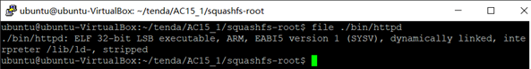

  

+ 可以看到，路由器中用于用户配置的Web服务器已经运行起来了。这种小型设备一般使用httpd这种小型的静态的http server.

### 进行Fuzzing测试

+ 搭建一个针对这种小型路由的漏洞挖掘工作环境的流程

  

+ 有一些下载的固件或者固件内部的部分软件是源代码形式的。所以可能还需要编译一下。这里的编译和我们之前用过的编译不同。称为交叉编译。我们以前在一个x86架构下的PC中，编译一个本架构下的软件，编译后在本机运行。而交叉编译是编译一个在其他系统中运行的软件，比如在x86系统中编译一个MIPS架构的软件。

+ 由于MIPS架构的主机一般性能不高，软件环境单一，所以通常不作为工作环境，也跑不起来编译器。所以我们在PC上进行编译发布在响应环境中运行。这种称为交叉编译。

+ mips-gcc 和 mipsel-gcc 编译器就是交叉编译器。所以，在实验过程中，根据情况，可能还有其他的支撑工具需要使用。

+ 搭建好环境以后，系统和应用已经运行起来。下一步，就可以使用Fuzzing测试工具进行测试了。

+ Fuzzing已经有一些框架可以使用了。`SPIKE、AFL、Sulley、BooFuzz`

  + AFL（American Fuzzy Lop）是由安全研究员Michał Zalewski开发的一款基于覆盖引导（Coverage-guided）的模糊测试工具，它通过记录输入样本的代码覆盖率，从而调整输入样本以提高覆盖率，增加发现漏洞的概率。其工作流程大致如下：
    1)   从源码编译程序时进行插桩，以记录代码覆盖率（Code Coverage）；
    2)   选择一些输入文件，作为初始测试集加入输入队列（queue）；
    3)   将队列中的文件按一定的策略进行“突变”；
    4)   如果经过变异文件更新了覆盖范围，则将其保留添加到队列中;
    5)   上述过程会一直循环进行，期间触发了crash的文件会被记录下来。

    6) AFL是基于变异策略的。所以的Fuzzing测试，有一个目标就是通过输入畸形数据让程序崩溃crash,程序的崩溃往往就意味着有bug或者有漏洞。然后对引起崩溃的输入样本，或者崩溃或的系统日志、dump文件等进行分析。AFL用了一种称为插桩的技术来进行崩溃的检测。

    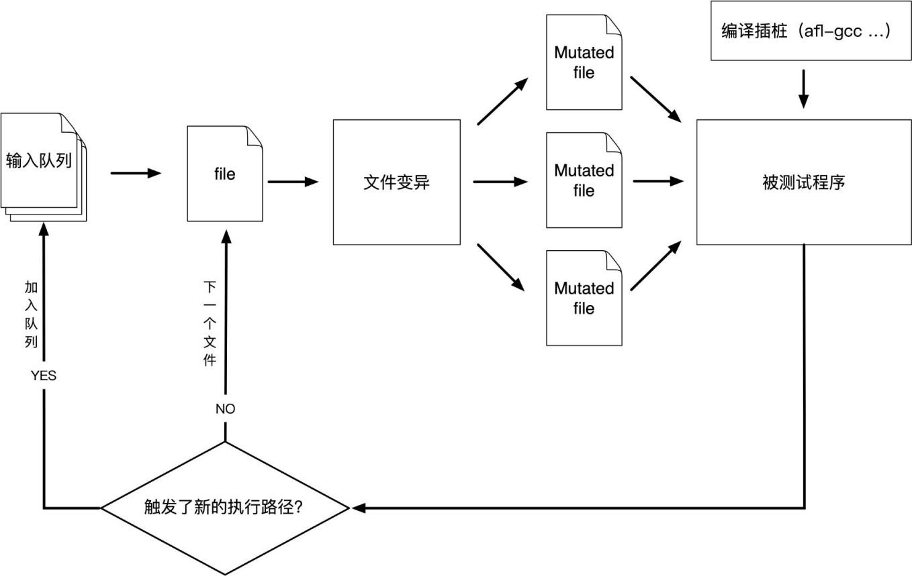

  + SPIKE是由Dave Aitel编写的一款非常著名的Protocol Fuzz（针对网络协议的模糊测试）工具，完全开源免费。它提供一系列API用于用户使用C语言创建自己的网络协议模糊测试器。SPIKE定义了许多可用于C编码器的原语，这些原语允许其构造可以发送给网络服务的模糊消息以测试是否产生错误。SPIKE功能如下：

    + 含大量可用于处理程序中产生错误的字符串。并且，SPIKE能够确定哪些值最适合发送到应用程序，从而以一种有用的方式导致应用程序异常。
    + SPIKE引入“块”的概念，用于计算由SPKIE代码生成的数据内指定部分的大小，并且可以将这些值以各种不同的格式插入。
    + 支持并以不同格式接收许多在网络协议中常用的不同数据类型。
      SPIKE功能强大，是一款优秀的模糊测试工具，但是文档较少，只能根据各种参考资料和一些测试脚本整理常用的API使用方法。

  + Sulley是由Pedram Amini编写的一款灵活且强大的模糊测试工具。可用于模糊化文件格式、网络协议、命令行参数和其它代码。除了专注于数据生成外，Sulley还具有如下功能：

    + 监视网络并保留记录。
    + 检测和监控目标程序的健康状况，能够使用多种方法恢复到已知的良好状态。
    + 检测、跟踪和分类检测到的故障。
    + 可以并行执行测试，提高检测速度。
    + 自动确定测试用例触发的特殊错误。
      Sulley功能比SPIKE更加的完善，能够进行构造模糊测试数据、监测网络流量、进行错误检测等，但是Sulley检测只能用于x86平台。

  + Boofuzz是Sulley的继承与完善。Boofuzz框架主要包括四个部分：

    + 数据生成，根据协议原语构造请求。
    + 会话管理或驱动，将请求以图的形式链接起来形成会话，同时管理待测目标、代理、请求，还提供一个Web界面用于监视和控制检测、跟踪并可以分类检测到的故障。
    + 通过代理与目标进行交互以实现日志记录、对网络流量进行监控功能等
    + 有独立的命令行工具，可以完成一些其他的功能。

+ 可以看出，以上几种主要的模糊测试工具中，BooFuzz是比较适合的一种。所以下一个需要进行的工作就是安装和配置BooFuzz

  + 使用Boofuzz对模拟器环境中的路由器程序进行测试主要步骤为：

    + 根据网络请求数据包构造测试用例请求；
    + 设置会话信息(目标IP、端口号等)，然后按照请求的先后顺序将其链接起来；
    + 添加对目标设备的监控和重启机制等；
    + 开始测试。

  + 比如上面那个tenda路由器，在运行起来以后，如果我们对其http服务进行Fuzzing，我们可以使用浏览器先访问他们的http 服务。

    

  + 这是路由器固件在QEMU中运行以后的结果。可以看到 服务器监听在 192.168.148.4:81,通过浏览器访问192.168.148.4:81与路由器管理界面进行尽可能多的交互，使用Wireshark抓取到不同URI的数据包。

  + 对捕获的数据包进行分析，确定数据输入点
    以抓取到的其中一共数据包为例：
    1   GET /goform/GetRouterStatus?0.7219206793806395&_=1587978102556  HTTP/1.1
    2   Host: 192.168.148.4:81
    3   User-Agent: Mozilla/5.0 (X11; Ubuntu; Linux x86_64; rv:75.0) Gecko/20100101 Firefox/75.0
    4   Accept: text/plain, */*; q=0.01
    5   Accept-Language: en-US,en;q=0.5
    6   Accept-Encoding: gzip, deflate
    7   X-Requested-With: XMLHttpRequest
    8   DNT: 1
    9   Connection: keep-alive
    10  Cookie:password=""
    11  Referer: http://192.168.148.4:81/main.html

  + 根据HTTP协议特点及缓冲区溢出漏洞特点，对该请求选取以下数据输入点

    + 第1行，HTTP协议有GET、POST、PUT、DELETE、CONNECT、OPTIONS、TRACE等方法，若方法使用错误可能会超长缓冲区溢出漏洞，例如，相比GET方法，POST方法可以提交更多的数据，若使用POST方法提交的表单误用了GET方法进行提交，会导致查询字符串过长造成溢出，因此把数据包中的GET方法当成一个输入点。若URI超长，服务器在处理请求的时候使用危险函数读取URI或未对URI长度进行限制，也可能导致安全漏洞，因此将URI处也进行模糊测试。第10行，若Cookie超长，程序认证用户身份信息时若用危险函数读取Cookie也可能造成缓冲区溢出，因此将Cookie处进行模糊测试。

  + 选定了一个具体目标，就可编写模糊测试脚本了

  + 根据上述分析，利用Boofuzz提供的原语对HTTP请求进行定义，设置与会话相关的信息，包括目标设备IP地址、端口等。脚本的编写，需要大家查一下BooFuzz的官方文档，查看一是示例代码，比价容易。

    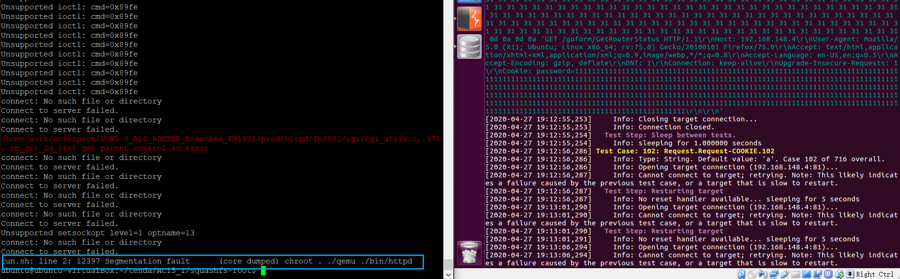

  + 上面的截图是师兄师姐在进行测试的是否发现了程序崩溃异常的一个测试数据。在模拟器中监视到了程序崩溃。造成程序异常的数据包主要是其Cookie字段过长，初步判断是由于Cookie字段造成缓冲区溢出导致程序异常退出。

    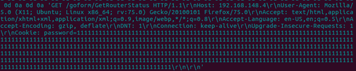

  + 有了以上数据以后，就可以将引起崩溃的输入数据在调试环境下再次输入到测试对象，进行调试了。这是上面那个漏洞的相关代码，在IDA-pro调试后定位的漏洞代码。

    

  + 图中的if语句不满足，函数不会读取R3寄存器存储地址，而是直接返回，因此，若在测试数据中添加.gif，则PC寄存器将会被覆盖。这些事后的分析是经过了非常多的调试工作以后确定的。

  + 工具主要是GDB和IDA-pro

  + 总结一下,下图显示了我们使用binwalk QEMU BooFuzz GDB IDA-pro一系列工具，发现了路由器http管理界面由于cookie超长引起的一个缓冲区溢出漏洞的发现（复现）过程,漏洞挖掘是一个非常综合性的工程。

    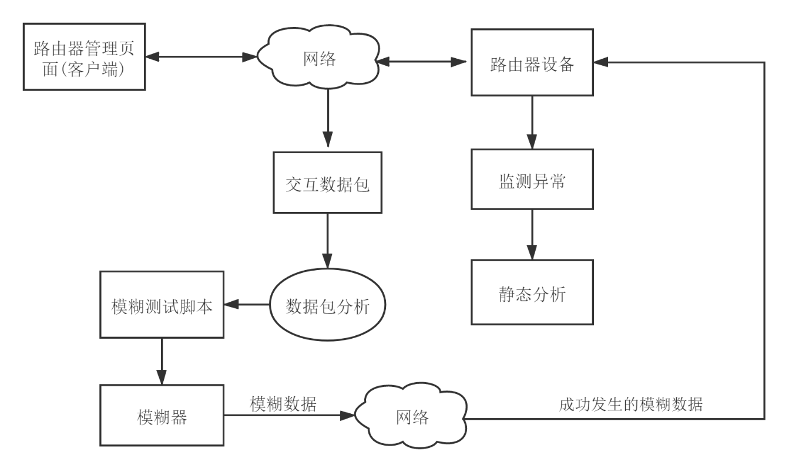


## 课后实验

### 实验一（TP-Link Archer路由器漏洞学习）

+ 搜集市面上主要的路由器厂家、在厂家的官网中寻找可下载的固件在CVE漏洞数据中查找主要的家用路由器厂家的已经公开的漏洞，选择一两个能下载到切有已经公开漏洞的固件。如果能下载对应版本的固件，在QEMU中模拟运行。确定攻击面（对哪个端口那个协议进行Fuzzing测试），尽可能多的抓取攻击面正常的数据包。

  + TP-Link Archer路由器发现的漏洞可允许远程管理账户密码（主要跟着教程学习）

  +  X-Force Red 实验室的Grzegorz Wypych研究人员（又名[@ horac341](https://twitter.com/horac341) ）发现了在TP-Link Archer C5（v4）路由器中发现的固件漏洞。这是一个0 day漏洞，以前没有报告过，并且可能影响家庭和企业环境。如果利用此路由器漏洞，则远程攻击者可以通过局域网（LAN）上的Telnet来控制路由器的配置，并通过LAN或广域网（WAN）连接到文件传输协议（FTP）服务器。

  + 它可以授予未经授权的第三方使用管理员特权访问路由器，而这是所有用户在该设备上的默认设置，而无需进行适当的身份验证。

  + 在深入探究如何发现此漏洞之前，描述此漏洞的简短方法是使用户密码无效的易受攻击的HTTP请求。在各种各样的溢出漏洞中，当将比预期的字符串长度短的字符串作为用户密码发送时，密码值会失真为一些非ASCII字节。但是，如果字符串太长，密码将完全无效，由空值代替。此TP-Link设备仅具有一种用户类型（具有root权限的管理者），并且所有进程均由用户在此访问级别下运行，这可以使攻击者以管理者的身份操作并接管设备。

  + 当我们调查触发脆弱情况的原因时，我们可以看到，只需发送正确的请求即可获得对设备的访问权限

    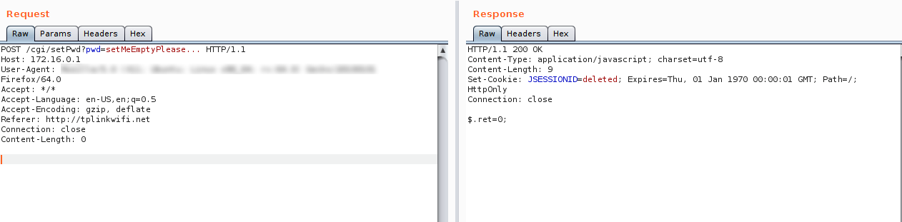

  + 易受攻击的HTTP POST请求未验证所需的参数,如果该引用从标头中删除，请求将返回一个“禁止访问”响应

    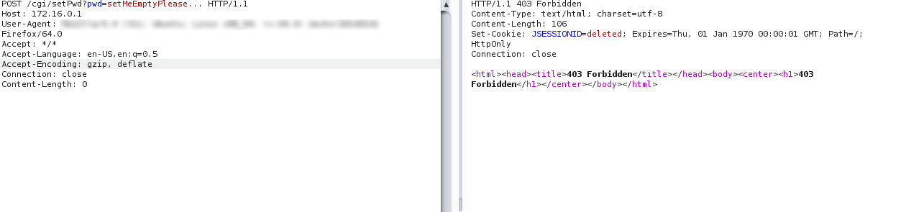

  + 从请求中删除的引用——HTTP响应返回“403禁止”,此漏洞以相同的方式影响HTTP POST和GET请求，当字符串长度超过允许的字节数时，管理密码无效。HTTP GET请求同样会使密码无效

    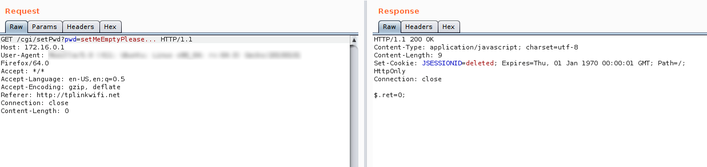

  + 有了存储芯片的版本号，可以更轻松地在线查找有关它的更多信息，并且我们能够使用芯片夹和二进制文件分析工具BinWalk直接从芯片中提取固件。首先要先安装`binwalk`

    ```bash
    sudo apt install binwalk
    ```

    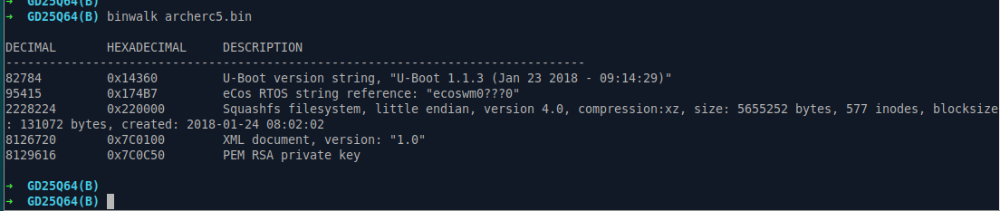

  + 使用BinWalk提取的路由器固件,请注意，在提取期间，有一个RSA私钥存储在内存中。访问Web服务时，此密钥用于加密和解密用户密码。解压缩固件后，我们发现登录数据存储在rootfs / etc文件夹中。默认的用户名和密码非常弱。保留默认组合可以允许访问FTP服务器并授予控制台访问权限。如此弱的密码有很多访问权限，几乎任何人都可以猜到，而且不幸的是，它也是传播诸如Mirai之类的僵尸网络恶意软件的自动攻击的源头。

    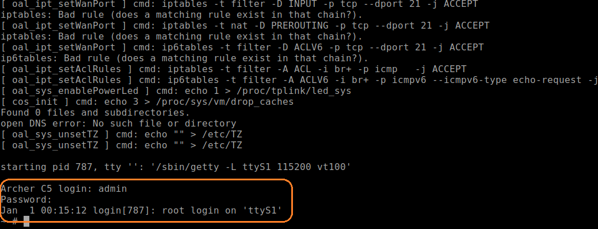
  
  + 通过root级访问，我们现在可以获得对二进制文件的一些控制。我们也有TFTP，所以我们下载了MIPS gdbServer，这是一个用于类Unix系统的控制程序，允许操作员从另一个系统远程调试其他程序。这样，调试器不需要驻留在同一设备上，只需要我们要调试的可执行文件驻留在目标系统上即可。我们将此工具与IDA（一种多处理器反汇编器和调试器）结合使用，以进行静态和动态分析，因此我们可以找到路由器漏洞的来源，并通过此过程来说明如何在找到该漏洞并触发它。下图显示了在IDA上查看的已解析HTTP标头的相关部分：

    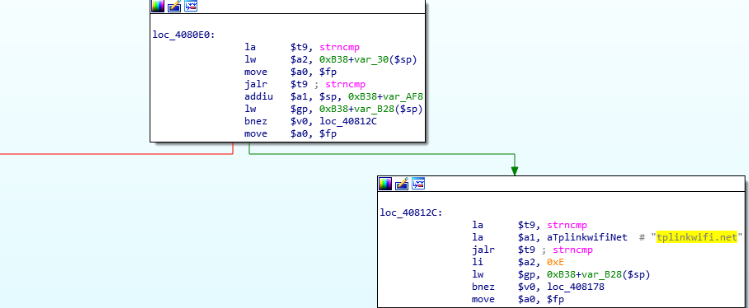
  
  + 请注意，此处使用函数strncmp来验证带有字符串tplinkwifi.net的Referrer标头。前面还验证了IP地址，附加调试器可以查看这些详细信息，确认这确实是一个可利用的路由器漏洞。我们的下一步是检查当我们使用不同的字符串长度发送易受攻击的请求时，密码文件会如何处理。首先，我们尝试发送一个较短的字符串，只有几个字节。

    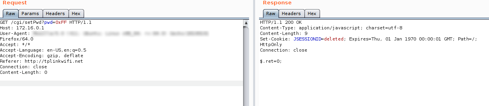

  + 使用较短的密码字符串发送HTTP GET请求,该短字符串通过并损坏了密码文件，结果是用户将无法登录，攻击者也将无法登录。此漏洞影响Telnet，FTP和Web服务。

    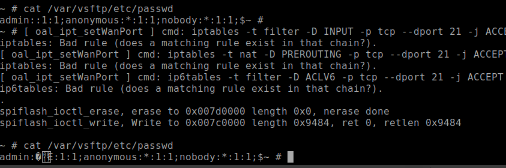

    
  
  + 被用户提交的短字节字符串损坏的密码文件,接下来，我们尝试发送长度超过允许字符数的密码。
  
    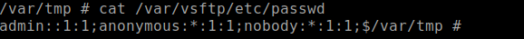
    
  + 这次，密码完全无效，并且该值现在为空。从现在开始，只使用“admin”作为用户名，即可访问TELNET和FTP，而无需输入任何密码，默认情况下，该用户名是设备上唯一可用的用户。
    
    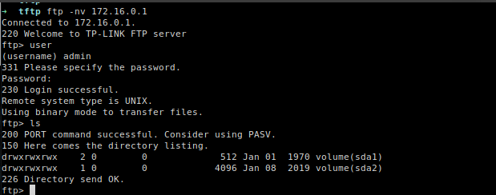
    
  + 此时，管理员密码已失效

### 实验二（QEMU模拟运行路由器）（太多坑了！！！！）

+ 搜集市面上主要的路由器厂家、在厂家的官网中寻找可下载的固件在CVE漏洞数据中查找主要的家用路由器厂家的已经公开的漏洞，选择一两个能下载到切有已经公开漏洞的固件。如果能下载对应版本的固件，在QEMU中模拟运行。确定攻击面（对哪个端口那个协议进行Fuzzing测试），尽可能多的抓取攻击面正常的数据包。

+ 物联网设备固件分析：Firmadyne固件模拟环境搭建

  > Firmadyne是一款自动化分析嵌入式Linux系统安全的开源软件，由卡内基梅隆大学的Daming D. Chen开发完成的。它支持批量检测，整个系统包括固件的爬取、root文件系统的提取、QEMU模拟执行以及漏洞的挖掘。

+ 实验工具：

  > Firmadyne
  > 项目地址：https://github.com/firmadyne/firmadyne
  > README.md中有详细的配置和安装步骤
  > Firmware Analysis Toolkit
  > 项目地址：https://github.com/attify/firmware-analysis-toolkit
  > 该工具集包含了binwalk、Firmadyne等必须的工具。这里我们只需要克隆该仓库到本地即可
  > qemu
  > 可以直接用apt-get安装，只安装一部分
  > 也可以从github的仓库编译安装所有的模块

#### 1克隆`Firmware Analysis Toolkit`工具集仓库

```bash
# 1. 安装依赖
sudo apt-get install busybox-static fakeroot git dmsetup kpartx netcat-openbsd nmap python-psycopg2 python3-psycopg2 snmp uml-utilities util-linux vlan

# 2. clone 
git clone --recursive https://github.com/attify/firmware-analysis-toolkit.git
```

#### 2 安装binwalk

```bash
# 1. 安装依赖和binwalk
#cd firmware-analysis-toolkit/binwalk
#sudo ./deps.sh
#sudo python setup.py install
sudo apt install binwalk
# 2. 对于 python2.x，还需要安装以下的库
sudo -H pip install git+https://github.com/ahupp/python-magic
sudo -H pip install git+https://github.com/sviehb/jefferson
```

+ 测试是否安装成功：

  ```bash
  cwx@ubuntu:~/firmware-analysis-toolkit$ binwalk
  
  Binwalk v2.1.1
  Craig Heffner, http://www.binwalk.org
  
  Usage: binwalk [OPTIONS] [FILE1] [FILE2] [FILE3] ...
  
  Signature Scan Options:
      -B, --signature              Scan target file(s) for common file signatures
      -R, --raw=<str>              Scan target file(s) for the specified sequence of bytes
      -A, --opcodes                Scan target file(s) for common executable opcode signatures
      -m, --magic=<file>           Specify a custom magic file to use
      -b, --dumb                   Disable smart signature keywords
      -I, --invalid                Show results marked as invalid
      -x, --exclude=<str>          Exclude results that match <str>
      -y, --include=<str>          Only show results that match <str>
  ...
  ```

  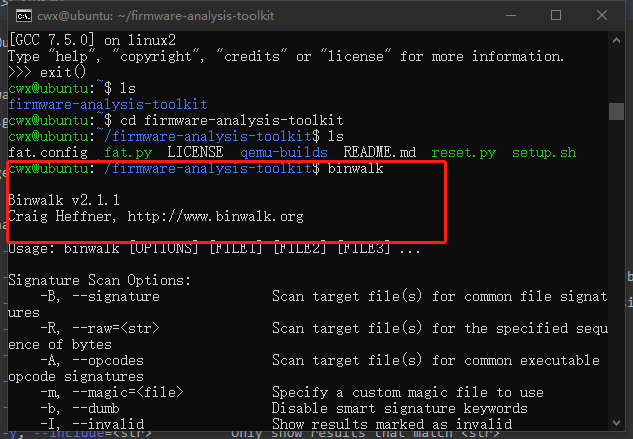

####  3 安装Firmadyne

+ 进入Firmadyne目录，然后打开`firmadyne.config`，修改 FIRMWARE_DIR的路径为当前Firmadyne目录的绝对路径

  ```bash
  git clone https://github.com/firmadyne/firmadyne
  cd firmware-analysis-toolkit/firmadyne
  
  vim firmadyne.config
  
  # 以下为firmadyne.config中的内容
  #!/bin/sh
  
  # uncomment and specify full path to FIRMADYNE repository
  FIRMWARE_DIR=/home/hzy/firmware-analysis-toolkit/firmadyne/
  
  # specify full paths to other directories
  BINARY_DIR=${FIRMWARE_DIR}/binaries/
  TARBALL_DIR=${FIRMWARE_DIR}/images/
  SCRATCH_DIR=${FIRMWARE_DIR}/scratch/
  SCRIPT_DIR=${FIRMWARE_DIR}/scripts/
  
  # functions to safely compute other paths
  
  ... ...
  ```

  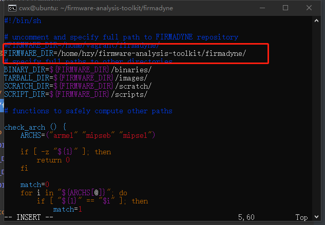

+ 安装Firmadyne

  ```bash
  sh ./download.sh
  sudo ./setup.sh #for a long long time 
  ```

  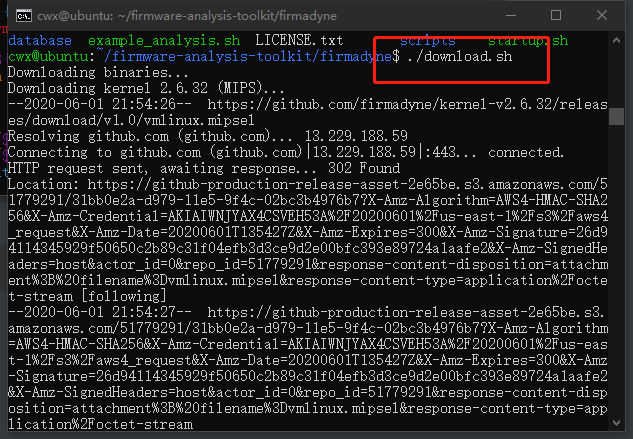

#### 4 安装postgresql数据库

```bash
sudo apt-get install postgresql

# 用户的密码设置为：firmadyne
sudo -u postgres createuser -P firmadyne, with password firmadyne

sudo -u postgres createdb -O firmadyne firmware

# 注意这里的数据库文件是在firmadyne/目录下，也就是该命令要在根目录firmware-analysis-toolkit/目录下执行
sudo -u postgres psql -d firmware < ./firmadyne/database/schema
```

+ 启动postgresql数据库，确认其正在运行。

  + 这里我在kali测试的时候，如果没有先启动数据库，就进行添加用户的命令会报错。

  + 还遇到了一个问题，明明数据库服务在运行，但是添加用户的时候一直报的错也是服务没有运行的错，这种情况下我是直接重装了一遍postgresql

  + 具体出现的错大家可以在网上搜索解决方案即可。一般还是有现成的方法的。

    ```bash
    sudo service postgresql start
    
    sudo service postgresql status
    ```

#### 5 安装qemu

> QEMU是一套由法布里斯·贝拉(Fabrice Bellard)所编写的以GPL许可证分发源码的模拟处理器，在GNU/Linux平台上使用广泛。

+ 直接安装

  ```bash
  sudo apt-get install qemu-system-arm qemu-system-mips qemu-system-x86 qemu-utils
  ```

  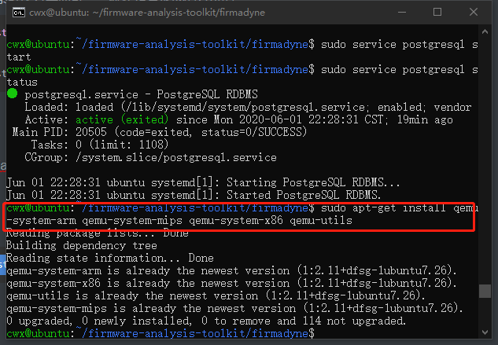

#### 6 测试运行

+ 将firmware-analysis-toolkit/目录下的fat.py和reset.py移动到firmadyne/目录下：

  ```bash
  mv fat.py ./firmadyne
  mv reset.py ./firmadyne
  ```

+ 修改fat.py中的执行权限、firmadyne的路径`firmadyne_path`以及root密码`root_pass`

  ```bash
  chmod +x fat.py
  
  vim fat.py
  # 以下是fat.py中的内容
  
  #!/usr/bin/env python2.7
  
  import os
  import pexpect
  import sys
  
  # Put this script in the firmadyne path downloadable from
  # https://github.com/firmadyne/firmadyne
  
  #Configurations - change this according to your system
  firmadyne_path = "/home/hzy/firmware-analysis-toolkit/firmadyne"
  binwalk_path = "/usr/local/bin/binwalk"
  root_pass = "123456"
  firmadyne_pass = "firmadyne"
  
  ... ...
  
  ```

  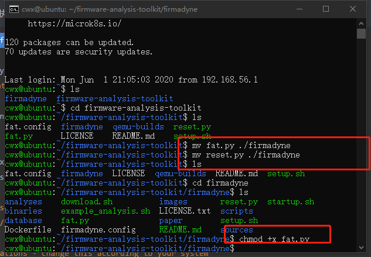

  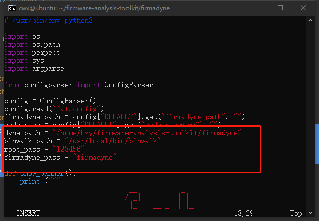

+ 下载要模拟的路由器固件

  + 要模拟的路由器为：WNAP320

  + 在https://www.netgear.com/support/product/WNAP320.aspx中下载固件

    ```bash
    wget http://www.downloads.netgear.com/files/GDC/WNAP320/WNAP320_V3.7.11.4.zip
    ```

    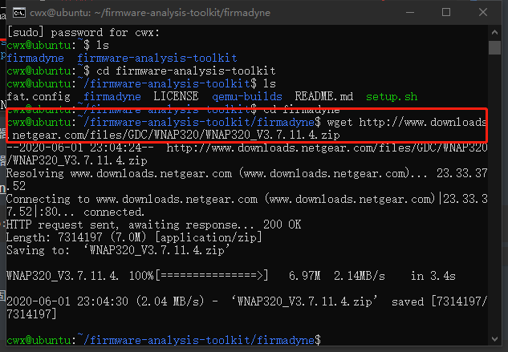

  + 假设我这里将固件文件重命名为 netgear.zip，并放在 /firmware/目录下

+ 测试运行

  ```bash
  cwx@ubuntu:~/firmware-analysis-toolkit/firmadyne$ sudo ./fat.py 
  [sudo] password for hzy: 
  
                                 __           _   
                                / _|         | |  
                               | |_    __ _  | |_ 
                               |  _|  / _` | | __|
                               | |   | (_| | | |_ 
                               |_|    \__,_|  \__|                    
                      
                  Welcome to the Firmware Analysis Toolkit - v0.2
      Offensive IoT Exploitation Training  - http://offensiveiotexploitation.com
                    By Attify - https://attify.com  | @attifyme
      
  [?] Enter the name or absolute path of the firmware you want to analyse : /home/hzy/firmware/netgear.zip
  [?] Enter the brand of the firmware : Netgear
  [+] Now going to extract the firmware. Hold on..
  [+] Firmware : /home/hzy/firmware/netgear.zip
  [+] Brand : Netgear
  [+] Database image ID : 2
  [+] Identifying architecture
  [+] Architecture : mipseb
  [+] Storing filesystem in database
  [!] Filesystem already exists
  [+] Building QEMU disk image
  [+] Setting up the network connection, please standby
  [+] Network interfaces : [('brtrunk', '192.168.0.100')]
  [+] Running the firmware finally
  [+] command line : sudo /home/hzy/firmware-analysis-toolkit/firmadyne/scratch/2/run.sh
  [*] Press ENTER to run the firmware...
  
  ```

+ 从`[+] Network interfaces : [('brtrunk', '192.168.0.100')]`可以看到，启动了一个服务，可以通过192.168.0.100访问

  接下来按`Enter`键运行该固件，等运行完了以后就可以从浏览器访问了：

  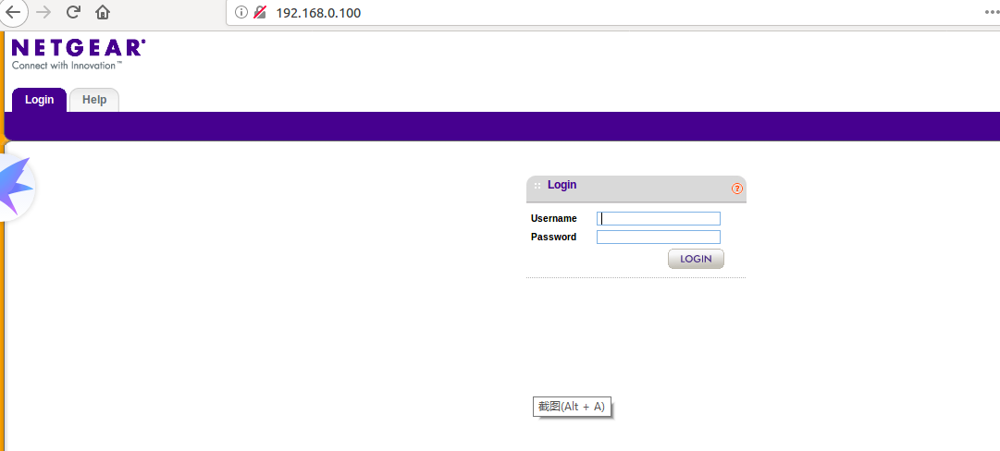


### 实验三 （DLink RCE漏洞CVE-2019-17621分析）

+ [漏洞分析](https://www.freebuf.com/vuls/228726.html)，(该路由器并没有在QEMU中运行成功┭┮﹏┭┮)


### 实验四（boofuzz脚本编写）

+ 查阅BooFuzz的文档，编写这对这个攻击面，这个协议的脚本，进行Fuzzing。配置BooFuzz QEMU的崩溃异常检测，争取触发一次固件崩溃，获得崩溃相关的输入测试样本和日志。尝试使用调试器和IDA-pro监视目标程序的崩溃过程，分析原理。

  + 以下是boofuzz测试的流程图
  
  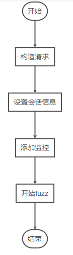
  
  
  
#### 根据API接口的数据包构造请求

  + 首先， 我们要根据API接口的数据包构造请求，我们要对路由器的登录接口进行fuzz测试，首先需要使用Burpsuite设置代理，进行抓包。以下为Burpsuite抓包结果
  
    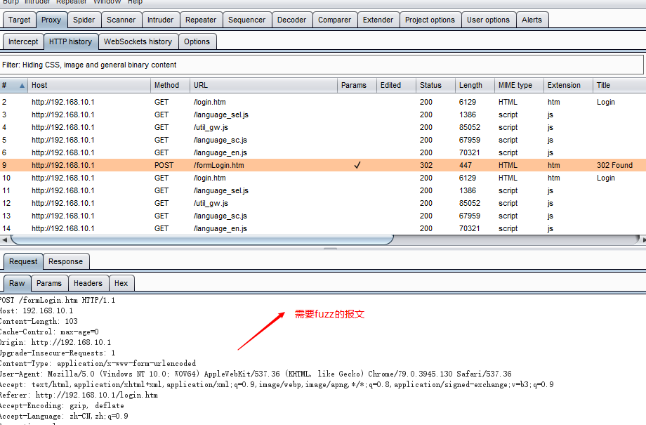
  
  + 现在需要根据报文，利用boofuzz框架提供的原语对http请求进行定义
  
    ```python
    s_initialize(name="Request")
        with s_block("Request-Line"):
            # LINE 1
            s_static("POST", name="Method")
            s_delim(" ", name='space-1')
            s_string("/fromLogin", name='Request-URI')  # 需要变异
            s_delim(" ", name='space-2')
            s_static('HTTP/1.1', name='HTTP-Version')   
            s_static("\r\n")
    
            # LINE 2
            s_static("Host", name="Host")
            s_static(": ")
            s_static("192.168.10.1", name="ip")
            s_static("\r\n")
    
            # LINE 3  对应 Content-Length: 400
            s_static('Content-Length')
            s_static(': ')
            s_size('data', output_format='ascii', fuzzable=True)    # size的值根据data部分的长度自动进行计算，同时对该字段进行fuzz
            s_static('\r\n')
    
            # ...
        	s_static('\r\n')
    
        # 对应http请求数据
        with s_block('data'):
            s_static('login_name=&curTime=1581845487827&setLang=&setNoAutoLang=&login_n=admin&login_pass=')
            s_string('123456', max_len=1024)	# 需要变异，且最大长度为1024
            s_static('&languageSel=1')
    ```
    
    
    
#### 设置会话信息

+ 以下是最简单的一个会话的设置，包括设备的IP地址以及端口

  ```bash
  session = Session(
          target=Target(
              connection=SocketConnection("192.168.10.1", 80, proto='tcp')
              netmon=Remote_NetworkMonitor(host, port, proto='tcp'))  # 服务可用性监控 非必须代码
          ),
      )
  ```

+ 如果需要fuzz多个请求，比如说，还要继续fuzz登录后的一些接口，还需要将之前定义的请求按照一定的先后顺序连接，比如说

  ```python
  session.connect(s_get('login'))		# 默认前置节点为root
  session.connect(s_get('login'), s_get('setsysemailsettings'), callback=add_auth_callback)
  session.connect(s_get('login'),s_get('setsyslogsettings'), callback=add_auth_callback)
  session.connect(s_get('login'),s_get('setschedulesettings'), callback=add_auth_callback)
  ```

+ 由于setsysemailsettings、setsyslogsettings、setschedulesettings等请求需要在登录之后才可以正常使用，所以需要在login请求之后发生。而setsysemailsettings、setsyslogsettings和setschedulesettings这几个请求之间则没有明确的先后关系。add_auth_callback为自定义的回调函数，主要用于从login请求中获取用于登录认证的信息如cookie，然后将其设置于setsysemailsettings、setsyslogsettings、setschedulesettings等请求中。

#### 添加监视器

+ 通过当前设备是否在线，就是判断目标设备是否崩溃的方法之一。结合`Step 2`中，我们已经引用的函数`Remote_NetworkMonitor()`，其核心代码如下

  ```python
  # 通过TCP全连接来判断目标端口是否在监听（网络安全实验学过的代码用上了）
  if self.proto == "tcp" or self.proto == "ssl":
      try:
          self._sock.connect((self.host, self.port))
          self.alive_flag = 1
      except socket.error as e:
     		self.alive_flag = 0
  ```

#### 开始fuzz

+ 最后只需要调用session.fuzz() 即可。运行我们编写好的脚本，每次运行的日志数据将保存到当前工作目录下boofuzz-results目录中的SQLite数据库中，运行boo open <run-*.db>，会在26000端口开启一个Web服务器，控制和查看测试进度（某些版本，运行fuzz脚本，会自动打开26000端口，所以只需要打开如下页面即可）。

  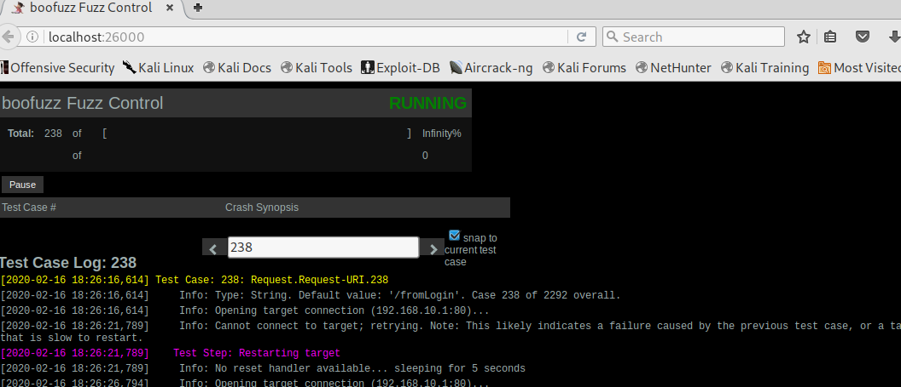

+ 上图表明，第238个用例测试结果出现了异常。*tips：在打开数据库监控状态的时候，如果提示26000端口已经占用，可以使用`netstat -anp | grep 26000`找到进程，并杀死即可*

+ 具体的原因，就要靠我们自己进行后续的分析了。可以使用数据库查看软件，Kali自带 `DB Browser for SQLite`，打开 boofuzz-results 目录下的相关文件可看到fuzz的日志

  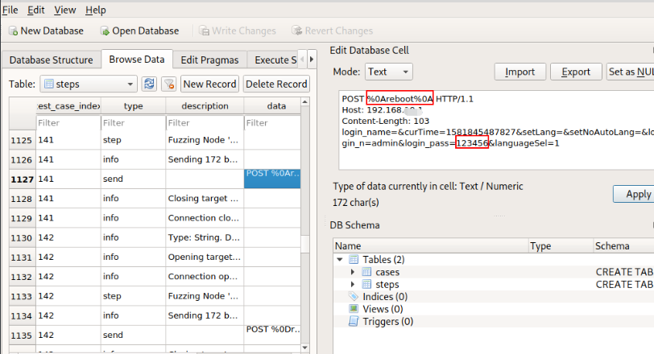

+ 从数据库中可以看到，的确是按照我们的代码，对相关字段进行变异，从而达到fuzz的效果。进一步观察238个用例的前一个用例，找到发送的内容，重新发送，观察设备状态，看问题是否能够复现，最终确定漏洞是否存在。

+ 完整fuzzing代码如下

  ```python
  #!/usr/bin/env python
  # Designed for use with boofuzz v0.0.9
  # coding=utf-8
  from boofuzz import *
  
  
  def main():
      session = Session(
          target=Target(
              connection=SocketConnection("192.168.10.1", 80, proto='tcp')
          ),
      )
  
      s_initialize(name="Request")
      with s_block("Request-Line"):
          # LINE 1
          s_static("POST", name="Method")
          s_delim(" ", name='space-1')
          s_string("/fromLogin", name='Request-URI')  # variation
          s_delim(" ", name='space-2')
          s_static('HTTP/1.1', name='HTTP-Version')   
          s_static("\r\n")
  
          # LINE 2
          s_static("Host", name="Host")
          s_static(": ")
          s_static("192.168.10.1", name="ip")
          s_static("\r\n")
  
          # LINE 3  对应 Content-Length: 400
          s_static('Content-Length')
          s_static(': ')
          s_size('data', output_format='ascii', fuzzable=True)    # size的值根据data部分的长度自动进行计算，同时对该字段进行fuzz
          s_static('\r\n')
  
          # ...
          s_static('\r\n')
  
      # 对应http请求数据
      with s_block('data'):
          s_static('login_name=&curTime=1581845487827&setLang=&setNoAutoLang=&login_n=admin&login_pass=')
          s_string('123456', max_len=1024)
          s_static('&languageSel=1')
  
  
      session.connect(s_get("Request"))
  
      session.fuzz()
  
  
  if __name__ == "__main__":
      main()
  ```

  

  


## 实验参考资料

+ [CVE漏洞](https://blog.csdn.net/weixin_34146805/article/details/90361512)
+ [路由器漏洞](https://www.redhat.uno/2004.html)
+ [boofuzz社区](https://xz.aliyun.com/t/5155)
+ [binwalk提取固件](https://blog.csdn.net/QQ1084283172/article/details/66971242)
+ [CVE社区](https://cve.mitre.org/cgi-bin/cvename.cgi?name=CVE-2019-7405)
+ [binwalk教程](https://blog.csdn.net/qq_35056292/article/details/99674670)
+ [固件模拟](https://blog.csdn.net/qq_35056292/article/details/99674670)
+ [firmadyne](https://github.com/firmadyne/firmadyne)
+ [DLink漏洞](https://www.freebuf.com/vuls/228726.html)
+ [boofuzz教程](https://blog.csdn.net/song_lee/article/details/104334096)

