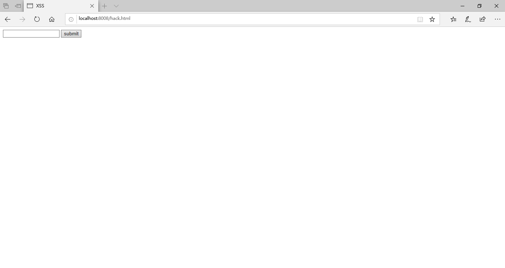
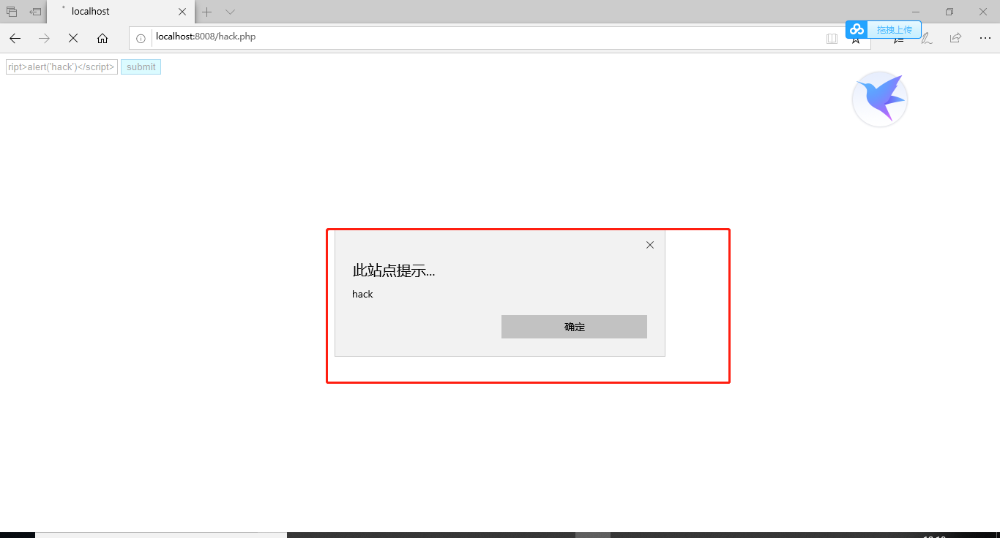
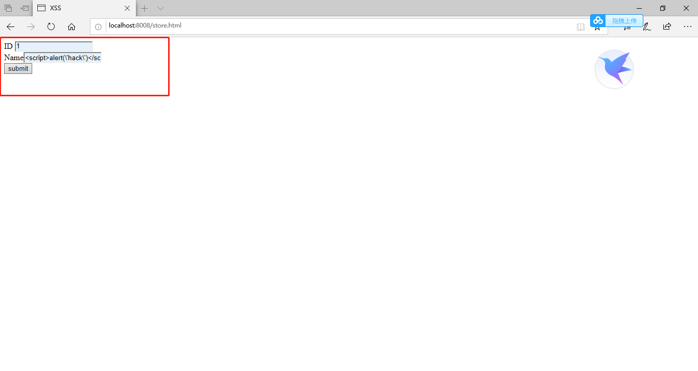

# XSS攻击

## 实验原理

+ XSS攻击通常指的是通过利用网页开发时留下的漏洞，通过一些方法注入恶意指令代码到网页，使用户加载并执行攻击者恶意制造的网页程序。这些恶意网页程序通常是JavaScript，但实际上也可以包括Java、 VBScript、ActiveX、 Flash 或者甚至是普通的HTML。

## 代码说明

+ a.html 是测试代码，静态htmls
+ chengfa.html 是乘法器的前端html代码
+ test.php 是后端php代码，执行乘法的代码
+ hack.html是反射型XSS攻击前端html，即会输出弹出框
+ hack.php是反射型XSS攻击后端php，处理脚本的php代码
+ store.html是存储型XSS攻击前端html，实现存入数据库
+ action2.php是存储型XSS攻击后端php，处理脚本
+ show2.php是新用户被脚本攻击的显示界面

## 反射型XSS攻击

### 原理

+ 反射型XSS的入侵过程:攻击者将含有恶意JavaScript代码的URL发给用户==>用户打开URL==>web应用程序对攻击者的JavaScript做出回应==>用户浏览器向攻击者发送会话信息==>攻击者使用会话信息跟web服务器进行交互

### 实验环境

+ php,apache都要安装好并配置好，详见[配置]( https://blog.csdn.net/qq_38002337/article/details/79354244 )

### 实验代码

```php+HTML
//前端
<html>
<head lang="en">
    <meta charset="UTF-8">
    <title>XSS</title>
</head>
<body>
    <form action="action.php" method="post">
        <input type="text" name="name" />
        <input type="submit" value="submit">
    </form>
</body>
</html>
 
//后端 
<?php
    $name=$_POST["name"]; 
	echo $name;
?>
```

+  这里有一个用户提交的页面，用户可以在此提交数据，数据提交之后给后台处理 

  

+ 接着，我们可以在输入框中提交数据： `<script>alert('hack')</script> `，即可得到如下结果，也就实现了简单的攻击。需要注意的是，该实验不能在chrome中做，chrome会自动过滤脚本

  


---

## 存储型XSS攻击

### 原理

+ 存储型XSS也被称为持久型XSS（persistent XSS），这种类型的XSS攻击更常见，危害也更大。它和反射型XSS类似，不过会把攻击代码存储到数据库中，任何用户访问包含攻击代码的页面都会被殃及。

### 实验环境

+ mysql+php+apache

### 实验代码

```php+HTML
//前端
<html>
<head lang="en">
    <meta charset="UTF-8">
    <title>XSS</title>
</head>
<body>
    <form action="action2.php" method="post">
       ID  <input type="text" name="id" /> <br/>
        Name<input type="text" name="name" /> <br/>
        <input type="submit" value="submit">
    </form>
</body>
</html>
//后端：action2.php
<?php
	$id=$_POST["id"];
	$name=$_POST["name"];
	$con=mysqli_connect("localhost","root","123456");
	mysqli_select_db($con,"test");
	
	$sql="insert into xss value ($id,'$name')";
	$result=mysqli_query($con,$sql);
?>
//供其他用户访问页面：show2.php
<?php
	$con=mysqli_connect("localhost","root","123456");
	mysqli_select_db($con,"test");
	$sql="select * from xss where id=1";
	$result=mysqli_query($con,$sql);
	while($row=mysql_fetch_array($result)){
		echo $row['name'];
	}
?>

```

+  这里有一个用户提交的页面，数据提交给后端之后，后端存储在数据库中。然后当其他用户访问另一个页面的时候，后端调出该数据，显示给另一个用户，XSS代码就被执行了 

  

+  我们输入 1  和 `<script>alert(\'hack\')</script> ` ，注意，这里的hack的单引号要进行转义，因为sql语句中的$name是单引号的，所以这里不转义的话就会闭合sql语句中的单引号。不然注入不进去。提交了之后，我们看看数据库 

  

+  然后当其他用户访问 show2.php 页面时，我们插入的XSS代码就执行了，也就意味着我们存储型XSS攻击成功了 

  