# 跨站脚本漏洞剖析

## 课内实验

### 示例代码（含注释）

```python
# -*- coding: utf-8 -*-

import sys
import cgi
from http.server import HTTPServer, BaseHTTPRequestHandler


#关键是 MyHTTPRequestHandler 类，这个是 HTTPServer 的回调。
#MyHTTPRequestHandler 直接 继承自 BaseHTTPRequestHandler，其中 BaseHTTPRequestHandler 的 do_GET和do_POST两个方法被重写
class MyHTTPRequestHandler(BaseHTTPRequestHandler):
    field_name = 'a'
    form_html = \
        '''
        <html>
        <body>
        <form method='post' enctype='multipart/form-data'>
        <input type='text' name='%s'>  #表单以变量名变量值的方式组织，input的name相当于变量名，你填入的数据就是变量值。
        #表单以变量名变量值的方式组织，input的name相当于变量名，你填入的数据就是变量值。
        #python的cgi.FieldStorage将form组织为python的dict数据类型，所以可以通过  form_data['field_name'].value 获得所填入的数据
        #如果填入了 123 那么123被写入了a.html文件,执行完成后，你的目录下会多一个a.html，内容为123
        <input type='submit'>
        </form>
        </body>
        </html>
        ''' % field_name

    def do_GET(self):#指定了 MyHTTPRequestHandler 来处理 http请求，那么当用get方法请求，就会调用 do_GET,POST方法请求，就会调用 do_POST函数
        self.send_response(200)#self.send_response(200)200按照协议 如果文件不存在应该是404，但是我这里做了一个特殊的处理，如果指定的文件不存在，我还是返回200，表示请求路径是正确的，可以处理，然后返回一个默认的页面。
        #这个页面就是 form_html的变量，在FileNotFoundError异常处理过程中写回
        self.send_header("Content-type", "text/html")
        self.end_headers()
        try:
            file = open("."+self.path, "rb")#self.path 是这个请求的路径 
            #比如，我们这里的 http://127.0.0.1:8080/a.html 其中 http://127.0.0.1:8080是协议服务器地址和端口。/a.html就是路径。
            #通常，一个静态的http服务器，这里的路径就是http服务器根目录下的文件，动态服务器这里可能是文件和参数，或者是对应其他服务器后台的处理过程。
            #例如 http://127.0.0.1:8080/a.php?p1=x,指定有a.php来处理这个请求，参数是p1=x,那么所以我们就去读 a.html文件。如果不存在，即返回404
        except FileNotFoundError as e:
            print(e)
            self.wfile.write(self.form_html.encode())
        else:
            content = file.read()
            self.wfile.write(content)

    def do_POST(self):
        form_data = cgi.FieldStorage(
            fp=self.rfile,
            headers=self.headers,
            environ={
                'REQUEST_METHOD': 'POST',
                'CONTENT_TYPE': self.headers['Content-Type'],
            })
            #python的cgi.FieldStorage将form组织为python的dict数据类型，所以可以通过  form_data['field_name'].value 获得所填入的数据
        fields = form_data.keys()
        if self.field_name in fields:
            input_data = form_data[self.field_name].value
            file = open("."+self.path, "wb")
            file.write(input_data.encode())

        self.send_response(200)
        self.send_header("Content-type", "text/html")
        self.end_headers()
        self.wfile.write(b"<html><body>OK</body></html>")


class MyHTTPServer(HTTPServer):
    def __init__(self, host, port):
        print("run app server by python!")
        HTTPServer.__init__(self,  (host, port), MyHTTPRequestHandler)

if '__main__' == __name__:
    server_ip = "0.0.0.0"
    server_port = 8080#我们的监听地址和端口是 0.0.0.0:8080。
    if len(sys.argv) == 2:
        server_port = int(sys.argv[1])
    if len(sys.argv) == 3:
        server_ip = sys.argv[1]
        server_port = int(sys.argv[2])
    print("App server is running on http://%s:%s " % (server_ip, server_port))

    server = MyHTTPServer(server_ip, server_port)#MyHTTPServer类，是继承自原生的HTTPSever,重写了 init函数，增加了打印输出语言，然后字节调用父类的 init 传递了服务器运行需要的地址 端口 等参数。
    server.serve_forever()


```

+ 代码FAQ

  + 这个是使用python原生的cgi和http.server两个库运行的一个简单的http服务器程序。因为没有使用第三方库，所有不需要使用pip安装依赖。运行比较简单

+ 运行上段代码，并在浏览器中访问`http:127.0.0.1:8080/a.html`,

  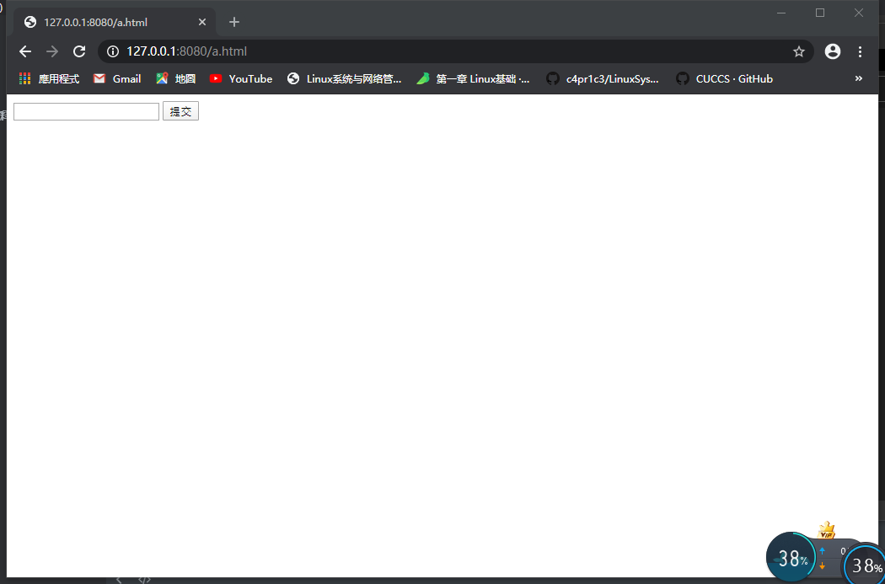

+ 打开浏览器的调试模式,到sources这个tab就看到了服务器向浏览器返回的数据,这一段 html 浏览器渲染出来，就是那个带一个编辑框的表单。

  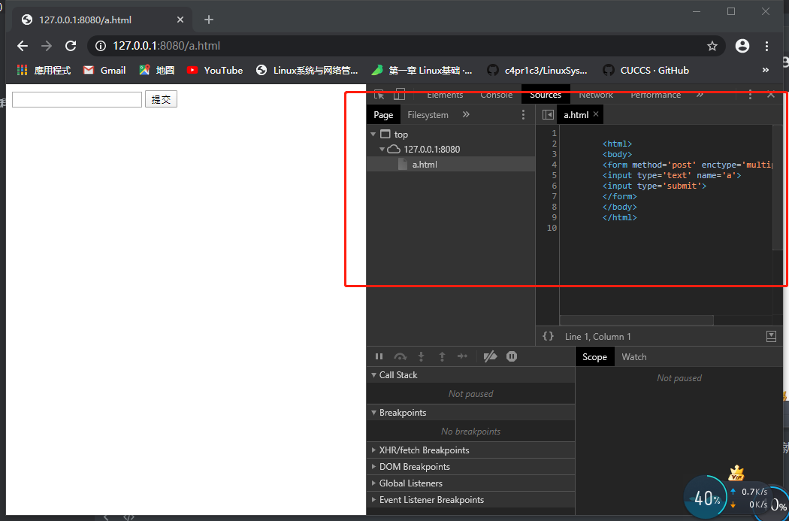

+ 漏洞也来了,如果这时大家提交了一个 123 ,这里获得的是，对应的是form中input的name,表单以变量名变量值的方式组织，input的name相当于变量名，你填入的数据就是变量值。python的cgi.FieldStorage将form组织为python的dict数据类型,所以可以通过  form_data['field_name'].value 获得所填入的数据

+ 所以当我们填入123时，目录下将会多一个a.html,内容为123，由于这个时候a.htm已经存在了，所以是运行的31-33行的else部分,直接把文件内容会写给浏览器,这里时在简化模拟用户提交数据-存入数据-其他用户获取这个数据的过程。这就存在xss漏洞了

  ```python
   else:
              content = file.read()
              self.wfile.write(content)
  ```

  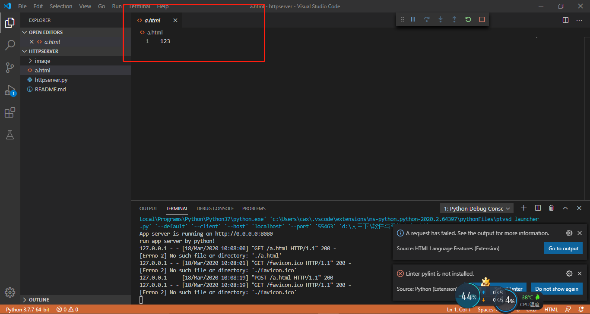

+ 下面再访问一个不存在的页面，比如b.html，又会出现那个默认的form。如果这时我们输入`<html><body><script>alert('XSS')</script></form></body></html>`，这段内容就会被写入b.html

  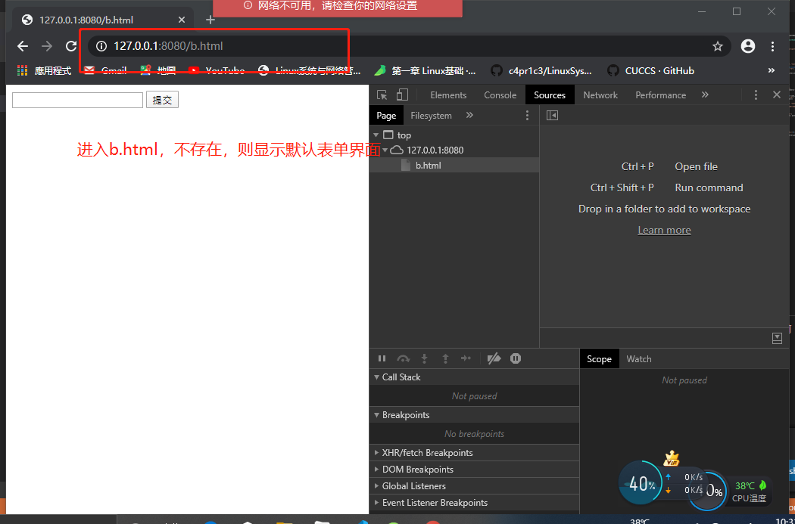

  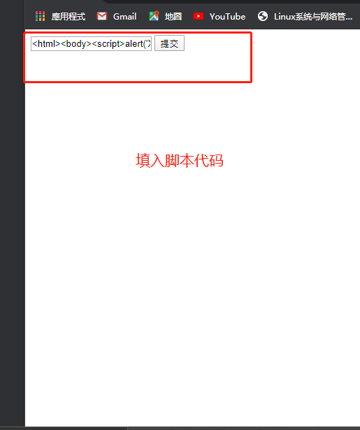

+ 然后在访问b.html的时候，整个页面被载入 script在浏览器上执行

  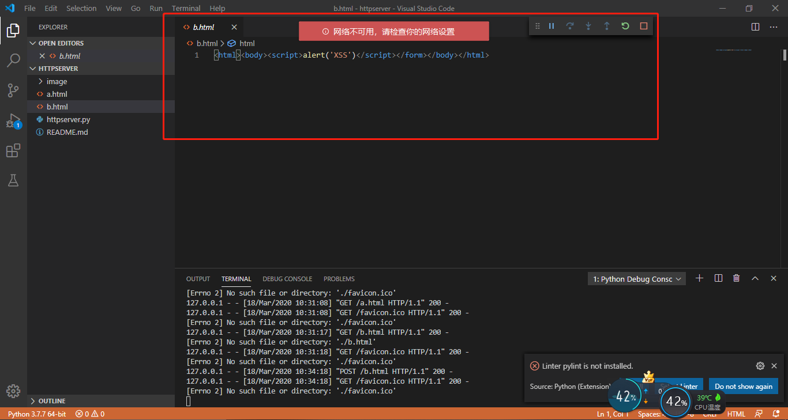

  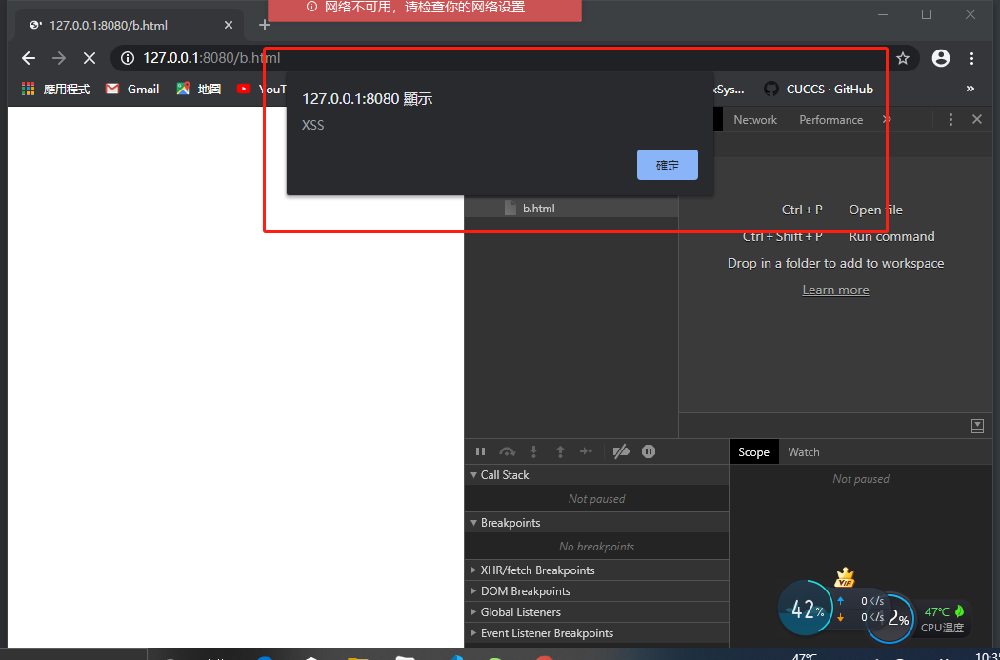

+ 接着，我们再次访问c.html，并填入`<html><body><script>window.location.href='http://by.cuc.edu.cn'</script></form></body></html>`,下次再访问c.html的时候。页面跳转了，跳转为`by.cuc.edu.cn`。这就是 window.location.href='http://by.cuc.edu.cn' 这段脚本的功能。即界面跳转漏洞，比如有一个商品A，你在评论里输入了一段js代码。如果服务器不做处理直接保存。后面的的用户访问商品A是，看评论，你输入的代码就会在其他用户的页面上执行。比如骗去用户支付，实际到账你的账户。

  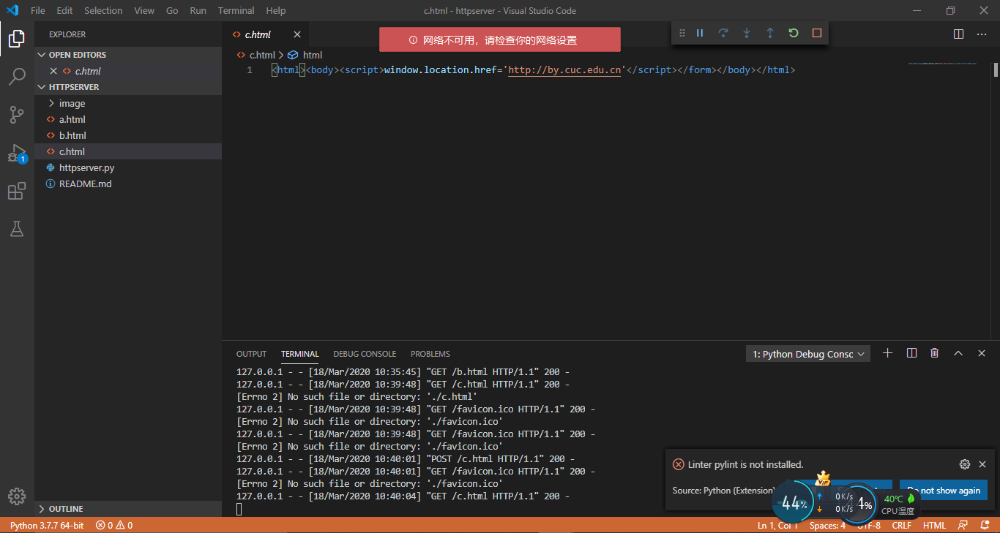
  
+ 接着，我们看一个更严重的漏洞，如果在浏览器中访问`http://127.0.0.1:8080/httpserver.py`，我们能看到如下内容
  
  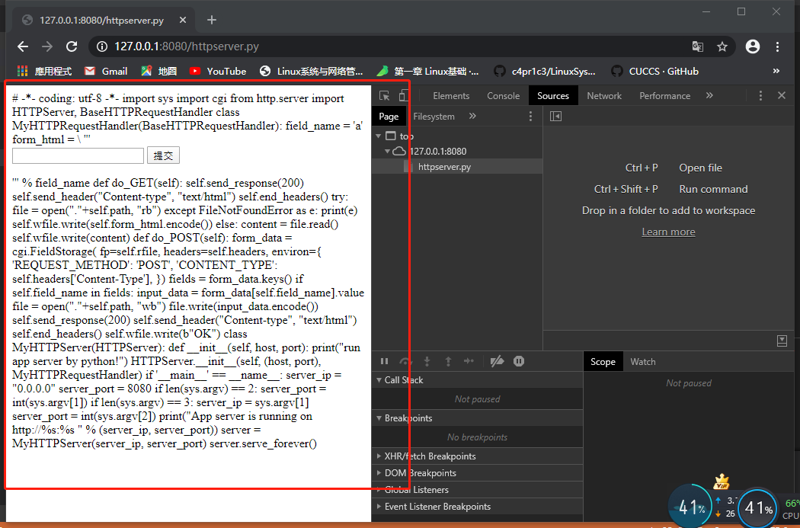
  
+ 是我们的源代码,由于服务器没有做任何过滤，只要是存在的文件，就发送给客户端,源代码文件也发送给了客户端。现在黑客可以知道我整个后台的逻辑了。如果还有一些配置文件，比如数据库地址和访问口令等,那就更严重了。黑客甚至可以注入后端代码，由于我们是回写到文件，你可以构造一个http post请求，把httpserver.py文件改写了，但是构造这个请求用浏览器就不行了，需要采用curl等更基础的工具裸写post请求发送给服务器的。
  
+ 比如，我们输入`hahaha`，把 name="%s" 改为 name="a" 再提交 
  
  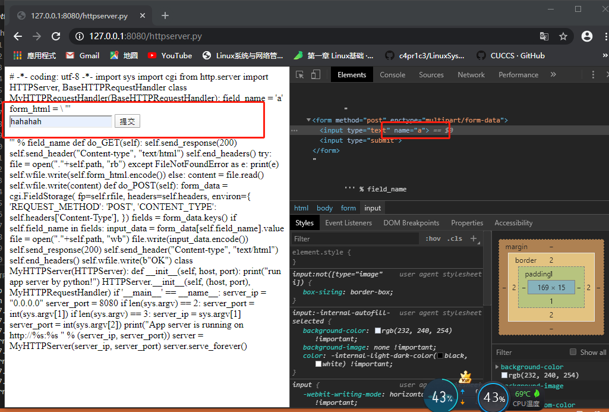
  
+ 则后端的文件内容改为`hahahah`
  
  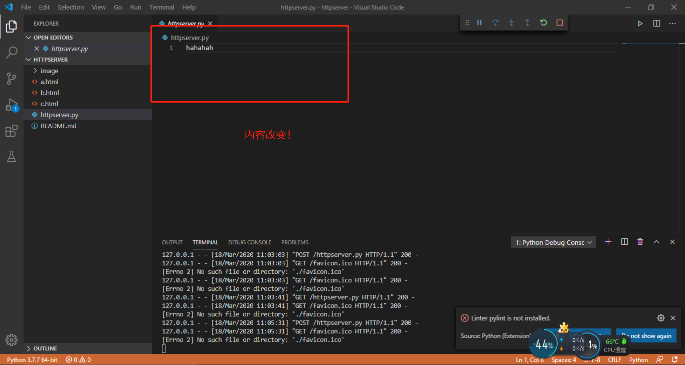
  
+ 综上，这是一个及其简单，但是漏洞百出的web服务器。这就是不做任何过滤，直接写入数据的危害。
  
  
  
  
  
  
  
  
  
  

