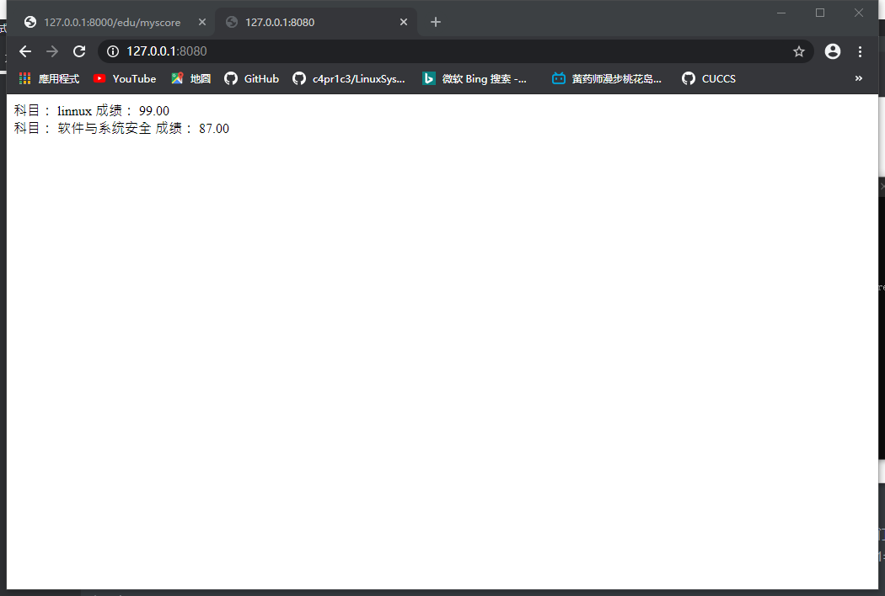
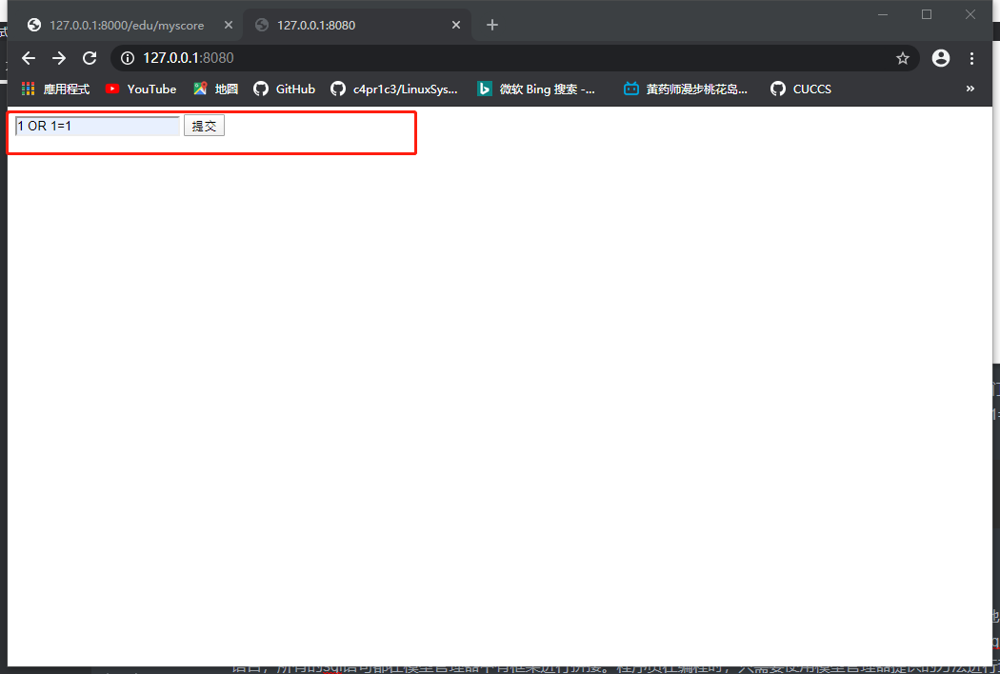
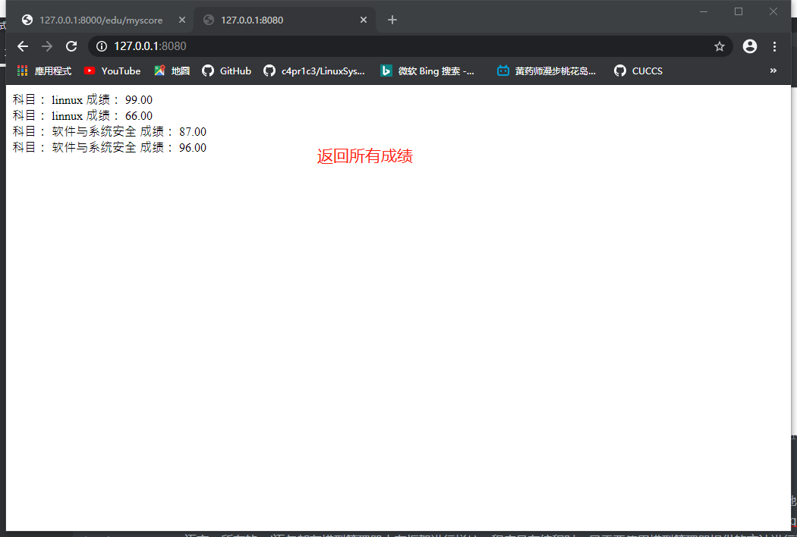

# sql注入

## 实验目的

+ 充分了解sql漏洞的原理及对应解决策略

## 实验原理

+ 客户端（浏览器）和服务端：用户使用浏览器访问服务器，服务器在云端，我们看不见，只有一个域名对应的IP地址。浏览器通过发送请求到服务器，服务器收到请求以后返回响应。
+ 这里面数据的发送和接受，底层是计算机网络的东西的工作。
+ 对web程序来说，主要关心就是这一收一发的过程，Requests and responses 

## 实验步骤

### 原理

+ 使用抓包器，去抓取一次web访问过程中的数据包，分析一下Requests and responses 数据的数据包格式。可以看到在tcp数据包的payload部分是http协议数据包，又分为了headers和body等部分。

+ 发送的Request，最核心的部分是一个url。就是大家通常说的网址。其中/前的部分，是主机地址，会被解析为ip地址。第一个/后的部分为路径和参数。会对应服务器上的文件或者功能。服务器处理完毕了，返回response，而response一般是一个html格式的文本。浏览器，会直接把html渲染为我们所看到的页面的不同样式。html有自己专门的语法。又可以嵌入js和css，用来要求浏览器执行动态的效果，或者根据css的配置，对各种html的内部的标签和元素，显示不同的样式。

+ chrome的开发者工具的 elements、sources和network几个工具可以来分析网页。

  

+ 使用pip安装并启动django（使用清华的源下载提高速度）[官方教程](https://docs.djangoproject.com/en/3.0/intro/tutorial01/)

  ```bash
  pip install -i https://pypi.tuna.tsinghua.edu.cn/simple django
  django-admin startproject mysite
  cd  mysite
  python manage.py startapp polls
  python manage.py runserver
  ```

  

+ 访问 http://127.0.0.1:8000/，可以看到命令行中有请求的消息

  

  

+ 下面，来做一个简单的教务管理系统[编写大型程序的时候，一定要做到mvc分离，m数据模型，我们要先建立基础的底层的数据结构。然后在处理用户输入，构建每个用户输入对应的处理函数。就是c 控制。然后，在底层m数据模型的基础上，绘制用户界面。比如写贪吃蛇游戏，最先做的事情，使用链表来保存蛇和食物的相应的数据，写一些处理这个数据的函数，供上层的c和v来调用。这个叫做封装。]

+ web程序，其实底层思想还是mvc。只是换了个名字，叫mvt。t是页面模板s。写Django的程序，或者任何框架程序。主要就是写三大部分，第一，数据模型，models，第二，views和url。是用户请求对应的处理程序。第三，前端页面模板。处理完的结果如何显示的问题。其中url部分，又称为路由。是吧用户请求的url，对应到处理函数的过程。Django的处理函数，有一个专门名称，叫views。其基本过程就是框架收到用户的request ，其中有URL。框架根据urls.py中的配置。将用户请求对应到一个处理函数。一般在views.py中。

+ views.py中的函数，参数就是request对象，Django中是HttpRequest类。然后views函数需要返回一个HTTPResponse类型的request，Django把这个reqeust变化为http协议的request数据包，返回给浏览器。一般在views的处理过程中，会访问数据库，也就是models。models吧底层的数据库操作，比如sql全部封装为了对象化的处理。比如底层操作数据库是用sql语句，这个大家在数据的课程中学习过。所以我们最原始的web程序，一般会程序员拼装sql语句。但是在Django中不用。我们把这种底层数据的封装，称为orm。（Object-relational Mapper）

+ 下面开始实验，总共需要三张表：课程信息，学生信息，成绩信息

  ```python
  from django.db import models
  from django.contrib.auth.models import AbstractUser
  class Course(models.Model):
      name=models.CharField(verbose_name='课程名',max_length=100)
      number=models.IntegerField(verbose_name='编号',default=0)
      summary=models.CharField(verbose_name='摘要',max_length=500,null=True)
  
  
  class Student(models.Model):
      class_name=models.CharField(verbose_name="班级",max_length=100,blank=True,null=True)
      name=models.CharField(verbose_name="姓名",max_length=100,blank=True,null=True)
      number=models.IntegerField(verbose_name="学号",default=0)
      phone_number=models.CharField(verbose_name='手机号',max_length=11,null=True)
  
  class Score(models.Model):
      course=models.ForeignKey(Course,verbose_name='课程',on_delete=models.CASCADE,related_name='students')
      student=models.ForeignKey(Student,verbose_name='学生',on_delete=models.CASCADE,related_name='my_courses')
      score=models.FloatField(verbose_name='成绩',null=True)
  ```

+ 再建一个app ，比如叫 edu_admin

  ```bash
  python manage.py startapp edu_admin
  python manage.py runserver
  ```

+ 直接放入edu_admin中的models.py

  

+ 我们需要把这个表结构，真实的写入到数据库中。也就是create table的过程。django称为migrate,打开 mysite的settings.py,在  INSTALLED_APPS 这里增加一个 edu_admin

  

+ startapp命令只是创建了app，必须要把app写入到这里，这个app才会被纳入到站点功能中。执行` python .\manage.py makemigrations`和`python .\manage.py migrate`,会出现一个 db.sqlite3，文件，数据库表结构就建立完成了。

  

+ 为了验证Django真的建立了表，我们去下载一个[sqlite](https://www.sqlite.org/download.html)的客户端软件，来看一下它的表结构。把这个exe加入在PATH环境变量，或者放在db.sqlite，然后执行 `sqlite3.exe db.sqlite3`

  

+ 在sqlite中执行`.table`查看所有建好的表

  

+ views是Django功能实现应用功能的地方。如果你想写一个动态的页面，就在views中定义一个函数。最基本的views函数，是收到一个HttpRequest类型的参数，需要返回一个HTTPResponse类型的返回值，下面在edu_admin中的views.py写入一下内容,这个函数就是一个基本的 “处理请求，返回响应”

  ```python
  from django.http import HttpResponse
  def index(request):
      return HttpResponse('<html><body>OK</body></html>')
  ```

  

+ 写好了以后，还没有结束。我们还需要把这个views，对应到一个路径上。也就是客户端如何调用这个views函数对应的功能。因为一个实用的web app只有一个views是不够的，可能有很多很多views,然后我们需要把这些views对应到不懂的url上。这样客户端才能访问。这个工作，是urls.py来完成的。下面我们在urls.py中写如下内容。

  ```python
  from django.urls import path
  from .views import *
  
  urlpatterns = [
       path('index', index),
  ]
  
  ```

  

+ 然后需要再主urls.py，也就是 mysite的urls.py中包括这个url配置。这是为了适应，可能有多个Django app共同工作的情况。

  

+ 有了以上修改，我们就可以运行我们的网站，看看效果了。

  ```python
   python manage.py runserver
  ```

  

+ Run之后访问 127.0.0.1:8000

+ 这个是404页面。说明我们访问的url路径并不存在。

  

+ 访问 http://127.0.0.1:8000/edu/index

  

+ 如果这一步有，就说明我们 urls和views配合工作成功。用户在浏览器中输入路径，django把这个url对应到一个views函数上。views函数处理HttpRequest。返回HttpResponse。

+ 接下来改一下views.py

  ```python
  from django.shortcuts import render
  from django.contrib.auth.decorators import login_required
  from django.http import HttpResponse
  
  from .models import Score
  
  def index(request, pk):
      return HttpResponse('<html><body>hello world %d </body></html>' % pk)
  
  # Create your views here.
  
  @login_required
  def my_score(request):
      result = Score.objects.filter(student=request.user)
      return render(request, 'score.html', {'result': result})
  ```

+ 关键在第5行和第14行。先从models中导入模型类。然后调用这个模型类的objects的filter方法，就完成了一次sql select,filter函数的参数是就相当于查询的过滤条件。

+ 我们要查询的是 student为当前登录用户的Score表的记录

  ```python
  Score.objects.filter(student=request.user)
  ```

+ views写了还不够。我们还需要修改一下模型。Django是有默认的用户管理系统的。用户相关的数据库表结构其实Django已经建立好了。但是我们这里用了student表来作为系统用户。但是我们这里用了student表来作为系统用户。

+ 首先在 models.py中 导入，并继承

  ```python
  from django.contrib.auth.models import AbstractUser #这个是Django默认的用户管理的数据库模型
  ```

  

+ Student继承了AbstractUser后。告诉Django用Student作为系统用户管理的数据库模型。在mysite settings.py也就是整个站点的配置文件中，增加一条。告诉Django，使用 edu_admin 的Student作为用户管理登录授权的模型。

  

+ 代码修改完以后。这里涉及到数据库修改。所以要进行数据库表结构的migrate

  ```python
  python manage.py makemigrations 
  python manage.py migrate
  ```

  

  

+ 我们用Django的方式，先建立一个超级用户

  ```
  python manage.py createsuperuser
  ```

  

+ Django的admin相当于一个数据管理的超级权限后台。可以直接操作数据库。在admin.py中录入以下内容。这样直接就可以生成一个管理数据库的后台页面。

  ```python
  from django.contrib import admin
  
  # Register your models here.
  from .models import Student, Course, Score
  
  class ScoreAdmin ( admin.ModelAdmin ):
      list_display = ('course', 'score', 'student')
  
  admin.site.register(Student)
  admin.site.register(Course)
  admin.site.register(Score, ScoreAdmin)
  
  ```

+ 访问 http://127.0.0.1:8000/admin/ 刚才新建的用户 登录后看到这个页面。

  

  

+ 为了在admin管理的时候，直接显示课程名称，可以给course模型增加一个 __str__方法。这样所有course对象的str ，返回的是name字段。界面显示就是课程名称了。

  

  

+ 当数据库有了值以后。我们就可以在view中验证，我们查询自己成绩的功能是否正常了。views中的@login_required表示需要登录。我们这里已经用超级管理员登录了，所以是可以访问的。

+ render是一个Django内置的函数。用于在模板文件的基础上，通过渲染得到动态的网页效果。其中 score.html是模板,那么还需要一个score.html,在 templates目录下

  ```html
  <html>
  <body>
  
  科目： {{ i.course.name }}
  成绩： {{ i.score }}
  <br>
  
  </body>
  </html>
  ```

+ 这里的result 就是 render传入的result,对每一个result 显示其课程名和分数,大家看到这里的多表查询 (course表中的name）直接. 就调用出来了。模板语言的语法 {{ 变量名 }}

+ 然后访问，应该能得到结果。注意，写了新的views函数，需要增加url,注意，写了新的views函数，需要增加url,这就完成了当前登录用户（超级管理员 admin 同学）的成绩查询。注意，这里我们偷了一个懒，实际情况，并不是每个用户都是超级管理员。需要有普通用户登录注册页面。实际情况下普通用户 是不能访问 127.0.0.1:8000/admin页面的。

  

  

+ 在不使用Django的情况下，我们可以使用更底层的pyhton的sqlite库来编程操作数据库，可以在httpserver.py的基础上，继续编写漏洞。写两个页面，一个是教师录入成绩页面，一个是学生查询成绩页面。教师录入成绩页面表单有三个字段，课程id，学生id，成绩。录入提交以后，httpserver调用sqlite库使用sql语句写入数据库。然后是学生查询成绩表单，学生输入学生id，课程id，httpserver使用sql语句查询成绩后返回给用户。这里不需要做登录功能，课程也用直接输入id而不是下拉菜单的方式，或者其他选择的方式，而是直接输入id。为了体验最原始的web的开发过程。（实战中`sql_injection.py`实现）

  

### 实战

+ 下面是存在sql漏洞的代码

  ```python
  # -*- coding: utf-8 -*-
  
  import sys
  import cgi
  from http.server import HTTPServer, BaseHTTPRequestHandler
  
  
  class MyHTTPRequestHandler(BaseHTTPRequestHandler):
      field_name = 'a'
      form_html = \
          '''
          <html>
          <body>
          <form method='post' enctype='multipart/form-data'>
          <input type='text' name='%s'>
          <input type='submit'>
          </form>
          </body>
          </html>
          ''' % field_name
  
      def do_GET(self):
          self.send_response(200)
          self.send_header("Content-type", "text/html")
          self.end_headers()
          self.wfile.write(self.form_html.encode())
  
  
      def do_POST(self):
          form_data = cgi.FieldStorage(
              fp=self.rfile,
              headers=self.headers,
              environ={
                  'REQUEST_METHOD': 'POST',
                  'CONTENT_TYPE': self.headers['Content-Type'],
              })
          fields = form_data.keys()
          if self.field_name in fields:
              input_data = form_data[self.field_name].value
              # 单表查询，只显示pk，不显示课程名。
              #sql = 'SELECT course_id, score FROM edu_admin_score WHERE student_id = %s' % input_data
              # 多表查询，通过成绩表中课程fk查出课程名。
              sql = 'SELECT edu_admin_course.name, edu_admin_score.score FROM edu_admin_score INNER JOIN edu_admin_course ON edu_admin_score.course_id=edu_admin_course.id WHERE student_id = %s ' % input_data
  
              import sqlite3
              conn = sqlite3.connect('db.sqlite3')
              c = conn.cursor()
              query_result = c.execute(sql)
              response_content = ''
              for i in query_result:
                  #response_content += '科目： %i 成绩： %.2f <br>' % i
                  response_content += '科目： %s 成绩： %.2f <br>' % i
              conn.close()
  
              self.send_response(200)
              self.send_header("Content-type", "text/html;charset=utf-8")
              self.end_headers()
              self.wfile.write(( "<html><body>%s</body></html>" %response_content ).encode('UTF-8') )
  
  
  
  class MyHTTPServer(HTTPServer):
      def __init__(self, host, port):
          print("run app server by python!")
          HTTPServer.__init__(self,  (host, port), MyHTTPRequestHandler)
  
  
  if '__main__' == __name__:
      server_ip = "0.0.0.0"
      server_port = 8080
      if len(sys.argv) == 2:
          server_port = int(sys.argv[1])
      if len(sys.argv) == 3:
          server_ip = sys.argv[1]
          server_port = int(sys.argv[2])
      print("App server is running on http://%s:%s " % (server_ip, server_port))
  
      server = MyHTTPServer(server_ip, server_port)
      server.serve_forever()
  
  ```

+ 运行该文件

  ```bash
  python sql_injections.py
  ```

+ 当然也可以在vscode中调试，我们需要增加launch.json的配置。在调试界面，点击 “增加配置”，选python 当前文件，然后在 launch.json中，会出现一个配置项。

+ 通过直接查询数据库，我们知道当前的用户的ID是1，所以输入1，查询。

  

  

+ 如果输入`1 OR 1=1`则查出了当前系统中所有用户的成绩。相当于整个数据库我都获得了。问题在代码的43行，我们直接把用户输入的数据，作为sql语句中的查询条件。最后的 sql语句为： 查询条件变成了 student_id = 1 OR 1=1,1=1恒为真， 任何数OR真值，也是真

  ```sql
  SELECT edu_admin_course.name, edu_admin_score.score FROM edu_admin_score INNER JOIN edu_admin_course ON edu_admin_score.course_id=edu_admin_course.id WHERE student_id = 1 OR 1=1
  ```

  

  

+ 避免该漏洞有两种方法，一种就是对用户输入进行过滤，比如这里。我们可以判断一下 input_data
   是否数字就可以。用python内置函数 isdigit，就可以判断，但是对于大型的系统，会有很多sql语句拼接和执行的地方。每一个都去过滤，编程效率很低，而且不一定能保证你写的过滤就是对的。ORM完全避免了程序员直接接触sql语言，所有的sql语句都在模型管理器中有框架进行拼接。程序员在编程时，只需要使用模型管理器提供的方法进行查询，创建等，就可以了。比如，我们之前写的Django代码。`result = Score.objects.filter(student=request.user)`底层在进行sql的拼接。Django的模型管理器中，主要有filter get等获取数据的方法。

+ 这些方法返回的数据类型是QuerySet数据类型。这个数据类型是一个数据库访问的接口。在调用filter时，实际上还未查询数据库，只是初步完成了数据库sql语句的拼接。实际的查询是在render中进行的。Django会根据render时需要的具体数据，来精确优化查询语句，所有这里的result，并不是真正的查询结果。而是一个查询对象。

+ 在模板 score.html 我们用到了 数据 {{ i.course.name }},course是 socre表的一个外键，course.name实际是在course表中。所有这里其实是一个跨表查询。这种两个表的跨表查询，我们自己写的sql语言已经比较复杂了。真实系统往往会有多个表的联合跨表查询，sql语句会非常复杂。但是Django处理后，查询数据库的操作就变得非常简单，把数据中的值得访问，编程了python对象的属性访问。

+ 但是，从学习的角度，我们需要知道Django内部是怎么做的，也就是我也需要一些底层的http server的开发原理，比如request response模式，html sql语言，数据库表结构等。底层知识要了解。这有助于我们理解Django的工作原理，学习起来就很快。对一些高级的操作也能比较深入理解。

+ 补充两点 ，student_id = 1; DROP TABLE xxx,这种注入方式，可以获得任意表的数据.在sqlite中，可以用PRAGMA table_info(table_name);取得表项的名字。

  

## 实验参考资料

+ [django官方教程](https://docs.djangoproject.com/en/3.0/intro/tutorial01/)