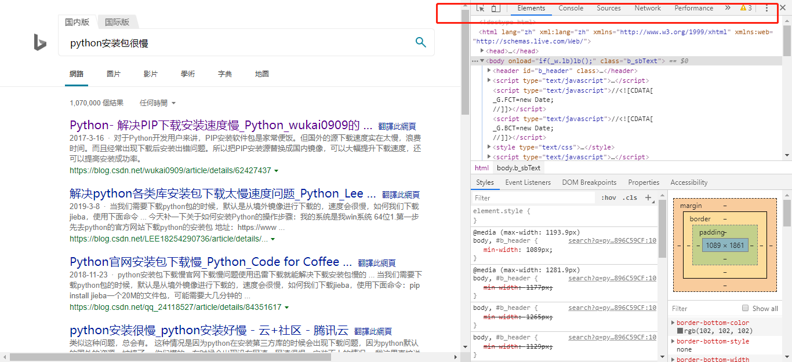
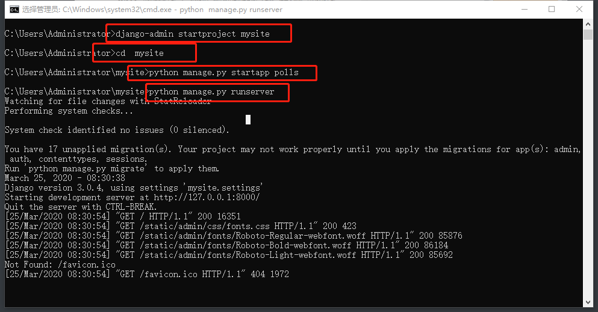
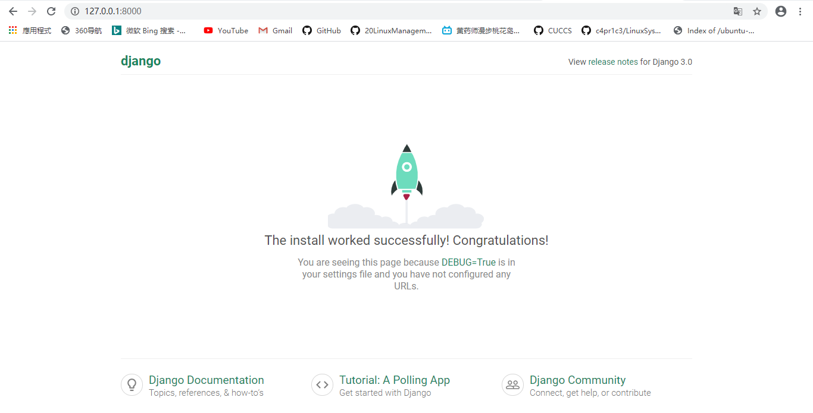
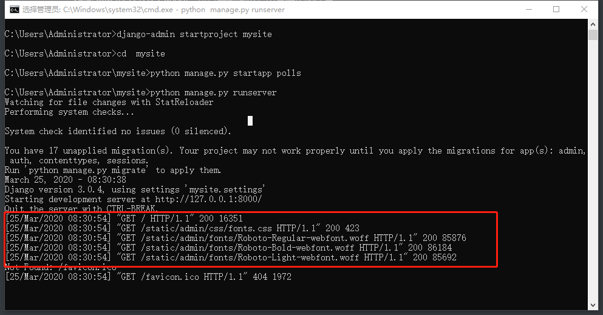
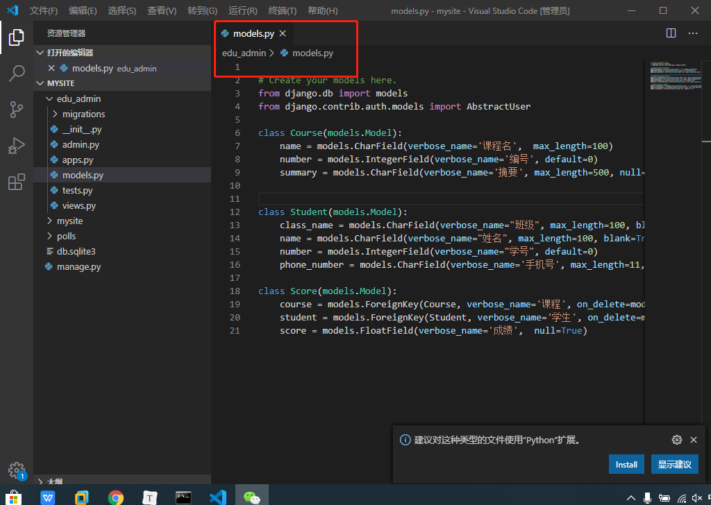
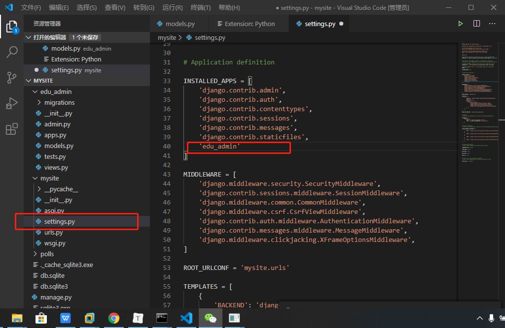
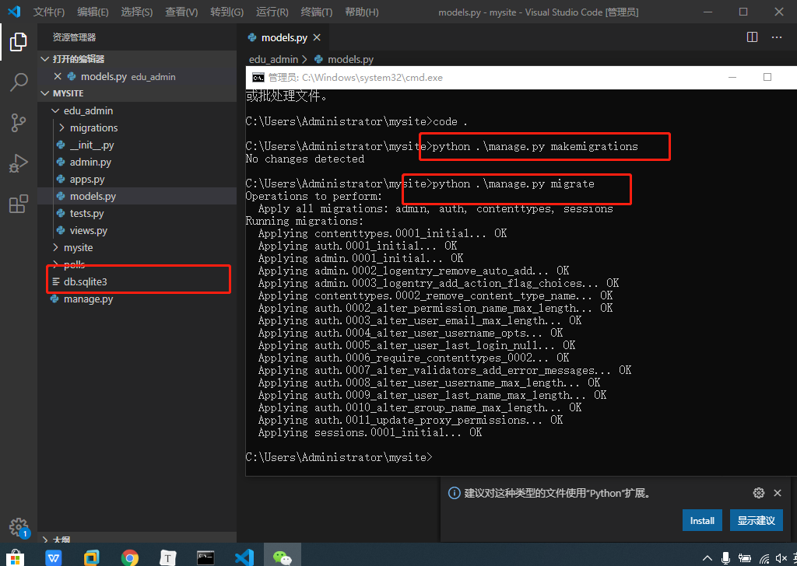
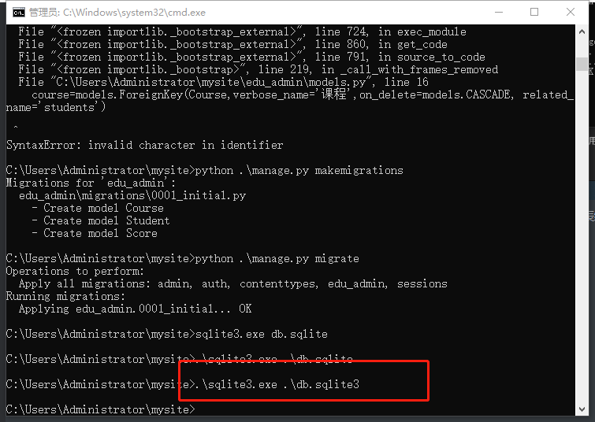
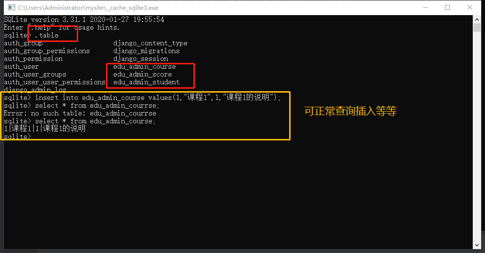

# sql注入

## 实验原理

+ 客户端（浏览器）和服务端：用户使用浏览器访问服务器，服务器在云端，我们看不见，只有一个域名对应的IP地址。浏览器通过发送请求到服务器，服务器收到请求以后返回响应。
+ 这里面数据的发送和接受，底层是计算机网络的东西的工作。
+ 对web程序来说，主要关心就是这一收一发的过程，Requests and responses 

## 实验步骤

+ 使用抓包器，去抓取一次web访问过程中的数据包，分析一下Requests and responses 数据的数据包格式。可以看到在tcp数据包的payload部分是http协议数据包，又分为了headers和body等部分。

+ 发送的Request，最核心的部分是一个url。就是大家通常说的网址。其中/前的部分，是主机地址，会被解析为ip地址。第一个/后的部分为路径和参数。会对应服务器上的文件或者功能。服务器处理完毕了，返回response，而response一般是一个html格式的文本。浏览器，会直接把html渲染为我们所看到的页面的不同样式。html有自己专门的语法。又可以嵌入js和css，用来要求浏览器执行动态的效果，或者根据css的配置，对各种html的内部的标签和元素，显示不同的样式。

+ chrome的开发者工具的 elements、sources和network几个工具可以来分析网页。

  

+ 使用pip安装并启动django（使用清华的源下载提高速度）[官方教程](https://docs.djangoproject.com/en/3.0/intro/tutorial01/)

  ```bash
pip install -i https://pypi.tuna.tsinghua.edu.cn/simple django
  django-admin startproject mysite
  cd  mysite
  python manage.py startapp polls
  python manage.py runserver
  ```
  
  
  
+ 访问 http://127.0.0.1:8000/，可以看到命令行中有请求的消息
  
  
  
  
  
+ 下面，来做一个简单的教务管理系统[编写大型程序的时候，一定要做到mvc分离，m数据模型，我们要先建立基础的底层的数据结构。然后在处理用户输入，构建每个用户输入对应的处理函数。就是c 控制。然后，在底层m数据模型的基础上，绘制用户界面。比如写贪吃蛇游戏，最先做的事情，使用链表来保存蛇和食物的相应的数据，写一些处理这个数据的函数，供上层的c和v来调用。这个叫做封装。]

+ web程序，其实底层思想还是mvc。只是换了个名字，叫mvt。t是页面模板s。写Django的程序，或者任何框架程序。主要就是写三大部分，第一，数据模型，models，第二，views和url。是用户请求对应的处理程序。第三，前端页面模板。处理完的结果如何显示的问题。其中url部分，又称为路由。是吧用户请求的url，对应到处理函数的过程。Django的处理函数，有一个专门名称，叫views。其基本过程就是框架收到用户的request ，其中有URL。框架根据urls.py中的配置。将用户请求对应到一个处理函数。一般在views.py中。

+ views.py中的函数，参数就是request对象，Django中是HttpRequest类。然后views函数需要返回一个HTTPResponse类型的request，Django把这个reqeust变化为http协议的request数据包，返回给浏览器。一般在views的处理过程中，会访问数据库，也就是models。models吧底层的数据库操作，比如sql全部封装为了对象化的处理。比如底层操作数据库是用sql语句，这个大家在数据的课程中学习过。所以我们最原始的web程序，一般会程序员拼装sql语句。但是在Django中不用。我们把这种底层数据的封装，称为orm。（Object-relational Mapper）

+ 下面开始实验，总共需要三张表：课程信息，学生信息，成绩信息

  ```python
  from django.db import models
  from django.contrib.auth.models import AbstractUser
  class Course(models.Model):
      name=models.CharField(verbose_name='课程名',max_length=100)
      number=models.IntegerField(verbose_name='编号',default=0)
      summary=models.CharField(verbose_name='摘要',max_length=500,null=True)
  
  
  class Student(models.Model):
      class_name=models.CharField(verbose_name="班级",max_length=100,blank=True,null=True)
      name=models.CharField(verbose_name="姓名",max_length=100,blank=True,null=True)
      number=models.IntegerField(verbose_name="学号",default=0)
      phone_number=models.CharField(verbose_name='手机号',max_length=11,null=True)
  
  class Score(models.Model):
      course=models.ForeignKey(Course,verbose_name='课程',on_delete=models.CASCADE,related_name='students')
      student=models.ForeignKey(Student,verbose_name='学生',on_delete=models.CASCADE,related_name='my_courses')
      score=models.FloatField(verbose_name='成绩',null=True)
  ```
  
+ 再建一个app ，比如叫 edu_admin

  ```bash
  python manage.py startapp edu_admin
  python manage.py runserver
  ```

+ 直接放入edu_admin中的models.py

  

+ 我们需要把这个表结构，真实的写入到数据库中。也就是create table的过程。django称为migrate,打开 mysite的settings.py,在  INSTALLED_APPS 这里增加一个 edu_admin

  

+ startapp命令只是创建了app，必须要把app写入到这里，这个app才会被纳入到站点功能中。执行` python .\manage.py makemigrations`和`python .\manage.py migrate`,会出现一个 db.sqlite3，文件，数据库表结构就建立完成了。

  
  
+ 为了验证Django真的建立了表，我们去下载一个[sqlite](https://www.sqlite.org/download.html)的客户端软件，来看一下它的表结构。把这个exe加入在PATH环境变量，或者放在db.sqlite，然后执行 `sqlite3.exe db.sqlite3`
  
  
  
+ 在sqlite中执行`.table`查看所有建好的表
  
  
  
+ 在不使用Django的情况下，我们可以使用更底层的pyhton的sqlite库来编程操作数据库。https://docs.python.org/3/library/sqlite3.html。大家可以在上周的httpserver.py的基础上，继续编写漏洞。写两个页面，一个是教师录入成绩页面，一个是学生查询成绩页面。教师录入成绩页面表单有三个字段，课程id，学生id，成绩。录入提交以后，httpserver调用sqlite库使用sql语句写入数据库。然后是学生查询成绩表单，学生输入学生id，课程id，httpserver使用sql语句查询成绩后返回给用户。这里不需要做登录功能，课程也用直接输入id而不是下拉菜单的方式，或者其他选择的方式，而是直接输入id。为了体验最原始的web的开发过程。
  
  
  
  
  
  
  
  
  
  

## 实验参考资料

+ [django官方教程](https://docs.djangoproject.com/en/3.0/intro/tutorial01/)