# 符号执行

## 实验原理

+ 符号执行是一种程序分析技术，和模糊测试的思路不一样，模糊测试是把测试对象当做一个黑盒子，不深入理解内部原理。符号执行是白盒测试技术，是基于程序分析的。或者说是一种程序分析技术，需要解析程序的源码（或者至少是反汇编后的汇编代码）。

+ 符号执行作为一种能够系统性探索程序执行路径的程序分析技术，能有效解决模糊测试冗余测试用例过多和代码覆盖率低这两个问题

+ 符号执行的主要思想是以符号输入代替程序的实际输入，以符号值代替程序运行过程中的实际值，并以符号布尔表达式表示程序中的分支条件。这样，一条程序执行路径就包含了一系列的符号变量、表达式赋值以及约束条件等，程序中的各路径的信息能以符号的形式被完整记录和保存。我们把某条执行路径上的所有分支条件所组成的约束集（Constraint Set）称为路径约束或路径条件（PC, Path Constraint，Path Condition）。符号执行的主要目的是通过对路径约束的求解来判断此条路径的可达性（Feasibility），并能给出执行此条路径的实际测试输入。这个描述有点抽象，简单来说，符号执行的目的是覆盖程序执行的每一个分支。方法就是查看和收集程序执行过程中每一个分支条件的具体条件，把这些具体条件收集起来，变成一个数学的表达式，然后通过一些方法自动化的求解这些表达式，得到满足执行程序的路径的具体的输入的值。就可以覆盖特定的程序分支了。

+ 举个例子

  

+ 左边的是一段示例代码，一共13行，包括两个函数，一个main函数，一个foo函数。程序有两个输入，从外部读入的数据x和y。程序有两个输入，从外部读入的数据x和y。假设在第五行有一个bug。我们的目的是有一种自动化的方法来找出这个bug

+ 前面已经说了Fuzzing技术在某些特定情况下有可能极其小得概率才能覆盖到特定分支，所以Fuzzing技术最大的问题就是代码覆盖率不高。对于穷尽每个执行路径目标来说有点难。那么符号执行在解析代码的情况下，首先把程序的每一个分支画出来。形成一个称为符号执行树的数据结构。这个符号执行树，和程序的控制流图有点类似。但是它要明确每个分支的具体的执行路径条件。

+ 比如第一个分支的执行条件是y>x,第二个分支的执行条件是y<z+10,x和y都是输入数据，在数学上来说，都是未知数。如果我们能够有一种方法，可以求解y>x的一个满足解和一个不满足解。那么是不是就找到了覆盖两个分支的两个测试用例。同样，对第二分支来说，在满足y>x的情况下，同时再满足y<z+10或者不满足 y<z+10，就能得到两个二级分支的具体的输入数据。这里多了一个变量z，通过分析代码发现，z并不是一个新的数据数据，所以他并不是未知数，而是其他未知数赋值而来，所以每一个步，我们都记录下这种赋值关系，形成一个“表达式组”，或者，说得简单点，我们初中的时候学的“不等式组”。

+ 理论上来讲，每一个程序执行的分支，每一个“执行路径”都有一个确定的不等式组作为执行条件。我们称为“约束”。如果能求解到这个不等式组的一个解，那么就可以构造出专门覆盖这条路径的测试数据了。我们称为“约束求解”

+ 这里，对于我们想要找的那个bug，第五行的代码。最终形成一个这样的“约束条件”

  

+ 下面的问题就是如何求解这个约束。我们的目的当时是自动化求解，不是人工求解。而且我们的目的是得到一个满足解即可，不用得到解析解。也就是只需要得到一个满足这个不等式组的具体的值，就等达到目的。

+ 如果我们把每一个路径的约束全部求解一遍，那么我们就能得到100%代码覆盖率的测试数据集。能够充分测试一个软件，找出软件中所有潜在的bug和漏洞。

+ 符号执行技术在上个世纪70年代被提出之后，受限于当时计算机的计算能力和约束求解技术的不足，并没有取得太大的进展。近年来，由于可满足模理论(SMT)研究以及动态符号执行技术的提出和应用使得符号执行技术研究有了革命性的进展，并已经被学术界和业界广泛应用于软件测试、漏洞挖掘、模型验证等领域。但是我们一直找不到一种自动化求解约束表达式的方法，所以也停留在理论层面。但是最近十几二十年情况不一样了。

+ 我们有了一种新的方法，并且开发出了工具，可以做到了。抽象一点，布尔可满足性问题（SAT，Boolean Satisfiability Problem），又称为命题可满足性问题（Propositional Satisfiability Problem），通常缩写为SATISFIABILITY或者SAT。布尔可满足性问题主要作用是在使用某种特定的语言描述对象（变量）的约束条件时，求解出能够满足所有约束条件的每个变量的值。SAT求解器已经被用于解决模型检查、形式化验证和其它包括成千上万变量和约束条件的复杂问题。但SAT问题是个NP完全问题，具有比较高的复杂度，且直接使用SAT求解器对程序进行分析的话需要需将问题转化为CNF形式的布尔公式，这给转化工作带来很大的困难。

+ 学过算法复杂度的同学知道，数学家已经证明了所有的NPC问题，都可以转化为SAT问题，后来发现一种算法，可以缓解这个问题，并在一定程度上求解。具体算法我们不用去深入了解，因为前人已经开发出工具了，简而言之是一种基于多维空间收敛搜索的方法。这个工具呢，我们称为 SAT 求解器。或者他的变种SMT 求解器。

+ 可满足模理论(SMT，Satisfiability Modulo Theories)主要用于自动化推论（演绎），学习方法，为了检查对于一些逻辑理论T的一阶公式的可满足性而提出的。SMT技术主要用于支持可推论的软件验证，在计算机科学领域已经被广泛应用于模型检测（Model Checking），自动化测试生成等。可以被用于检查基于一种或多种理论的逻辑公式的可满足性问题。典型的应用理论主要包括了各种形式的算术运算（Formalizations of Various Forms of Arithmetic），数组（Arrays），有限集（Finite Sets），比特向量（Bit Vectors），代数数据类型（Algebraic Datatypes），字符串（Strings），浮点数（Floating Point Numbers），以及各种理论的结合等。
  相对于SAT求解器，而言SMT求解器不仅仅支持布尔运算符，而且在使用SMT求解器的解决问题的时候不需要把问题转化成复杂的CNF范式，这使得问题得以简化。

+ 不过说白了就是一个结论，上面我们总结出来的“约束求解”问题有自动化的方法了，而且已经有人开发了工具了。

  

+ 其中比较优秀的是Z3，微软研究院开发的。

+ 来看[具体例子](https://rise4fun.com/z3)，约束求解器是怎么用到。

+ 打开网页以后，先看到左上。

  

+ 这个是SMT 求解器使用的一种描述语言。来描述变量之间的约束关系。

+ 我们来简化一下。

  

  ```c
  ; This example illustrates basic arithmetic and 
  ; uninterpreted functions
  
  (declare-fun x () Int)
  (declare-fun y () Int)
  (declare-fun z () Int)
  (assert (>= (* 2 x) (+ y z)))
  (assert (= x y))
  (check-sat)
  (get-model)
  (exit)
  ```

+ 这个formula呢，按照工具的要求语法，写成一种固定的形式。一二行是注释，3、4、5三行相当于定义了三个变量。这三个变量都是Int型的。7、8两行就是定义了两个约束。运算符写在前面，运算数写在后面。第一个约束表达式实际是。2*x >= y+z 9 10 11行是要求求解器做三个具体的事情。第一个是检测是否这个表达式是否满足。也就是有解还是没有解。当然会有没有解的表达式组的。例如 x>y and x<y 不管xy怎么取值，都没有解。就是一个不满足的情况。

+ 那么我们这个例子中，工具给出的结果是满足 sat。然后是要 get-model，其实就是得到解。一个具体的满足解。然后求解器给出了x=0 y=0 z=0就能满足两个约束。11行就简单了，告诉求解器，工作做完了可以退出。有了这个工具，之前图里的那个例子就能自动化了。

+ SMT-LIB（The satisfiability modulo theories library）自从2003年开始发起的为SMT理论研究提供标准化支持的项目，旨在促进SMT理论的研究和开发。SMT-LIB的目的主要如下：为SMT系统提供标准化严谨的背景理论描述；发展和促进SMT求解器的输入和输出语言；为SMT求解器研究团队建立和提供大型测试集library等。
  定义 如果对于用户声明(declare)的常量和函数，存在一个解（interpretation0能使全局栈里面的所有的公式集（the set of formulas）为true，则我们称这些公式集是可满足（satisfiable）的。

+ 再举个例子

  

+ 这个为SMT-LIB V2语言在实际约束求解中的应用。其中declare-fun 命令用于声明一个函数，当函数里面参数为空时，表示声明一个符号常量；assert命令用于添加一个约束式formula到SMT全局栈里面；check-sat 命令决定在栈里面的公式（formulas)是否是可满足的，如果是，则返回sat，如果不满足（not satisfiable，即unsatisfiable)，则返回unsat，如果求解器无法根据已有的formula决定是否满足，则返回unknown；get-value命令用于在check-sat命令返回的结果是sat的前提下获取满足使SMT求解器全局栈中所有formulas为true的其中的一个解。当前很多非常著名的软件测试工具都采用了符号执行技术，而且已经有很大一部分开放了源代码。例如：NASA的Symbolic (Java) PathFinder，伊利诺大学香槟分校（UIUC）的 CUTE和jCUTE，斯坦福大学（Stanford）的 KLEE, 加利福尼亚大学伯克利分校（UC Berkeley）的 CREST和 BitBlaze，瑞士洛桑联邦理工学院（EPEL）的S2E，卡内基梅隆大学（CMU）的Mayhem和Mergepoint，加利福尼亚大学圣巴巴拉分校（UC Santa Barbara）的angr等。
  在工业领域也有符号执行工具被广泛使用，如Microsoft(Pex, SAGE, YOGI和PREfix), IBM (Apollo), NASA 和Fujitsu的 (Symbolic PathFinder)等。可以看出来，符号执行确实是计算机领域一个非常重要的研究点。很多著名大学都在研究这个东西。

+ 上面说了这么多符号执行工具，这些工具是把我们刚才说的整个过程都实现了：根据代码生成符号执行树->收集路径的约束->转为SMT-LIB格式->输入给约束求解器->验证路径可达或者不可达，可达的情况下获得解->根据解自动构造输入数据,但是不同的符号执行工具在实现时有不同比如KLEE，只能分析C源码程序。后续的一些工具可以分析二进制程序。

+ KLEE是开源的，而且比较成熟[文档](https://klee.github.io/)比较多，我们来学习一下。

+ KLEE能实现全自动化，唯一的缺点是需要在程序中进行少量的修改。这个 klee_make_symbolic(&a, sizeof(a), "a");的作用就是a标记为需要求解的输入数据。

  

+  BitBlaze还有一些后续工具，能够实现输入数据的自动识别，更高级一些。使用KLEE一共就几个步骤：准备一份源码，标记要分析的输入数据，编译，使用KLEE来运行编译后的程序，得到KLEE自动生成的测试用例。最后把所有输入测试用例循环输入给被测试程序，完成自动测试。

+ 按照[官方的教程](https://klee.github.io/tutorials/testing-function/)，做一遍，比较简单,环境是Linux

+ [自动走迷宫](https://github.com/grese/klee-maze)

+ 符号执行的主要问题。

  + 当程序中有循环的时候，按照符号执行树，每一个分支条件都是需要展开。这会造成程序的路径非常多。循环是程序的一个基本结构，普遍存在的。这种情况要遍历每一个路径，实际路径数量会非常巨大。造成消耗的时间不可行。这个问题称为路径爆炸，路径的数据量是分支数量的指数级。循环更加强了这个问题。还有当程序路径非常多，输入变量非常多的时候，会超过SMT求解的求解能力。所以对大型程序，目前符号执行只是一种辅助性的手段。但是这种技术是有前景的，随着计算能力的增强，算法的优化和改进，未来可能成为程序分析、程序自动化测试和程序安全性分析的主要的形式化的方法。

+ 最后补充一点，KLEE当然不是使用的在线版本的示例性质的约束求解器。而是直接调用本地的二进制程序。Windows和Linux下都有Z3的可执行程序，Windows系统中是z3.exe，可以在官网下载。


## 课后实验

+ 作业：安装KLEE，完成官方tutorials。至少完成前三个，有时间的同学可以完成全部一共7个

  + 实验环境：virtualbox+ubuntu16.04 server

  + 安装`docker`

    ```bash
    #更新apt包索引：
    $ sudo apt-get update
  #安装以下包以使apt可以通过HTTPS使用存储库（repository）：
    $ sudo apt-get install -y apt-transport-https ca-certificates curl software-properties-common
  #添加Docker官方的GPG密钥：
    $ curl -fsSL https://download.docker.com/linux/ubuntu/gpg | sudo apt-key add -
    #使用下面的命令来设置stable存储库：
    $ sudo add-apt-repository "deb [arch=amd64] https://download.docker.com/linux/ubuntu $(lsb_release -cs) stable"
    #再更新一下apt包索引：
    $ sudo apt-get update
    #安装最新版本的Docker CE：（需要一定时间）
  $ sudo apt-get install -y docker-ce
    ```

    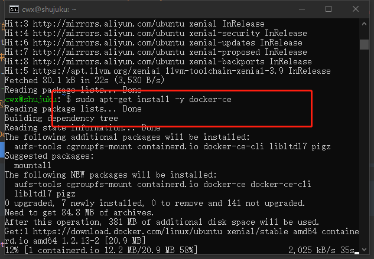

  + 验证docker安装成功
  
    ```bash
    #查看docker服务是否启动：
    $ systemctl status docker
    #若未启动，则启动docker服务：
    $ sudo systemctl start docker
    #经典的hello world：
    $ sudo docker run hello-world
    ```
  
  + 在`docker`中安装`klee`
  
    ```bash
    # 启动 docker
  systemctl start docker
    # 安装 KLEE
    docker pull klee/klee:2.0
    
    # 创建一个临时容器
    docker run --rm -ti --ulimit='stack=-1:-1' klee/klee:2.0
    
    # 创建一个长期容器
    docker run -ti --name=klee_container --ulimit='stack=-1:-1' klee/klee
    # 退出后可通过名字再次进入
    docker start -ai klee_container
    # 删除长期容器
    docker rm klee_container
    ```
    
  
  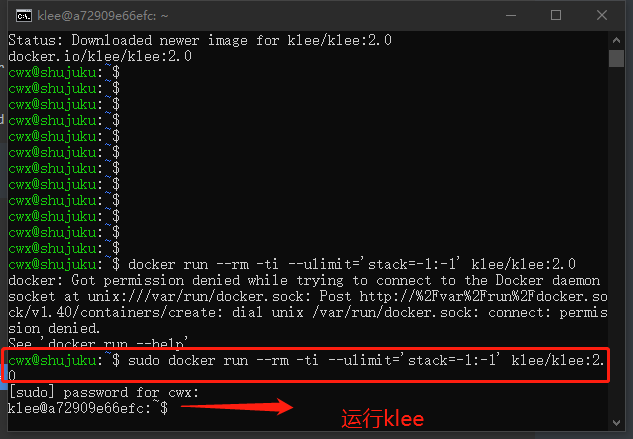
  

### tutorial 1: Testing a small function.


  + 运行官方 tutorial:（新建了一个klee用户便于实验，且环境是新搭建的）
  
  + 这个实例完整程序如下，在 `/klee_src/examples/get_sign` 目录下，用来判断一个整数的正，负，或者为0.
  
    ```c
    
    #include <klee/klee.h>
     
    int get_sign(int x) {
      if (x == 0)
         return 0;
      
      if (x < 0)
         return -1;
      else 
         return 1;
    } 
     
    int main() {
      int a;
      klee_make_symbolic(&a, sizeof(a), "a");
      return get_sign(a);
    }
    
    ```
  
  + 其中，klee_make_sybolic是KLEE自带的函数，用来产生符号化的输入。因为KLEE是在LLVM字节码上进行工作，所以我们首先需要将.c编译为LLVM字节码。首先，我们进入到该文件目录（~/klee_src/examples/get_sign）下执行命令
  
    ```bash
    clang -I ../../include -emit-llvm -c -g -O0 -Xclang -disable-O0-optnone get_sign.c
    ```

  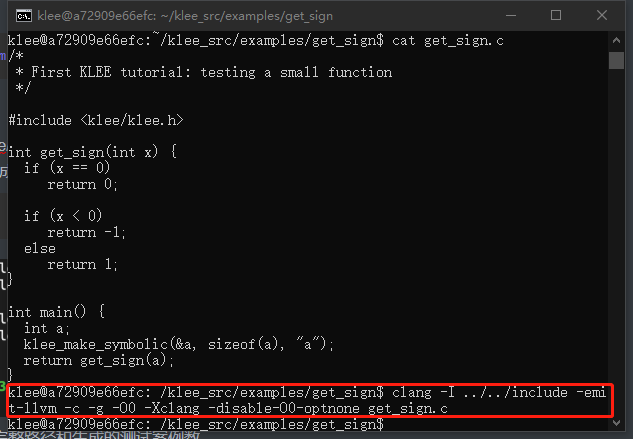

  + 其中，参数-I是为了编译器找到头文件klee/klee.h,-g是为了在字节码文件中添加debug信息，还有后面的，具体不深究，按照官网推荐来。同目录下我们会生成一个get-sign.bc的字节码文件，然后进行测试：
  
    ```bash
    $ klee get_sign.bc
    ```
  
    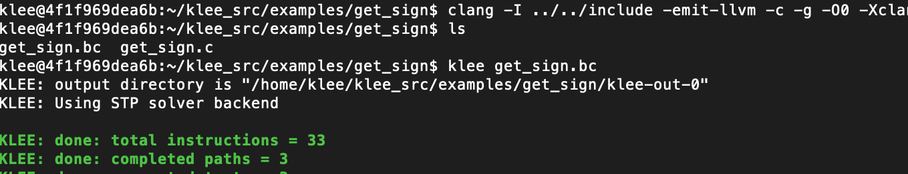
    
  + 可以看到结果中KLEE给出了总指令数，完整路径和生成的测试案例数。
  
  + 最后，我们看当前目录下多生成了两个文件：**klee-last** 和 **klee-out-0。**其中klee-out-0是本次测试结果，klee-last是最新测试结果，每次测试后覆盖。
  
    
  
  + 符号化输入,为了利用KLEE测试这个函数，首先需要设置符号化输入，也就是把输入变量符号化。这里用到 klee_make_symbolic() 函数，该函数输入三个参数，分别是变量地址、变量大小、变量名（这个名可以自己随便取，就是用作标识）。之后设置一个main函数，调用klee-make-symbolic函数，再利用符号化的输入变量调用所要测试的函数get_sign。具体main函数的定义如下：
  
    ```c
    int main() {
      int a;
      klee_make_symbolic(&a, sizeof(a), "a");
      return get_sign(a);
    }
    ```

  +  从中可以看出，该测试函数有3条路径，并且为每一条路径都生成了一个测试例。KLEE执行输出信息都在文件klee-out-N中，不过最近一次的执行生成的目录由klee-last快捷方式指向。查看生成的文件：
  
    ```bash
    $ ls klee-last/
        assembly.ll      run.istats       test000002.ktest
        info             run.stats        test000003.ktest
        messages.txt     test000001.ktest warnings.txt
    ```

  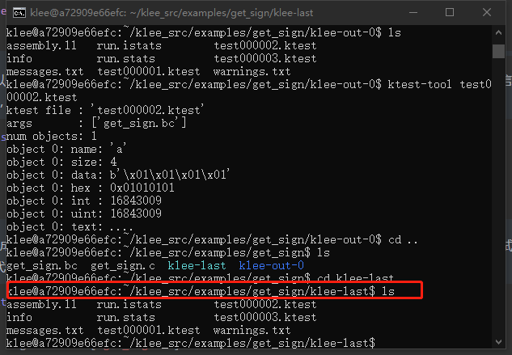

  + KLEE生成的测试例查看,扩展名为.ktest的都是生成的测试例，这个程序有三条path，所以三个测试例，这些文件都是二进制代码，可以用ktest-tool命令查看，具体如下：
  
    ```bash
    $klee@a72909e66efc:~/klee_src/examples/get_sign/klee-out-0$ ktest-tool test000001.ktest
    ktest file : 'test000001.ktest'
    args       : ['get_sign.bc']
    num objects: 1
    object 0: name: 'a'
    object 0: size: 4
    object 0: data: b'\x00\x00\x00\x00'
    object 0: hex : 0x00000000
    object 0: int : 0
    object 0: uint: 0
    object 0: text: ....
    $klee@a72909e66efc:~/klee_src/examples/get_sign/klee-out-0$ ktest-tool test000002.ktest
    ktest file : 'test000002.ktest'
    args       : ['get_sign.bc']
    num objects: 1
    object 0: name: 'a'
    object 0: size: 4
    object 0: data: b'\x01\x01\x01\x01'
    object 0: hex : 0x01010101
    object 0: int : 16843009
    object 0: uint: 16843009
    object 0: text: ....
    $klee@a72909e66efc:~/klee_src/examples/get_sign/klee-out-0$ ktest-tool test000003.ktest
    ktest file : 'test000003.ktest'
    args       : ['get_sign.bc']
    num objects: 1
    object 0: name: 'a'
    object 0: size: 4
    object 0: data: b'\x00\x00\x00\x80'
    object 0: hex : 0x00000080
    object 0: int : -2147483648
    object 0: uint: 2147483648
    object 0: text: ....
    ```

  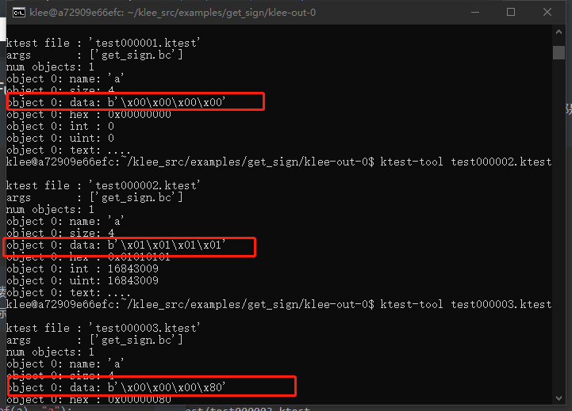

  +  很明显的可以看到，每一个路径对应的输入变量值
  
  + 利用测试例运行程序, 用生成的测试例作为输入运行程序，命令及结果如下：
  
    ```bash
    # 设置除默认路径外查找动态链接库的路径
    $ export LD_LIBRARY_PATH=path-to-klee-root/Release+Asserts/lib/:$LD_LIBRARY_PATH
    $ export LD_LIBRARY_PATH=~/klee_build/lib/:$LD_LIBRARY_PATH
     #LD_LIBRARY_PATH中的path-to-klee-root需要用具体的路径代替，后面的也一样
     # 将程序与 libkleeRuntest 库链接
    $ gcc -L path-to-klee-root/Release+Asserts/lib/ get_sign.c -lkleeRuntest
    $ gcc -I ../../include -L /home/klee/klee_build/lib/ get_sign.c -lkleeRuntest
            #gcc编译生成a.out，一个可执行程序，然后用下面的方式指定其输入为test000001.ktest。
    
        $ KTEST_FILE=klee-last/test000001.ktest ./a.out
        $ echo $?
    
            #查看返回值
        1
        $ KTEST_FILE=klee-last/test000002.ktest ./a.out
        $ echo $?
    
            #255实际上对应的是-1
        255
        $ KTEST_FILE=klee-last/test000003.ktest ./a.out
        $ echo $?
      0
    
    ```


​    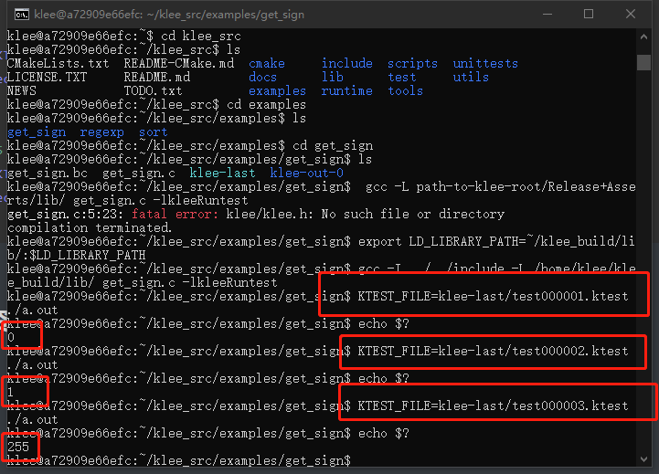

### tutorial 2: Testing a simple regular expression library.

+ 示例代码`Regexp.c`位于`/home/klee/klee_src/examples/regexp`目录下，进入该目录下

+ 将 C 语言文件编译转化为 LLVM bitcode

  ```bash
  clang -I ../../include -emit-llvm -c -g -O0 -Xclang -disable-O0-optnone Regexp.c
  ```

+ 使用 KLEE 运行代码：

  ```bash
  klee --only-output-states-covering-new Regexp.bc
  ```

  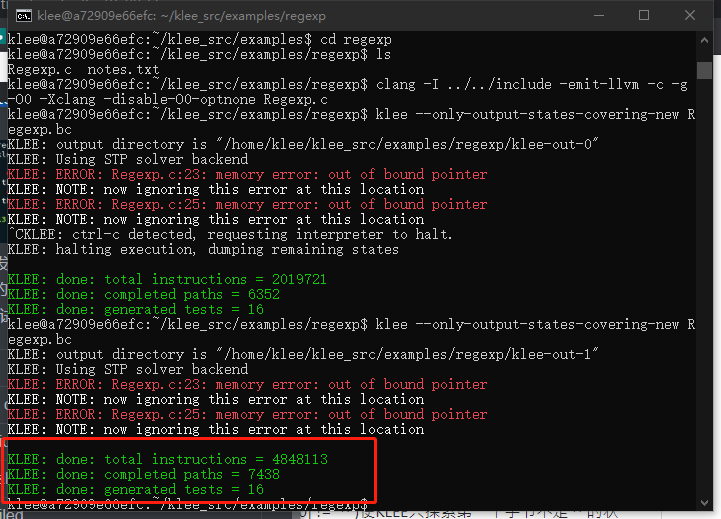

+ KLEE 在程序执行时发现了错误，就会生成能触发错误的测试用例，并将关于错误的附加信息写入文件`testN.TYPE.err`（`N`是测试样例编号，`TYPE`指明错误类型）,上图红色部分显示23、25行出现了报错，查看报错信息，分析：出现内存错误，不是因为正则表达式函数有一个错误，而是测试驱动程序有一个错误。因为输入的正则表达式序列完全是符号的，但是match函数期望它是一个以null结尾的字符串。

  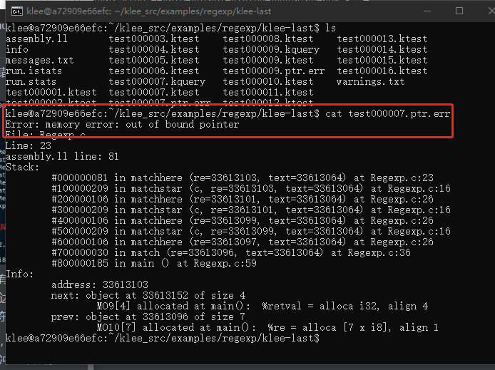

+ 解决方式：将' \0 '符号化后存储在缓冲区的末尾。修改代码如下

  ```c
  int main() {
    // The input regular expression.
    char re[SIZE];
  
    // Make the input symbolic.
    klee_make_symbolic(re, sizeof re, "re");
    re[SIZE - 1] = '\0';
  
    // Try to match against a constant string "hello".
    match(re, "hello");
  
    return 0;
  }
  ```

  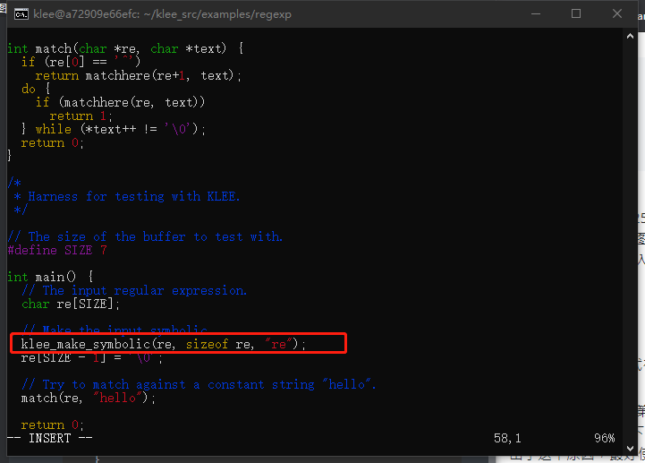

+ 再次编译链接，发现错误解决，执行成功

  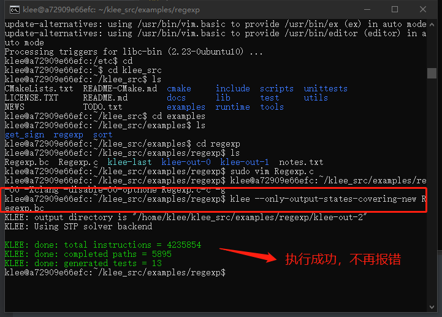


### tutorial 3:Solving a maze with KLEE

+  这是一个11*7的迷宫问题，程序中故意在迷宫的第二行开了一个后门。KLEE通过符号执行找到了所有的解（包括陷阱）。通过这个例子可以完全看到KLEE符号执行的过程，首先是按照符号变量的size每一个字节都是符号值，然后从第一个字节开始一个一个地试验具体值（本例中实验的顺序w->a->d->s,且这4个都会试个遍，然后保存所有可行的具体值，再次基础上在再试验第二个字节，如此下去，知道实验完所有的字节，也就找到了所有的可行路径。）


+ 首先要下载迷宫的程序

  ```bash
  # Update aptitude 
  sudo apt-get update
  # Install git 
  sudo apt-get install -y git-core
  # Download maze 
  git clone https://github.com/grese/klee-maze.git ~/maze
  
  
  # Build & Run Maze
  # Source is in maze.c.
  cd ~/maze
  
  #Build: 
  gcc maze.c -o maze
  #Run manually: 
  ./maze
  #Input a string of "moves" and press "enter"
  #Allowed moves: w (up), d (right), s (down), a (left)
  #Example solution: ssssddddwwaawwddddssssddwwww
  #Run w/solution: 
  cat solution.txt | ./maze
  ```

  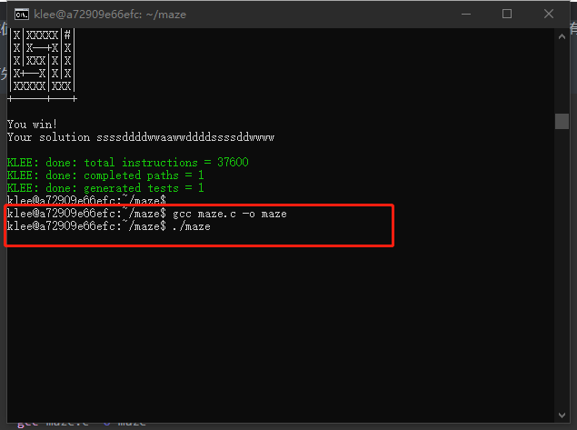

  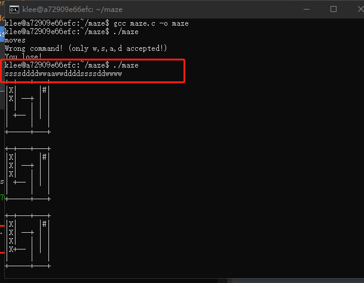

  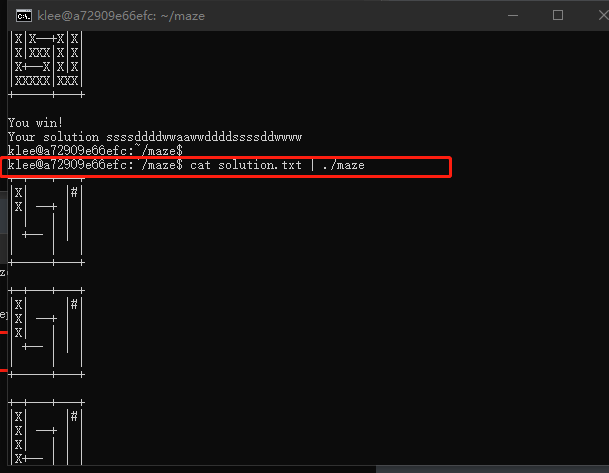

+ 通过修改源代码，把用户输入改为符号测试，看到所有的测试用例,将read调用改成klee_make_symbolic，在`printf ("You win!\n");`这个语句之后增加一个`klee_assert(0);`，这样每次成功就会又一次assert

  ```c
  /**
   * maze_klee.c
   * The maze from maze.c with Klee "symbolic execution" 
   * and "assertions" added.
   * 
   * Create LLVM bytecode: ./build_bc.sh
   * 
   * Run with Klee: ./run_klee.sh
   * 
   * Find solutions: ./show_solutions.sh
   */
  
  #include <klee/klee.h>
  #include <stdlib.h>
  #include <stdio.h>
  #include <unistd.h>
  
  #define H 7
  #define W 11
  #define ITERS 28
  
  char maze[H][W] = {
      "+-+---+---+",
      "| |     |#|",
      "| | --+ | |",
      "| |   | | |",
      "| +-- | | |",
      "|     |   |",
      "+-----+---+"
  };
  
  void draw ()
  {
      int i, j;
      for (i = 0; i < H; i++)
      {
          for (j = 0; j < W; j++)
          {
              printf("%c", maze[i][j]);
          }
          printf("\n");
      }
      printf("\n");
  }
  
  int main (int argc, char *argv[])
  {
      int x = 1, y = 1;    //Player position
      int ox, oy;          //Old player position
      int i = 0;           //Iteration number
      char program[ITERS];
  
      maze[y][x] = 'X';
  
      // Use Klee's symbolic execution
      klee_make_symbolic(program, ITERS, "program");
  
      while(i < ITERS)
      {
          //Save old player position
          ox = x;
          oy = y;
  
          switch (program[i])
          {
          case 'w':
              y--;
              break;
          case 's':
              y++;
              break;
          case 'a':
              x--;
              break;
          case 'd':
              x++;
              break;
          default:
              printf("Wrong command! (only w,s,a,d accepted!)\n");
              printf("You lose!\n");
              exit(-1);
          }
  
          if (maze[y][x] == '#')
          {
              printf("You win!\n");
              printf("Your solution %s\n", program);
              klee_assert(0); // Klee assertion identifies the win
              exit(1);
          }
  
          if (maze[y][x] != ' ' && !((y == 2 && maze[y][x] == '|' && x > 0 && x < W)))
          {
              x = ox;
              y = oy;
          }
  
          if (ox==x && oy==y)
          {
              printf("You lose\n");
              exit(-2);
          }
  
          maze[y][x]='X';
          draw();    //draw it
  
          i++;
          sleep(1);    //wait for next input
      }
  
      printf("You lose\n");
  }
  ```

  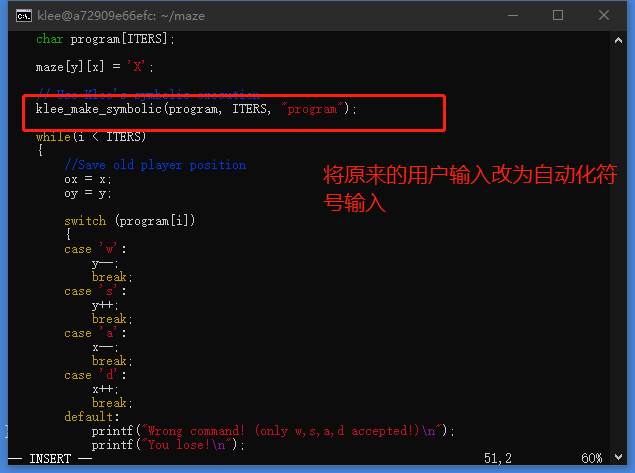

+ 接下来对修改后的源文件进行编译测试，可以得到所有成功以及失败的例子，并在`show_solutions.sh`中看到成功的例子

  ```bash
  cd ~/maze
  #Build LLVM Bytecode: 
  ./scripts/build_bc.sh #(builds "maze_klee.bc" using "clang -emit-llvm")
  #Ignore the "implicit declaration of function '__assert_fail'" warning.
  #Run Klee on Bytecode: 
  ./scripts/run_klee.sh #(runs klee on "maze_klee.bc" using "--emit-all-errors")
  #Show solutions: 
  ./scripts/show_solutions.sh #(gets klee test results from "ktest-tool", and prints maze solutions)
  klee@a72909e66efc:~/maze$ ./scripts/show_solutions.sh
  
  TESTID       SOLUTION
  test000135:  sddwddddsddw................
  test000211:  ssssddddwwaawwddddsddw......
  test000251:  sddwddddssssddwwww..........
  test000301:  ssssddddwwaawwddddssssddwwww
  ```

  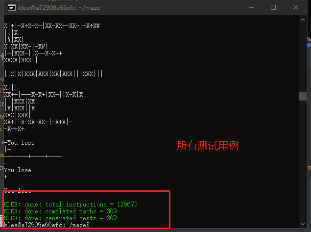

  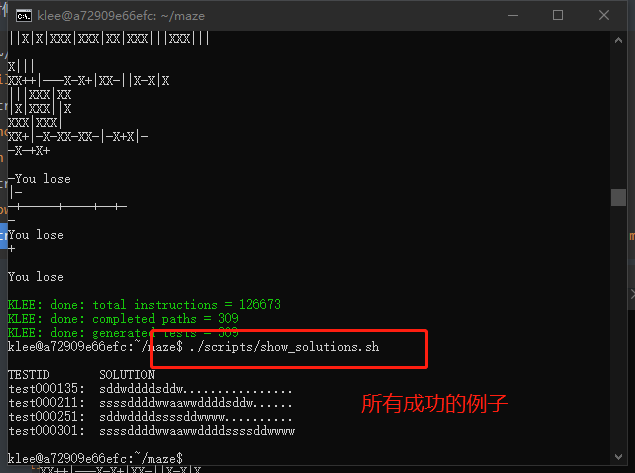

+ 再使用刚刚获得的四个例子去测试，发现均能`win`，说明符号执行确实成功了
  
  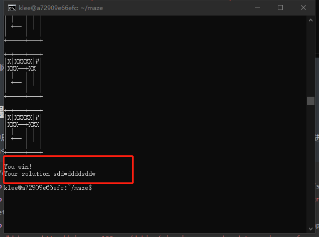
  
  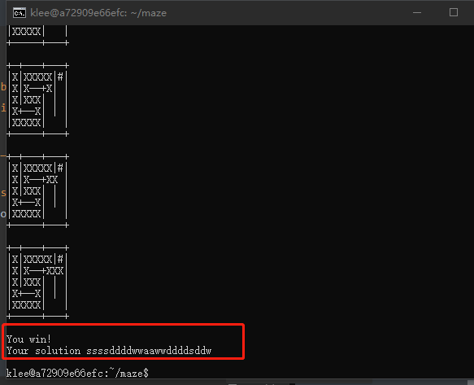
  
  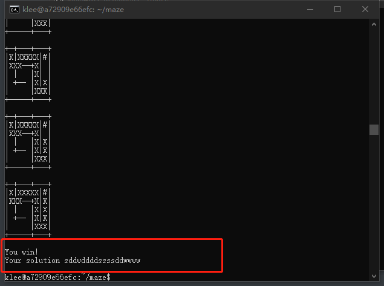
  
  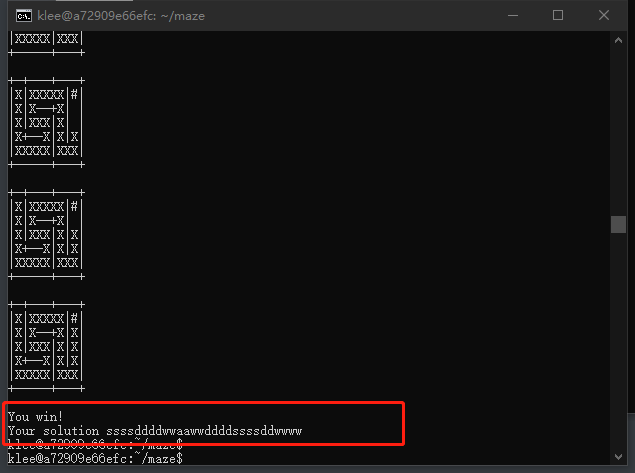
  
  
  
+ 下面是操作的录屏
  
  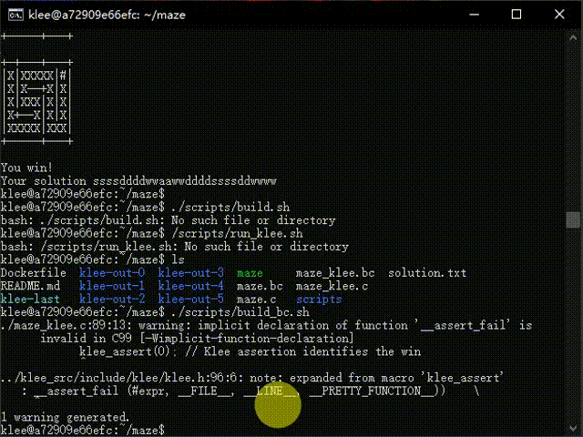
  
  
  
  
  
  

## 实验所遇问题

+ docker中居然没有自带`vim`，安装`vim`又需要apt update，这又需要换源，换源又需要用到`vim`，进入了死循环，输入以下命令解决

  ```bash
  mv /etc/apt/sources.list /etc/apt/sources.list.bak
  echo "deb http://mirrors.163.com/debian/ jessie main non-free contrib" >> /etc/apt/sources.list
  echo "deb http://mirrors.163.com/debian/ jessie-proposed-updates main non-free contrib" >>/etc/apt/sources.list
  echo "deb-src http://mirrors.163.com/debian/ jessie main non-free contrib" >>/etc/apt/sources.list
  echo "deb-src http://mirrors.163.com/debian/ jessie-proposed-updates main non-free contrib" >>/etc/apt/sources.list
  ```

  


## 实验参考资料

+ [klee安装](https://blog.csdn.net/goto2091/article/details/86602063)
+ [编译klee](https://blog.csdn.net/melissa_cjt/article/details/74995527)
+ [apt-get出错](https://blog.csdn.net/zyxlinux888/article/details/6358615)
+ [klee教程](https://blog.csdn.net/qq_26736193/article/details/103455451)
+ [安装docker](https://www.cnblogs.com/jiyang2008/p/9014960.html)
+ [docker下载包出错](https://blog.csdn.net/qq_37189082/article/details/100047697)
+ [klee-maze](https://github.com/grese/klee-maze)