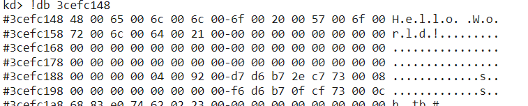

# 缓冲区溢出漏洞（内存）

## 实验目的

+ 理解缓冲区溢出漏洞底层原理

## 实验步骤

### 原理

+ 先观察下面的代码

  ```c
  int main() 
  {
   char* a = malloc(100);
   a[101] = 'a';
  }
  ```

+ 我们分配了100个字节的内存单位。但是，这段代码，在执行的时候。不会有异常情况。原因在于，操作系统对内存的管理，也是有开销的。系统本身需要在一块单独的系统内存中记录那些内存是可用的，那些内存是不可用的。如果记录内存是否可用这个信息太细，那么记录所有的内存开销就很高。比如，如果我们记录详细到每一个bit是否可用。如果系统的内存有1GB，记录内存是否可用的内存也需要1GB。这个开销有点太大了。所以，实际上，没有记录到这么细。

+ 在Windows系统中，通常是以4KB为单位进行管理的。也就是要么这4KB，都可用，要么都不可用。这样，所需要的管理数据就小得多。所以，malloc还不是最底层的内存管理方式。malloc我们称为堆内存管理。malloc可以分配任意大小的数据，但是，malloc并不管理一块数据是否有效的问题。而是由更底层的虚拟内存管理来进行的。

+ 一个4MB的内存管理单元，我们称为一个内存分页。当malloc在内存分配时，如果已经可用的分页中，还有剩余的空间足够用，那么malloc就在这个可用的分页中拿出需要的内存空间，返回地址。如果已经可用的分页不够用，再去分配新的分页。然后返回可用的地址。所以，malloc分配可以比较灵活，但是系统内部，不会把内存搞得特别细碎。都是分块的。

+ 打开任务管理器，查看详细信息，发现全是4KB倍数

  

+ 这两个小实验，证明了，系统确实以4KB作为单元在管理内存，要么4KB全部有效，要么全部无效。上述实验虽然我们只分配了100个字节。但是这100个字节所在的整个4KB的内存全部是可用的。然后，我们每个4KB的内存分页，其实有三个属性，可读可写可执行，所以，我们甚至可以分配一块readonly的内存。

+ 那么如何改变一块内存的访问属性呢？用VirtualProtect 函数。虚拟内管管理，系统也提供了一些的函数来让应用程序可以自己管理。

+ 分配内存是用 VirtualAlloc，释放使用VirtualFree，修改属性使用 VirtualProtec大家记住这三个函数。只要是VirtualAlloc分配的内存，就可以使用。VirtualAlloc甚至可以指定希望将内存分配在哪个地址上。malloc函数底层也会调用VirtualAlloc函数。当没有足够的整页的的内存可用时，malloc会调用VirtualAlloc，所以，实际的内存分配，没有那么频繁。

### 内存管理总结

* 以4KB（页）作为基本管理单元的虚拟内存管理。
* 虚拟内存管理是一套虚拟地址和物理地址对应的机制。
* 程序访问的内存都是虚拟内存地址，由CPU自动根据系统内核区中的地址对应关系表（分页表）来进行虚拟内存和物理内存地址的对应。
* 每个进程都有一个分页表。
* 每个进程都有一个完整的虚拟内存地址空间，x86情况下为4GB（0x00000000-0xffffffff）
* 但不是每个地址都可以使用（虚拟内存地址没有对应的物理内存）
* 使用VirtualAlloc API可以分配虚拟内存（以页为单位）、使用VirtualFree释放内存分页。
* 使用VirtualProtect 修改内存也保护属性（可读可写可执行）
* 数据执行保护（DEP）的基本原理
* malloc和free等C函数（也包括HeapAlloc和HeapFree等）管理的是堆内存，堆内存区只是全部内存区的一个部分。
* 堆内存管理是建立在虚拟内存管理的机制上的二次分配。
* 真正的地址有效还是无效是以分页为单位的。
* 内存分页可以直接映射到磁盘文件（FileMapping）、系统内核有内存分页是映射物理内存还是映射磁盘文件的内存交换机制。
* 完成内存分页管理的相关实验

## 课后实验

### 实验一 阅读

+ 阅读VirtualAlloc、VirtualFree、VirtualProtect等函数的官方文档。

  + [virtual protect](https://docs.microsoft.com/en-us/windows/win32/api/memoryapi/nf-memoryapi-virtualprotect)
  + [virtual free](https://docs.microsoft.com/en-us/windows/win32/api/memoryapi/nf-memoryapi-virtualfree)
  + [virtual alloc](https://docs.microsoft.com/en-us/windows/win32/api/memoryapi/nf-memoryapi-virtualalloc)


### 实验二 malloc

+ 编程使用malloc分配一段内存，测试是否这段内存所在的整个4KB都可以写入读取。

  ```c
  #include <stdio.h>  /* printf, scanf, NULL */
  #include <stdlib.h>  /* malloc, free, rand, system */
  
  int main()
  {
      int test = 0;
      char* a = (char*)malloc(10);
      for (int i = 0; i < 4096; i++)a[i] = 'a';
      for (int i = 0; i < 4096; i++)
          if (a[i] == 'a')
              test++;
  
      return 0;
  }
  ```

  + c语言中char型占1字节，4KB是4096个字节，可以看到`test`的值为4096，可知4KB空间都可以进行读取，但是由于内存溢出的问题，可能无法正常退出，这也可以理解

    


### 实验三 virtualAlloc

+ 使用VirtualAlloc分配一段，可读可写的内存，写入内存，然后将这段内存改为只读，再读数据和写数据，看是否会有异常情况。然后VirtualFree这段内存，再测试对这段内存的读写释放正常。

  + 使用VirtualAlloc分配一段，可读可写的内存，显示已分配成功

    ```c
    #include<iostream>
    #include<windows.h>
    #include<stdio.h>
    #include<stdlib.h>
    #include<time.h>
    
    using namespace std;
    int main() {
    	LPVOID pV;
    	pV = VirtualAlloc(NULL, 1000 * 1024 * 1024, MEM_RESERVE | MEM_TOP_DOWN, PAGE_READWRITE);
    
    	if (pV == NULL)
    
    		cout << "没有那么多虚拟空间!" << endl;
    
    	MEMORYSTATUS memStatusVirtual1;
    
    	GlobalMemoryStatus(&memStatusVirtual1);
    
    	cout << "虚拟内存分配：" << endl;
    
    	printf("指针地址=%x/n", pV);
    
    	
    }
    ```

    

  

  + 分配完整代码如下

    ```c
    #include "stdafx.h"
    
    #include "windows.h"
    
    #include "conio.h"
    
    #include <iostream>
    
    using namespace std;
    
    void MemoryStatus()
    
    {
    
    	MEMORYSTATUSmemStatus;
    
    	GlobalMemoryStatus(&memStatus);
    
    	cout << "内存初始状态：" << endl;
    
    	cout << "内存繁忙程度=" << memStatus.dwMemoryLoad << endl;
    
    	cout << "总物理内存=" << memStatus.dwTotalPhys << endl;
    
    	cout << "可用物理内存=" << memStatus.dwAvailPhys << endl;
    
    	cout << "总页文件=" << memStatus.dwTotalPageFile << endl;
    
    	cout << "可用页文件=" << memStatus.dwAvailPageFile << endl;
    
    	cout << "总进程空间=" << memStatus.dwTotalVirtual << endl;
    
    	cout << "可用进程空间=" << memStatus.dwAvailVirtual << endl;
    
    }
    
    
    
    int _tmain(int argc, _TCHAR* argv[])
    
    {
    
    	cout << "初始状态：" << endl;
    
    	MemoryStatus();
    
    	//申请内存
    
    	char* lpv = (char*)VirtualAlloc(NULL, 1024 * 1024 * 1024, MEM_RESERVE,
    
    		PAGE_READWRITE);
    
    	cout << "申请内存后：" << endl;
    
    	MemoryStatus();
    
    	//提交内存
    
    	lpv = (char*)VirtualAlloc(lpv, 1024 * 1024 * 1024, MEM_COMMIT,
    
    		PAGE_READWRITE);
    
    	cout << "提交内存后：" << endl;
    
    	MemoryStatus();
    
    	//使用内存
    
    	strcpy(lpv, "abc");
    
    	cout << "使用内存后：" << endl;
    
    	MemoryStatus();
    
    	//释放内存
    
    	VirtualFree(lpv, 1024 * 1024 * 1024, MEM_RELEASE);
    
    
    
    	system("pause");
    
    	return 0;
    
    }
    
    ```

    

    

    

    

    

  + 更改已经提交的页面的保护属性，有时候会很有用处，假设你在访问数据后，不想别的函数再访问，或者出于防止指针乱指改变结构的目的，你可以更改数据所处的页面的属性，让别人无法访问。

  + 使用 VirtualProtect 修改一段内存的访问属性

    ```c
    vp = VirtualProtect(
            lVirtualProtect (PVOID 基地址，SIZE_T 大小，DWORD 新属性，DWORD 旧属性)
    
    //“基地址”是你想改变的页面的地址，注意，不能跨区改变。pvBase,
            PAGELIMIT * dwPageSize,	// 需要改变访问属性的区域大小
            PAGE_READONLY,		// 只读
            &oldProtect	// 在修改前，旧的访问属性将被存储
        );
    ```

  + 更改一页的页面属性，改为只读后无法访问，还原后可以访问

    ```c
    DWORD protect;
    
                iP[0]=8;
    
                VirtualProtect(pV,4096,PAGE_READONLY,&protect);
    
                int * iP=(int*)pV;
    
    iP[1024]=9;//可以访问，因为在那一页之外
    
                //iP[0]=9;不可以访问，只读
    
                //还原保护属性
    
                VirtualProtect(pV,4096,PAGE_READWRITE,&protect);
    
       cout<<"初始值="<<iP[0]<<endl;//可以访问
    
    ```

  + 释放内存代码

    ```c
         //只释放物理内存
             VirtualAlloc (PVOID 开始地址，SIZE_T 大小，DWORD 类型，DWORD 保护属性);
    
                VirtualFree((int*)pV+2000,50*1024*1024,MEM_DECOMMIT);
    
                int* a=(int*)pV;
    
                a[10]=2;//可以使用，没有释放这一页
    
                MEMORYSTATUS memStatusVirtual3;
    
                GlobalMemoryStatus(&memStatusVirtual3);
    
                cout<<"物理内存释放："<<endl;
    
    cout<<"增加物理内存="<<memStatusVirtual3.dwAvailPhys-memStatusVirtual2.dwAvailPhys<<endl;
    
    cout<<"增加可用页文件="<<memStatusVirtual3.dwAvailPageFile-memStatusVirtual2.dwAvailPageFile<<endl;
    
       cout<<"增加可用进程空间="
    
    <<memStatusVirtual3.dwAvailVirtual-memStatusVirtual2.dwAvailVirtual<<endl<<endl;
    
  ```
  
+ 结论1：由 VirtualAlloc 分配的 内存（可读可写）内存可以正常的写入和读取
  
+ 结论2：将访问属性修改为 PAGE_READONLY 后，该段内存无法写入，但可以正常读取
  
  + 结论3：内存释放后将无法读取和写入


### 实验四 内存地址保护

+ 验证不同进程的相同的地址可以保存不同的数据。（1）在VS中，设置固定基地址，编写两个不同可执行文件。同时运行这两个文件。然后使用调试器附加到两个程序的进程，查看内存，看两个程序是否使用了相同的内存地址；（2）在不同的进程中，尝试使用VirtualAlloc分配一块相同地址的内存，写入不同的数据。再读出。

  ```c
  //test1
  #include<stdio.h>
  
  int main()
  {
  	printf("test 1");
  }
  //test2
  #include<stdio.h>
  
  int main()
  {
  	printf("test 2");
  }
  ```

  + 修改固定基址如下

    

    

  + 执行上述两段代码，查看结果，发现两个程序的地址完全相同，但是正常执行，可见不同进程的相同的地址可以保存不同的数据

    

    

  + 新建两个工程，同时执行以下代码，可以发现地址完全不相同，由此可见系统的内存保护

    ```c
    #include <windows.h>
    #include<stdio.h>
    void main()
    {
    
        SYSTEM_INFO sSysInfo;	// Useful information about the system
        GetSystemInfo(&sSysInfo);
        DWORD dwPageSize = sSysInfo.dwPageSize;
    
        //分配内存，标记为提交、可读可写
        LPVOID lpvBase = VirtualAlloc(
            (LPVOID)0x30000000,	// The starting address of the region to allocate
            dwPageSize,
            MEM_COMMIT | MEM_RESERVE,
            PAGE_READWRITE);
        if (lpvBase == NULL)
            return;
    
        LPTSTR ustr;
        ustr = (LPTSTR)lpvBase;
      
        for (DWORD i = 0; i < dwPageSize; i++)
        {
            ustr[i] = '1'; //test 1用1 ，test2用2
            printf("%c", ustr[i]);
        }
       
    
    
    
    
        return;
    
    }
    ```

  + 两个程序的结果如下
  
    
  
    
  
  + 可见，相同的内存存入了不同的数据，具有内存保护

### 实验五 windbg

+ 配置一个Windbg双机内核调试环境，查阅Windbg的文档，了解（1）Windbg如何在内核调试情况下看物理内存，也就是通过物理地址访问内存（2）如何查看进程的虚拟内存分页表，在分页表中找到物理内存和虚拟内存的对应关系。然后通过Windbg的物理内存查看方式和虚拟内存的查看方式，看同一块物理内存中的数据情况。

  + 装VmWare虚拟机，并自行安装好Windows7系统，虚拟机关闭状态下添加一个管道虚拟串口，此处需要删除打印机，否则串口之间冲突。

    

  + 开启虚拟机中的Windows7系统，然后以管理员身份运行CMD命令行，输入`bcdedit`命令，可以查看到系统的当前启动项，如果是新的系统，则只会有一个 `{current}` 的启动项。

    

  + 接着我们连续执行下方的三条命令，依次建立启动项，并激活调试模式。

    ```bash
    bcdedit /copy {current} /d "Windwos7"
    bcdedit /debug ON
    bcdedit /bootdebug ON
    bcdedit /timeout 10
    ```
    

    
+ 最后查看一下当前调试配置选项，执行命令 `bcdedit /dbgsettings`，显示出使用的第一个串口，波特率为115200bps，保持默认不需要修改。
  
  
  
+ 配置完成后，重新启动系统，在开机的时候选择`Windows7 [启用调试程序]`则系统会黑屏，说明已经正常进入调试模式了。
  
  
  
+ 接着回到物理机上面，我们在命令行中切换到WinDBG的根目录下，并执行以下命令，即可连接虚拟机串口进行调试了。
    执行命令 `Windbg.exe -b -k com:port=\\.\pipe\com_1,baud=115200,pipe` 如下图，已经成功连接上了。
  
  
  
+ 为了方便调试，可以通过【File菜单】加载一下符号文件，也可以按下【Ctrl+S】并输入。
    输入命令 `srv*c:\symbols*http://msdl.microsoft.com/download/symbols` 自动下载符号保存到C盘下。
  
  
  
+ 到此为止，我们的内核调试环境已经配置并能够独立工作了，接下来，我们将手动编译一个简单的驱动文件，并通过WinDBG对其进行调试分析。首先我们需要编写一个简单的驱动程序，由于我们的驱动程序比较的简单，所以我们只能够从DriverEntry驱动开始执行之前下一个断点，此处我们可以通过内联汇编的方式手动加入一个断点，其最终代码如下所示。
  
  ```c
    
    #include <ntddk.h>
     
    VOID UnDriver(PDRIVER_OBJECT driver)
    {
        DbgPrint(("Uninstall Driver Is OK \n"));
    }
     
    NTSTATUS DriverEntry(IN PDRIVER_OBJECT Driver,PUNICODE_STRING RegistryPath)
    {
        __asm{ int 3 }                                // 内联汇编添加 int 3 断点
        DbgPrint(("hello lyshark \n"));
        Driver->DriverUnload = UnDriver;
        return STATUS_SUCCESS;
    }
    ```
  
+ 现在我们启动Windows7系统，并通过上面的方法使之与WinDBG联机，当WinDBG断下时，手动添加符号文件。
  
  
  
+ 添加符号完成以后，在命令窗口输入g并按下回车键，过程中可能需要按下多次g键，使Windows系统正常加载并运行。
  
  
  
+ 当Windows系统加载完成以后，拖入我们的驱动文件`wdk.sys`，并通过驱动加载工具加载运行，此时Windows系统会卡死，回到WinDBG中发现已经可以进行源码调试
  
  
  
  
  
+ 基于上面搭建的调试模式进行物理内存的查看
  
+ 打开记事本，输入一串字符串（那就”Hello World!“吧。。。）
  
  
  
+ 然后点击WinDbg的break按钮，使操作系统断下来
  
  
  
+ 使用 !process 0 0 命令查看当前系统所有进程信息，找到记事本所在进程
  
  
  
+ 可以看出记事本进程的进程块起始地址为882e4030,因为当前是在系统进程断下，所以此时我们要切换到记事本的进程,使用.process -i 882e4030(进程块地址)命令，在输入 g 命令将WinDbg当前调试进程切换到notepad.exe
  
  
  
+ 然后我们使用s -u命令再记事本进程中搜索 Hello World! 这个字符串`s -u 0x00000000 L0x01000000 "Hello World!"`
  
  
  
  
  
+ 在上面两个地址处都保存有字符串 Hello World！ 我们取第一个虚拟地址0x001ee148，求出此地址在计算机内存内所对应的物理地址。
    
  + 以下是Win32 X86下虚拟地址的构成，在开启PAE模式的情况下，一个32位的虚拟地址有以下几部分组成：
  
    
  
  + 0x001ee148这个虚拟地址按照上图进行分解可得----- 00(0)-000000000(0)-111101110(0x1EE)-000101001000(0x148)
  
  + CPU中有一个CR3寄存器保存了当前进程的页目录表的的基址 通过 r cr3命令查看cr3寄存器的值，得到cr3=7eaf6540，即为页目录的基址（注意，cr3保存的是物理地址，用WinDbg查看物理地址时要在最前面加上！符号）。因为页目录表索引为0，所以使用 !dq 7eaf6540+0*8查看页目录的基址
  
    
  
  + 页目录和页表的每一项都是8个字节，其中第12-31位保存了页表的基址。从之前对虚拟地址的分解可知，页目录项的索引为0，也就是是第一项，所以页目录的基址为3a4b6000，而页目录索引为0
  
    使用！dq 3a4b6000+0*8查看页表的基址
  
    
  
  + 使用！dq db9e000+8*0x1ee找到页基址
  
    
  
  + 可以得到物理地址所在页基址为3cefc000，而字节索引为0x148，再使用！db 3cefc000+0x148查看该地址的内容
  
    
  
  + 这正好是我们的Hello World字符串，所以我们成功地根据虚拟地址通过分页机制找到了物理地址。

## 实验参考资料

+ [虚拟内存管理](https://docs.microsoft.com/en-us/windows/win32/api/memoryapi/nf-memoryapi-virtualalloc)
+ [系统保护](https://docs.microsoft.com/zh-cn/windows/win32/memory/memory-protection-constants)
+ [virtual protect](https://docs.microsoft.com/en-us/windows/win32/api/memoryapi/nf-memoryapi-virtualprotect)
+ [virtual free](https://docs.microsoft.com/en-us/windows/win32/api/memoryapi/nf-memoryapi-virtualfree)
+ [virtual alloc](https://docs.microsoft.com/en-us/windows/win32/api/memoryapi/nf-memoryapi-virtualalloc)
+ [malloc](http://c.biancheng.net/cpp/html/137.html)
+ [虚拟内存详解](https://blog.csdn.net/rankun1/article/details/50449512)
+ [设置基址](https://blog.csdn.net/HappyBear1995/article/details/51126998)
+ [虚拟地址到物理地址的转换](https://blog.csdn.net/rikeyone/article/details/84672000)
+ [windbg](https://blog.csdn.net/weixin_30834019/article/details/95482417)

