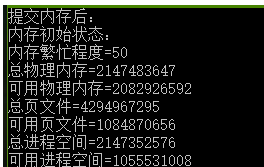
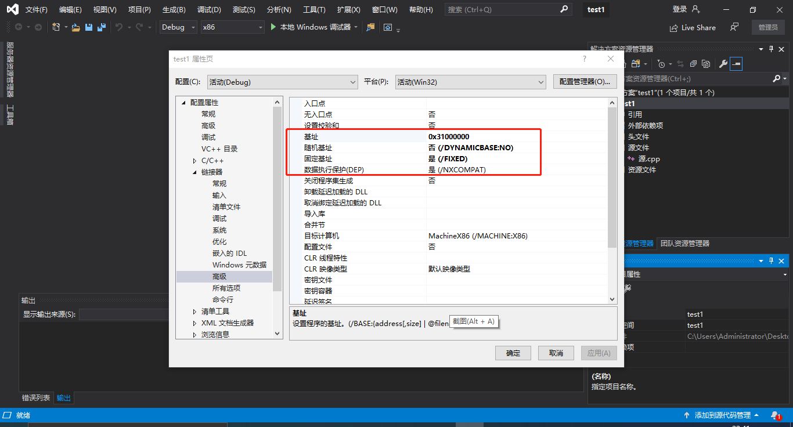
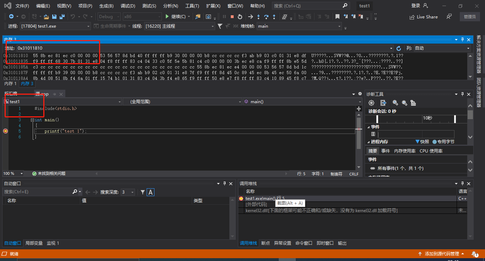

# 缓冲区溢出漏洞（内存）

## 实验目的

+ 理解缓冲区溢出漏洞底层原理

## 实验步骤

### 原理

+ 先观察下面的代码

  ```c
  int main() 
  {
   char* a = malloc(100);
   a[101] = 'a';
  }
  ```

+ 我们分配了100个字节的内存单位。但是，这段代码，在执行的时候。不会有异常情况。原因在于，操作系统对内存的管理，也是有开销的。系统本身需要在一块单独的系统内存中记录那些内存是可用的，那些内存是不可用的。如果记录内存是否可用这个信息太细，那么记录所有的内存开销就很高。比如，如果我们记录详细到每一个bit是否可用。如果系统的内存有1GB，记录内存是否可用的内存也需要1GB。这个开销有点太大了。所以，实际上，没有记录到这么细。

+ 在Windows系统中，通常是以4KB为单位进行管理的。也就是要么这4KB，都可用，要么都不可用。这样，所需要的管理数据就小得多。所以，malloc还不是最底层的内存管理方式。malloc我们称为堆内存管理。malloc可以分配任意大小的数据，但是，malloc并不管理一块数据是否有效的问题。而是由更底层的虚拟内存管理来进行的。

+ 一个4MB的内存管理单元，我们称为一个内存分页。当malloc在内存分配时，如果已经可用的分页中，还有剩余的空间足够用，那么malloc就在这个可用的分页中拿出需要的内存空间，返回地址。如果已经可用的分页不够用，再去分配新的分页。然后返回可用的地址。所以，malloc分配可以比较灵活，但是系统内部，不会把内存搞得特别细碎。都是分块的。

+ 打开任务管理器，查看详细信息，发现全是4KB倍数

  

+ 这两个小实验，证明了，系统确实以4KB作为单元在管理内存，要么4KB全部有效，要么全部无效。上述实验虽然我们只分配了100个字节。但是这100个字节所在的整个4KB的内存全部是可用的。然后，我们每个4KB的内存分页，其实有三个属性，可读可写可执行，所以，我们甚至可以分配一块readonly的内存。

+ 那么如何改变一块内存的访问属性呢？用VirtualProtect 函数。虚拟内管管理，系统也提供了一些的函数来让应用程序可以自己管理。

+ 分配内存是用 VirtualAlloc，释放使用VirtualFree，修改属性使用 VirtualProtec大家记住这三个函数。只要是VirtualAlloc分配的内存，就可以使用。VirtualAlloc甚至可以指定希望将内存分配在哪个地址上。malloc函数底层也会调用VirtualAlloc函数。当没有足够的整页的的内存可用时，malloc会调用VirtualAlloc，所以，实际的内存分配，没有那么频繁。

### 内存管理总结

* 以4KB（页）作为基本管理单元的虚拟内存管理。
* 虚拟内存管理是一套虚拟地址和物理地址对应的机制。
* 程序访问的内存都是虚拟内存地址，由CPU自动根据系统内核区中的地址对应关系表（分页表）来进行虚拟内存和物理内存地址的对应。
* 每个进程都有一个分页表。
* 每个进程都有一个完整的虚拟内存地址空间，x86情况下为4GB（0x00000000-0xffffffff）
* 但不是每个地址都可以使用（虚拟内存地址没有对应的物理内存）
* 使用VirtualAlloc API可以分配虚拟内存（以页为单位）、使用VirtualFree释放内存分页。
* 使用VirtualProtect 修改内存也保护属性（可读可写可执行）
* 数据执行保护（DEP）的基本原理
* malloc和free等C函数（也包括HeapAlloc和HeapFree等）管理的是堆内存，堆内存区只是全部内存区的一个部分。
* 堆内存管理是建立在虚拟内存管理的机制上的二次分配。
* 真正的地址有效还是无效是以分页为单位的。
* 内存分页可以直接映射到磁盘文件（FileMapping）、系统内核有内存分页是映射物理内存还是映射磁盘文件的内存交换机制。
* 完成内存分页管理的相关实验

## 课后实验

+ 阅读VirtualAlloc、VirtualFree、VirtualProtect等函数的官方文档。

  + [virtual protect](https://docs.microsoft.com/en-us/windows/win32/api/memoryapi/nf-memoryapi-virtualprotect)
  + [virtual free](https://docs.microsoft.com/en-us/windows/win32/api/memoryapi/nf-memoryapi-virtualfree)
  + [virtual alloc](https://docs.microsoft.com/en-us/windows/win32/api/memoryapi/nf-memoryapi-virtualalloc)

+ 编程使用malloc分配一段内存，测试是否这段内存所在的整个4KB都可以写入读取。

  ```c
  #include <stdio.h>  /* printf, scanf, NULL */
  #include <stdlib.h>  /* malloc, free, rand, system */
  
  int main()
  {
      int test = 0;
      char* a = (char*)malloc(10);
      for (int i = 0; i < 4096; i++)a[i] = 'a';
      for (int i = 0; i < 4096; i++)
          if (a[i] == 'a')
              test++;
  
      return 0;
  }
  ```

  + c语言中char型占1字节，4KB是4096个字节，可以看到`test`的值为4096，可知4KB空间都可以进行读取，但是由于内存溢出的问题，可能无法正常退出，这也可以理解

    

    

+ 使用VirtualAlloc分配一段，可读可写的内存，写入内存，然后将这段内存改为只读，再读数据和写数据，看是否会有异常情况。然后VirtualFree这段内存，再测试对这段内存的读写释放正常。

  + 使用VirtualAlloc分配一段，可读可写的内存，显示已分配成功

    ```c
    #include<iostream>
    #include<windows.h>
    #include<stdio.h>
    #include<stdlib.h>
    #include<time.h>
    
    using namespace std;
    int main() {
    	LPVOID pV;
    	pV = VirtualAlloc(NULL, 1000 * 1024 * 1024, MEM_RESERVE | MEM_TOP_DOWN, PAGE_READWRITE);
    
    	if (pV == NULL)
    
    		cout << "没有那么多虚拟空间!" << endl;
    
    	MEMORYSTATUS memStatusVirtual1;
    
    	GlobalMemoryStatus(&memStatusVirtual1);
    
    	cout << "虚拟内存分配：" << endl;
    
    	printf("指针地址=%x/n", pV);
    
    	
    }
    ```

    

  

  + 分配完整代码如下

    ```c
    #include "stdafx.h"
    
    #include "windows.h"
    
    #include "conio.h"
    
    #include <iostream>
    
    using namespace std;
    
    void MemoryStatus()
    
    {
    
    	MEMORYSTATUSmemStatus;
    
    	GlobalMemoryStatus(&memStatus);
    
    	cout << "内存初始状态：" << endl;
    
    	cout << "内存繁忙程度=" << memStatus.dwMemoryLoad << endl;
    
    	cout << "总物理内存=" << memStatus.dwTotalPhys << endl;
    
    	cout << "可用物理内存=" << memStatus.dwAvailPhys << endl;
    
    	cout << "总页文件=" << memStatus.dwTotalPageFile << endl;
    
    	cout << "可用页文件=" << memStatus.dwAvailPageFile << endl;
    
    	cout << "总进程空间=" << memStatus.dwTotalVirtual << endl;
    
    	cout << "可用进程空间=" << memStatus.dwAvailVirtual << endl;
    
    }
    
    
    
    int _tmain(int argc, _TCHAR* argv[])
    
    {
    
    	cout << "初始状态：" << endl;
    
    	MemoryStatus();
    
    	//申请内存
    
    	char* lpv = (char*)VirtualAlloc(NULL, 1024 * 1024 * 1024, MEM_RESERVE,
    
    		PAGE_READWRITE);
    
    	cout << "申请内存后：" << endl;
    
    	MemoryStatus();
    
    	//提交内存
    
    	lpv = (char*)VirtualAlloc(lpv, 1024 * 1024 * 1024, MEM_COMMIT,
    
    		PAGE_READWRITE);
    
    	cout << "提交内存后：" << endl;
    
    	MemoryStatus();
    
    	//使用内存
    
    	strcpy(lpv, "abc");
    
    	cout << "使用内存后：" << endl;
    
    	MemoryStatus();
    
    	//释放内存
    
    	VirtualFree(lpv, 1024 * 1024 * 1024, MEM_RELEASE);
    
    
    
    	system("pause");
    
    	return 0;
    
    }
    
    ```

    

    

    

    

    

  + 更改已经提交的页面的保护属性，有时候会很有用处，假设你在访问数据后，不想别的函数再访问，或者出于防止指针乱指改变结构的目的，你可以更改数据所处的页面的属性，让别人无法访问。

  + 使用 VirtualProtect 修改一段内存的访问属性

    ```c
    vp = VirtualProtect(
            lVirtualProtect (PVOID 基地址，SIZE_T 大小，DWORD 新属性，DWORD 旧属性)
    
    //“基地址”是你想改变的页面的地址，注意，不能跨区改变。pvBase,
            PAGELIMIT * dwPageSize,	// 需要改变访问属性的区域大小
            PAGE_READONLY,		// 只读
            &oldProtect	// 在修改前，旧的访问属性将被存储
        );
    ```

  + 更改一页的页面属性，改为只读后无法访问，还原后可以访问

    ```c
    DWORD protect;
    
                iP[0]=8;
    
                VirtualProtect(pV,4096,PAGE_READONLY,&protect);
    
                int * iP=(int*)pV;
    
    iP[1024]=9;//可以访问，因为在那一页之外
    
                //iP[0]=9;不可以访问，只读
    
                //还原保护属性
    
                VirtualProtect(pV,4096,PAGE_READWRITE,&protect);
    
       cout<<"初始值="<<iP[0]<<endl;//可以访问
    
    ```

  + 释放内存代码

    ```c
         //只释放物理内存
    
                VirtualFree((int*)pV+2000,50*1024*1024,MEM_DECOMMIT);
    
                int* a=(int*)pV;
    
                a[10]=2;//可以使用，没有释放这一页
    
                MEMORYSTATUS memStatusVirtual3;
    
                GlobalMemoryStatus(&memStatusVirtual3);
    
                cout<<"物理内存释放："<<endl;
    
    cout<<"增加物理内存="<<memStatusVirtual3.dwAvailPhys-memStatusVirtual2.dwAvailPhys<<endl;
    
    cout<<"增加可用页文件="<<memStatusVirtual3.dwAvailPageFile-memStatusVirtual2.dwAvailPageFile<<endl;
    
       cout<<"增加可用进程空间="
    
    <<memStatusVirtual3.dwAvailVirtual-memStatusVirtual2.dwAvailVirtual<<endl<<endl;
    
    ```

  + 结论1：由 VirtualAlloc 分配的 内存（可读可写）内存可以正常的写入和读取

  + 结论2：将访问属性修改为 PAGE_READONLY 后，该段内存无法写入，但可以正常读取

  + 结论3：内存释放后将无法读取和写入

+ 验证不同进程的相同的地址可以保存不同的数据。（1）在VS中，设置固定基地址，编写两个不同可执行文件。同时运行这两个文件。然后使用调试器附加到两个程序的进程，查看内存，看两个程序是否使用了相同的内存地址；（2）在不同的进程中，尝试使用VirtualAlloc分配一块相同地址的内存，写入不同的数据。再读出。

  ```c
  //test1
  #include<stdio.h>
  
  int main()
  {
  	printf("test 1");
  }
  //test2
  #include<stdio.h>
  
  int main()
  {
  	printf("test 2");
  }
  ```

  + 修改固定基址如下

    

    

  + 执行上述两段代码，查看结果，发现两个程序的地址完全不同，可见不同进程的相同的地址可以保存不同的数据

    

    

  + 新建两个工程，同时执行以下代码，可以发现地址完全不相同，由此可见系统的内存保护

    ```c
    #include <windows.h>
    
    void main()
    {
     SYSTEM_INFO sf;
     GetSystemInfo(&sf);
    
     //分配内存，标记为提交、可读可写
     LPVOID lpvBase = VirtualAlloc(
            NULL,                 // system selects address
            4096,     // size of allocation
            MEM_COMMIT,   // allocate reserved pages
            PAGE_READWRITE);       // protection = no access
       if (lpvBase == NULL )
       return;
    
    
     //向该内存里面写些东西
     unsigned char *ustr=(unsigned char *)lpvBase;
     ustr[0]=0x89;
    
    
     
    
    
     return;
    
    } 
    
    ```

## 实验参考资料

+ [虚拟内存管理](https://docs.microsoft.com/en-us/windows/win32/api/memoryapi/nf-memoryapi-virtualalloc)
+ [系统保护](https://docs.microsoft.com/zh-cn/windows/win32/memory/memory-protection-constants)
+ [virtual protect](https://docs.microsoft.com/en-us/windows/win32/api/memoryapi/nf-memoryapi-virtualprotect)
+ [virtual free](https://docs.microsoft.com/en-us/windows/win32/api/memoryapi/nf-memoryapi-virtualfree)
+ [virtual alloc](https://docs.microsoft.com/en-us/windows/win32/api/memoryapi/nf-memoryapi-virtualalloc)
+ [malloc](http://c.biancheng.net/cpp/html/137.html)
+ [虚拟内存详解](https://blog.csdn.net/rankun1/article/details/50449512)
+ [设置基址](https://blog.csdn.net/HappyBear1995/article/details/51126998)

